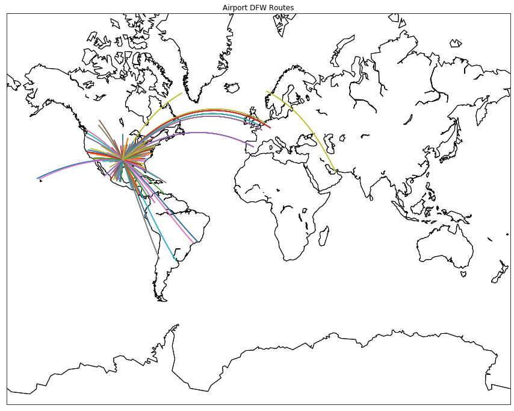

## We'll explore the fundamentals of geographic coordinate systems and how to work with the basemap library to plot geographic data points on maps. We'll be working with flight data from the openflights website, and answer 2 questions:

### 1. For each airport, which destination airport is the most common?

### 2. Which cities are the most important hubs for airports and airlines?

### Here's a breakdown of the files we'll be working with and the most pertinent columns from each dataset:

#### airlines.csv - data on each airline
- country - where the airline is headquartered.
- active - if the airline is still active.

#### airports.csv - data on each airport
- name - name of the airport.
- city - city the airport is located.
- country - country the airport is located.
- code - unique airport code.
- latitude - latitude value.
- longitude - longitude value.

#### routes.csv - data on each flight route
- airline - airline for the route.
- source - starting city for the route.
- dest - destination city for the route.


```python
import pandas as pd
import matplotlib.pyplot as plt
import numpy as np
```


```python
airline = pd.read_csv('airlines.csv')
airports = pd.read_csv('airports.csv')
routes = pd.read_csv('routes.csv')
```


```python
airline
```


<div>
<style scoped>
    .dataframe tbody tr th:only-of-type {
        vertical-align: middle;
    }

    .dataframe tbody tr th {
        vertical-align: top;
    }

    .dataframe thead th {
        text-align: right;
    }
</style>
<table border="1" class="dataframe">
  <thead>
    <tr style="text-align: right;">
      <th></th>
      <th>id</th>
      <th>name</th>
      <th>alias</th>
      <th>iata</th>
      <th>icao</th>
      <th>callsign</th>
      <th>country</th>
      <th>active</th>
    </tr>
  </thead>
  <tbody>
    <tr>
      <th>0</th>
      <td>1</td>
      <td>Private flight</td>
      <td>\N</td>
      <td>-</td>
      <td>NaN</td>
      <td>NaN</td>
      <td>NaN</td>
      <td>Y</td>
    </tr>
    <tr>
      <th>1</th>
      <td>2</td>
      <td>135 Airways</td>
      <td>\N</td>
      <td>NaN</td>
      <td>GNL</td>
      <td>GENERAL</td>
      <td>United States</td>
      <td>N</td>
    </tr>
    <tr>
      <th>2</th>
      <td>3</td>
      <td>1Time Airline</td>
      <td>\N</td>
      <td>1T</td>
      <td>RNX</td>
      <td>NEXTIME</td>
      <td>South Africa</td>
      <td>Y</td>
    </tr>
    <tr>
      <th>3</th>
      <td>4</td>
      <td>2 Sqn No 1 Elementary Flying Training School</td>
      <td>\N</td>
      <td>NaN</td>
      <td>WYT</td>
      <td>NaN</td>
      <td>United Kingdom</td>
      <td>N</td>
    </tr>
    <tr>
      <th>4</th>
      <td>5</td>
      <td>213 Flight Unit</td>
      <td>\N</td>
      <td>NaN</td>
      <td>TFU</td>
      <td>NaN</td>
      <td>Russia</td>
      <td>N</td>
    </tr>
    <tr>
      <th>...</th>
      <td>...</td>
      <td>...</td>
      <td>...</td>
      <td>...</td>
      <td>...</td>
      <td>...</td>
      <td>...</td>
      <td>...</td>
    </tr>
    <tr>
      <th>6043</th>
      <td>19828</td>
      <td>Vuela Cuba</td>
      <td>Vuela Cuba</td>
      <td>6C</td>
      <td>6CC</td>
      <td>NaN</td>
      <td>Cuba</td>
      <td>Y</td>
    </tr>
    <tr>
      <th>6044</th>
      <td>19830</td>
      <td>All Australia</td>
      <td>All Australia</td>
      <td>88</td>
      <td>8K8</td>
      <td>NaN</td>
      <td>Australia</td>
      <td>Y</td>
    </tr>
    <tr>
      <th>6045</th>
      <td>19831</td>
      <td>Fly Europa</td>
      <td>NaN</td>
      <td>ER</td>
      <td>RWW</td>
      <td>NaN</td>
      <td>Spain</td>
      <td>Y</td>
    </tr>
    <tr>
      <th>6046</th>
      <td>19834</td>
      <td>FlyPortugal</td>
      <td>NaN</td>
      <td>PO</td>
      <td>FPT</td>
      <td>FlyPortugal</td>
      <td>Portugal</td>
      <td>Y</td>
    </tr>
    <tr>
      <th>6047</th>
      <td>19845</td>
      <td>FTI Fluggesellschaft</td>
      <td>NaN</td>
      <td>NaN</td>
      <td>FTI</td>
      <td>NaN</td>
      <td>Germany</td>
      <td>N</td>
    </tr>
  </tbody>
</table>
<p>6048 rows × 8 columns</p>
</div>


```python
airports
```


<div>
<style scoped>
    .dataframe tbody tr th:only-of-type {
        vertical-align: middle;
    }

    .dataframe tbody tr th {
        vertical-align: top;
    }

    .dataframe thead th {
        text-align: right;
    }
</style>
<table border="1" class="dataframe">
  <thead>
    <tr style="text-align: right;">
      <th></th>
      <th>id</th>
      <th>name</th>
      <th>city</th>
      <th>country</th>
      <th>code</th>
      <th>icao</th>
      <th>latitude</th>
      <th>longitude</th>
      <th>altitude</th>
      <th>offset</th>
      <th>dst</th>
      <th>timezone</th>
    </tr>
  </thead>
  <tbody>
    <tr>
      <th>0</th>
      <td>1</td>
      <td>Goroka</td>
      <td>Goroka</td>
      <td>Papua New Guinea</td>
      <td>GKA</td>
      <td>AYGA</td>
      <td>-6.081689</td>
      <td>145.391881</td>
      <td>5282</td>
      <td>10.0</td>
      <td>U</td>
      <td>Pacific/Port_Moresby</td>
    </tr>
    <tr>
      <th>1</th>
      <td>2</td>
      <td>Madang</td>
      <td>Madang</td>
      <td>Papua New Guinea</td>
      <td>MAG</td>
      <td>AYMD</td>
      <td>-5.207083</td>
      <td>145.788700</td>
      <td>20</td>
      <td>10.0</td>
      <td>U</td>
      <td>Pacific/Port_Moresby</td>
    </tr>
    <tr>
      <th>2</th>
      <td>3</td>
      <td>Mount Hagen</td>
      <td>Mount Hagen</td>
      <td>Papua New Guinea</td>
      <td>HGU</td>
      <td>AYMH</td>
      <td>-5.826789</td>
      <td>144.295861</td>
      <td>5388</td>
      <td>10.0</td>
      <td>U</td>
      <td>Pacific/Port_Moresby</td>
    </tr>
    <tr>
      <th>3</th>
      <td>4</td>
      <td>Nadzab</td>
      <td>Nadzab</td>
      <td>Papua New Guinea</td>
      <td>LAE</td>
      <td>AYNZ</td>
      <td>-6.569828</td>
      <td>146.726242</td>
      <td>239</td>
      <td>10.0</td>
      <td>U</td>
      <td>Pacific/Port_Moresby</td>
    </tr>
    <tr>
      <th>4</th>
      <td>5</td>
      <td>Port Moresby Jacksons Intl</td>
      <td>Port Moresby</td>
      <td>Papua New Guinea</td>
      <td>POM</td>
      <td>AYPY</td>
      <td>-9.443383</td>
      <td>147.220050</td>
      <td>146</td>
      <td>10.0</td>
      <td>U</td>
      <td>Pacific/Port_Moresby</td>
    </tr>
    <tr>
      <th>...</th>
      <td>...</td>
      <td>...</td>
      <td>...</td>
      <td>...</td>
      <td>...</td>
      <td>...</td>
      <td>...</td>
      <td>...</td>
      <td>...</td>
      <td>...</td>
      <td>...</td>
      <td>...</td>
    </tr>
    <tr>
      <th>8102</th>
      <td>9537</td>
      <td>Mansons Landing Water Aerodrome</td>
      <td>Mansons Landing</td>
      <td>Canada</td>
      <td>YMU</td>
      <td>\N</td>
      <td>50.066667</td>
      <td>-124.983333</td>
      <td>0</td>
      <td>-8.0</td>
      <td>A</td>
      <td>America/Vancouver</td>
    </tr>
    <tr>
      <th>8103</th>
      <td>9538</td>
      <td>Port McNeill Airport</td>
      <td>Port McNeill</td>
      <td>Canada</td>
      <td>YMP</td>
      <td>\N</td>
      <td>50.575556</td>
      <td>-127.028611</td>
      <td>225</td>
      <td>-8.0</td>
      <td>A</td>
      <td>America/Vancouver</td>
    </tr>
    <tr>
      <th>8104</th>
      <td>9539</td>
      <td>Sullivan Bay Water Aerodrome</td>
      <td>Sullivan Bay</td>
      <td>Canada</td>
      <td>YTG</td>
      <td>\N</td>
      <td>50.883333</td>
      <td>-126.833333</td>
      <td>0</td>
      <td>-8.0</td>
      <td>A</td>
      <td>America/Vancouver</td>
    </tr>
    <tr>
      <th>8105</th>
      <td>9540</td>
      <td>Deer Harbor Seaplane</td>
      <td>Deer Harbor</td>
      <td>United States</td>
      <td>DHB</td>
      <td>\N</td>
      <td>48.618397</td>
      <td>-123.005960</td>
      <td>0</td>
      <td>-8.0</td>
      <td>A</td>
      <td>America/Los_Angeles</td>
    </tr>
    <tr>
      <th>8106</th>
      <td>9541</td>
      <td>San Diego Old Town Transit Center</td>
      <td>San Diego</td>
      <td>United States</td>
      <td>OLT</td>
      <td>\N</td>
      <td>32.755200</td>
      <td>-117.199500</td>
      <td>0</td>
      <td>-8.0</td>
      <td>A</td>
      <td>America/Los_Angeles</td>
    </tr>
  </tbody>
</table>
<p>8107 rows × 12 columns</p>
</div>


```python
routes
```


<div>
<style scoped>
    .dataframe tbody tr th:only-of-type {
        vertical-align: middle;
    }

    .dataframe tbody tr th {
        vertical-align: top;
    }

    .dataframe thead th {
        text-align: right;
    }
</style>
<table border="1" class="dataframe">
  <thead>
    <tr style="text-align: right;">
      <th></th>
      <th>airline</th>
      <th>airline_id</th>
      <th>source</th>
      <th>source_id</th>
      <th>dest</th>
      <th>dest_id</th>
      <th>codeshare</th>
      <th>stops</th>
      <th>equipment</th>
    </tr>
  </thead>
  <tbody>
    <tr>
      <th>0</th>
      <td>2B</td>
      <td>410</td>
      <td>AER</td>
      <td>2965</td>
      <td>KZN</td>
      <td>2990</td>
      <td>NaN</td>
      <td>0</td>
      <td>CR2</td>
    </tr>
    <tr>
      <th>1</th>
      <td>2B</td>
      <td>410</td>
      <td>ASF</td>
      <td>2966</td>
      <td>KZN</td>
      <td>2990</td>
      <td>NaN</td>
      <td>0</td>
      <td>CR2</td>
    </tr>
    <tr>
      <th>2</th>
      <td>2B</td>
      <td>410</td>
      <td>ASF</td>
      <td>2966</td>
      <td>MRV</td>
      <td>2962</td>
      <td>NaN</td>
      <td>0</td>
      <td>CR2</td>
    </tr>
    <tr>
      <th>3</th>
      <td>2B</td>
      <td>410</td>
      <td>CEK</td>
      <td>2968</td>
      <td>KZN</td>
      <td>2990</td>
      <td>NaN</td>
      <td>0</td>
      <td>CR2</td>
    </tr>
    <tr>
      <th>4</th>
      <td>2B</td>
      <td>410</td>
      <td>CEK</td>
      <td>2968</td>
      <td>OVB</td>
      <td>4078</td>
      <td>NaN</td>
      <td>0</td>
      <td>CR2</td>
    </tr>
    <tr>
      <th>...</th>
      <td>...</td>
      <td>...</td>
      <td>...</td>
      <td>...</td>
      <td>...</td>
      <td>...</td>
      <td>...</td>
      <td>...</td>
      <td>...</td>
    </tr>
    <tr>
      <th>67658</th>
      <td>ZL</td>
      <td>4178</td>
      <td>WYA</td>
      <td>6334</td>
      <td>ADL</td>
      <td>3341</td>
      <td>NaN</td>
      <td>0</td>
      <td>SF3</td>
    </tr>
    <tr>
      <th>67659</th>
      <td>ZM</td>
      <td>19016</td>
      <td>DME</td>
      <td>4029</td>
      <td>FRU</td>
      <td>2912</td>
      <td>NaN</td>
      <td>0</td>
      <td>734</td>
    </tr>
    <tr>
      <th>67660</th>
      <td>ZM</td>
      <td>19016</td>
      <td>FRU</td>
      <td>2912</td>
      <td>DME</td>
      <td>4029</td>
      <td>NaN</td>
      <td>0</td>
      <td>734</td>
    </tr>
    <tr>
      <th>67661</th>
      <td>ZM</td>
      <td>19016</td>
      <td>FRU</td>
      <td>2912</td>
      <td>OSS</td>
      <td>2913</td>
      <td>NaN</td>
      <td>0</td>
      <td>734</td>
    </tr>
    <tr>
      <th>67662</th>
      <td>ZM</td>
      <td>19016</td>
      <td>OSS</td>
      <td>2913</td>
      <td>FRU</td>
      <td>2912</td>
      <td>NaN</td>
      <td>0</td>
      <td>734</td>
    </tr>
  </tbody>
</table>
<p>67663 rows × 9 columns</p>
</div>


### 1. For each airport, which destination airport is the most common?


```python
# make a pivot table that count destinations by sources
countDest = routes.pivot_table(index='source', values='dest_id', columns='dest', aggfunc='count')
countDest
```


<div>
<style scoped>
    .dataframe tbody tr th:only-of-type {
        vertical-align: middle;
    }

    .dataframe tbody tr th {
        vertical-align: top;
    }

    .dataframe thead th {
        text-align: right;
    }
</style>
<table border="1" class="dataframe">
  <thead>
    <tr style="text-align: right;">
      <th>dest</th>
      <th>AAE</th>
      <th>AAL</th>
      <th>AAN</th>
      <th>AAQ</th>
      <th>AAR</th>
      <th>AAT</th>
      <th>AAX</th>
      <th>AAY</th>
      <th>ABA</th>
      <th>ABB</th>
      <th>...</th>
      <th>ZSA</th>
      <th>ZSE</th>
      <th>ZSJ</th>
      <th>ZTB</th>
      <th>ZTH</th>
      <th>ZUH</th>
      <th>ZUM</th>
      <th>ZVK</th>
      <th>ZYI</th>
      <th>ZYL</th>
    </tr>
    <tr>
      <th>source</th>
      <th></th>
      <th></th>
      <th></th>
      <th></th>
      <th></th>
      <th></th>
      <th></th>
      <th></th>
      <th></th>
      <th></th>
      <th></th>
      <th></th>
      <th></th>
      <th></th>
      <th></th>
      <th></th>
      <th></th>
      <th></th>
      <th></th>
      <th></th>
      <th></th>
    </tr>
  </thead>
  <tbody>
    <tr>
      <th>AAE</th>
      <td>NaN</td>
      <td>NaN</td>
      <td>NaN</td>
      <td>NaN</td>
      <td>NaN</td>
      <td>NaN</td>
      <td>NaN</td>
      <td>NaN</td>
      <td>NaN</td>
      <td>NaN</td>
      <td>...</td>
      <td>NaN</td>
      <td>NaN</td>
      <td>NaN</td>
      <td>NaN</td>
      <td>NaN</td>
      <td>NaN</td>
      <td>NaN</td>
      <td>NaN</td>
      <td>NaN</td>
      <td>NaN</td>
    </tr>
    <tr>
      <th>AAL</th>
      <td>NaN</td>
      <td>NaN</td>
      <td>NaN</td>
      <td>NaN</td>
      <td>1.0</td>
      <td>NaN</td>
      <td>NaN</td>
      <td>NaN</td>
      <td>NaN</td>
      <td>NaN</td>
      <td>...</td>
      <td>NaN</td>
      <td>NaN</td>
      <td>NaN</td>
      <td>NaN</td>
      <td>NaN</td>
      <td>NaN</td>
      <td>NaN</td>
      <td>NaN</td>
      <td>NaN</td>
      <td>NaN</td>
    </tr>
    <tr>
      <th>AAN</th>
      <td>NaN</td>
      <td>NaN</td>
      <td>NaN</td>
      <td>NaN</td>
      <td>NaN</td>
      <td>NaN</td>
      <td>NaN</td>
      <td>NaN</td>
      <td>NaN</td>
      <td>NaN</td>
      <td>...</td>
      <td>NaN</td>
      <td>NaN</td>
      <td>NaN</td>
      <td>NaN</td>
      <td>NaN</td>
      <td>NaN</td>
      <td>NaN</td>
      <td>NaN</td>
      <td>NaN</td>
      <td>NaN</td>
    </tr>
    <tr>
      <th>AAQ</th>
      <td>NaN</td>
      <td>NaN</td>
      <td>NaN</td>
      <td>NaN</td>
      <td>NaN</td>
      <td>NaN</td>
      <td>NaN</td>
      <td>NaN</td>
      <td>NaN</td>
      <td>NaN</td>
      <td>...</td>
      <td>NaN</td>
      <td>NaN</td>
      <td>NaN</td>
      <td>NaN</td>
      <td>NaN</td>
      <td>NaN</td>
      <td>NaN</td>
      <td>NaN</td>
      <td>NaN</td>
      <td>NaN</td>
    </tr>
    <tr>
      <th>AAR</th>
      <td>NaN</td>
      <td>1.0</td>
      <td>NaN</td>
      <td>NaN</td>
      <td>NaN</td>
      <td>NaN</td>
      <td>NaN</td>
      <td>NaN</td>
      <td>NaN</td>
      <td>NaN</td>
      <td>...</td>
      <td>NaN</td>
      <td>NaN</td>
      <td>NaN</td>
      <td>NaN</td>
      <td>NaN</td>
      <td>NaN</td>
      <td>NaN</td>
      <td>NaN</td>
      <td>NaN</td>
      <td>NaN</td>
    </tr>
    <tr>
      <th>...</th>
      <td>...</td>
      <td>...</td>
      <td>...</td>
      <td>...</td>
      <td>...</td>
      <td>...</td>
      <td>...</td>
      <td>...</td>
      <td>...</td>
      <td>...</td>
      <td>...</td>
      <td>...</td>
      <td>...</td>
      <td>...</td>
      <td>...</td>
      <td>...</td>
      <td>...</td>
      <td>...</td>
      <td>...</td>
      <td>...</td>
      <td>...</td>
    </tr>
    <tr>
      <th>ZUH</th>
      <td>NaN</td>
      <td>NaN</td>
      <td>NaN</td>
      <td>NaN</td>
      <td>NaN</td>
      <td>NaN</td>
      <td>NaN</td>
      <td>NaN</td>
      <td>NaN</td>
      <td>NaN</td>
      <td>...</td>
      <td>NaN</td>
      <td>NaN</td>
      <td>NaN</td>
      <td>NaN</td>
      <td>NaN</td>
      <td>NaN</td>
      <td>NaN</td>
      <td>NaN</td>
      <td>NaN</td>
      <td>NaN</td>
    </tr>
    <tr>
      <th>ZUM</th>
      <td>NaN</td>
      <td>NaN</td>
      <td>NaN</td>
      <td>NaN</td>
      <td>NaN</td>
      <td>NaN</td>
      <td>NaN</td>
      <td>NaN</td>
      <td>NaN</td>
      <td>NaN</td>
      <td>...</td>
      <td>NaN</td>
      <td>NaN</td>
      <td>NaN</td>
      <td>NaN</td>
      <td>NaN</td>
      <td>NaN</td>
      <td>NaN</td>
      <td>NaN</td>
      <td>NaN</td>
      <td>NaN</td>
    </tr>
    <tr>
      <th>ZVK</th>
      <td>NaN</td>
      <td>NaN</td>
      <td>NaN</td>
      <td>NaN</td>
      <td>NaN</td>
      <td>NaN</td>
      <td>NaN</td>
      <td>NaN</td>
      <td>NaN</td>
      <td>NaN</td>
      <td>...</td>
      <td>NaN</td>
      <td>NaN</td>
      <td>NaN</td>
      <td>NaN</td>
      <td>NaN</td>
      <td>NaN</td>
      <td>NaN</td>
      <td>NaN</td>
      <td>NaN</td>
      <td>NaN</td>
    </tr>
    <tr>
      <th>ZYI</th>
      <td>NaN</td>
      <td>NaN</td>
      <td>NaN</td>
      <td>NaN</td>
      <td>NaN</td>
      <td>NaN</td>
      <td>NaN</td>
      <td>NaN</td>
      <td>NaN</td>
      <td>NaN</td>
      <td>...</td>
      <td>NaN</td>
      <td>NaN</td>
      <td>NaN</td>
      <td>NaN</td>
      <td>NaN</td>
      <td>NaN</td>
      <td>NaN</td>
      <td>NaN</td>
      <td>NaN</td>
      <td>NaN</td>
    </tr>
    <tr>
      <th>ZYL</th>
      <td>NaN</td>
      <td>NaN</td>
      <td>NaN</td>
      <td>NaN</td>
      <td>NaN</td>
      <td>NaN</td>
      <td>NaN</td>
      <td>NaN</td>
      <td>NaN</td>
      <td>NaN</td>
      <td>...</td>
      <td>NaN</td>
      <td>NaN</td>
      <td>NaN</td>
      <td>NaN</td>
      <td>NaN</td>
      <td>NaN</td>
      <td>NaN</td>
      <td>NaN</td>
      <td>NaN</td>
      <td>NaN</td>
    </tr>
  </tbody>
</table>
<p>3409 rows × 3418 columns</p>
</div>


```python
# a helper function that returns the 1st question result
def mostCommonDest(pivotDf):
    result = {}
    for i in range(0, len(pivotDf)):
        temp = pivotDf.iloc[i, :]
        result[pivotDf.index[i]] = temp[[n for n in temp.index if (temp[n] == temp.max())]].index.to_list()
    return result
```

#### Since the data contains too many rows and columns, we will answer the 1st question with 10 sample rows.


```python
def first10Airports(pivotDf):
    result = {}
    for i in range(0, 11):
        temp = pivotDf.iloc[i, :]
        result[pivotDf.index[i]] = temp[[n for n in temp.index if (temp[n] == temp.max())]].index.to_list()
    return result
```


```python
first10Airports(countDest)
```


    {'AAE': ['MRS', 'ORY'],
     'AAL': ['BLL', 'OSL'],
     'AAN': ['CCJ', 'PEW'],
     'AAQ': ['DME', 'LED', 'SVO'],
     'AAR': ['AAL', 'AGP', 'BMA', 'CPH', 'GOT', 'OSL', 'PMI', 'STN'],
     'AAT': ['URC'],
     'AAX': ['POJ'],
     'AAY': ['SAH'],
     'ABA': ['DME', 'IKT', 'NSK', 'SVO'],
     'ABB': ['ABV', 'LOS'],
     'ABD': ['THR']}


### 2.1. Which cities are the most important hubs for airports?


```python
airports.groupby('city').count().max(axis=1).sort_values(ascending=False)[:11]
```


    city
    London       21
    New York     13
    Hong Kong    12
    Berlin       10
    Paris        10
    Chicago       9
    Seattle       9
    Moscow        9
    Glasgow       8
    Beijing       8
    San Diego     8
    dtype: int64


### 2.2. Which cities are the most important hubs for airlines?


```python
# top 10 source airports
source = routes.groupby('source').count().sort_values(by='airline_id', ascending=False).max(axis=1)[0:11]
source
```


    source
    ATL    915
    ORD    558
    PEK    535
    LHR    527
    CDG    524
    FRA    497
    LAX    492
    DFW    469
    JFK    456
    AMS    453
    PVG    411
    dtype: int64


```python
# top 10 destination airport
dest = routes.groupby('dest').count().sort_values(by='airline_id', ascending=False).max(axis=1)[0:11]
dest
```


    dest
    ATL    911
    ORD    550
    PEK    534
    LHR    524
    CDG    517
    LAX    498
    FRA    493
    DFW    467
    JFK    455
    AMS    450
    PVG    414
    dtype: int64


```python
# filter cities that is in both source and destination lists
airports[airports['code'].isin(np.intersect1d(source.index, dest.index))]['city']
```


    337             Frankfurt
    503                London
    575             Amsterdam
    1358                Paris
    3268              Beijing
    3307             Shanghai
    3385          Los Angeles
    3571    Dallas-Fort Worth
    3583              Atlanta
    3698             New York
    3731              Chicago
    Name: city, dtype: object


### We create a visualization on world airports.


```python
from mpl_toolkits.basemap import Basemap
```


```python
m = Basemap(projection='merc',llcrnrlat=-80,urcrnrlat=80,llcrnrlon=-180,urcrnrlon=180)
```


```python
longitudes = airports["longitude"].tolist()
latitudes = airports["latitude"].tolist()
x, y = m(longitudes, latitudes)
```


```python
fig, ax = plt.subplots(figsize=(10,15))
plt.title("Scaled Up Earth With Coastlines")
m.scatter(x,y,s=1)
m.drawcoastlines()
```


### We also created a visualization of one sample airport which includes its flight routes.


```python
geo_routes = pd.read_csv('geo_routes.csv')
geo_routes
```


<div>
<style scoped>
    .dataframe tbody tr th:only-of-type {
        vertical-align: middle;
    }

    .dataframe tbody tr th {
        vertical-align: top;
    }

    .dataframe thead th {
        text-align: right;
    }
</style>
<table border="1" class="dataframe">
  <thead>
    <tr style="text-align: right;">
      <th></th>
      <th>airline</th>
      <th>source</th>
      <th>dest</th>
      <th>equipment</th>
      <th>start_lon</th>
      <th>end_lon</th>
      <th>start_lat</th>
      <th>end_lat</th>
    </tr>
  </thead>
  <tbody>
    <tr>
      <th>0</th>
      <td>2B</td>
      <td>AER</td>
      <td>KZN</td>
      <td>CR2</td>
      <td>39.956589</td>
      <td>49.278728</td>
      <td>43.449928</td>
      <td>55.606186</td>
    </tr>
    <tr>
      <th>1</th>
      <td>2B</td>
      <td>ASF</td>
      <td>KZN</td>
      <td>CR2</td>
      <td>48.006278</td>
      <td>49.278728</td>
      <td>46.283333</td>
      <td>55.606186</td>
    </tr>
    <tr>
      <th>2</th>
      <td>2B</td>
      <td>ASF</td>
      <td>MRV</td>
      <td>CR2</td>
      <td>48.006278</td>
      <td>43.081889</td>
      <td>46.283333</td>
      <td>44.225072</td>
    </tr>
    <tr>
      <th>3</th>
      <td>2B</td>
      <td>CEK</td>
      <td>KZN</td>
      <td>CR2</td>
      <td>61.503333</td>
      <td>49.278728</td>
      <td>55.305836</td>
      <td>55.606186</td>
    </tr>
    <tr>
      <th>4</th>
      <td>2B</td>
      <td>CEK</td>
      <td>OVB</td>
      <td>CR2</td>
      <td>61.503333</td>
      <td>82.650656</td>
      <td>55.305836</td>
      <td>55.012622</td>
    </tr>
    <tr>
      <th>...</th>
      <td>...</td>
      <td>...</td>
      <td>...</td>
      <td>...</td>
      <td>...</td>
      <td>...</td>
      <td>...</td>
      <td>...</td>
    </tr>
    <tr>
      <th>67423</th>
      <td>ZL</td>
      <td>WYA</td>
      <td>ADL</td>
      <td>SF3</td>
      <td>137.514000</td>
      <td>138.530556</td>
      <td>-33.058900</td>
      <td>-34.945000</td>
    </tr>
    <tr>
      <th>67424</th>
      <td>ZM</td>
      <td>DME</td>
      <td>FRU</td>
      <td>734</td>
      <td>37.906111</td>
      <td>74.477556</td>
      <td>55.408611</td>
      <td>43.061306</td>
    </tr>
    <tr>
      <th>67425</th>
      <td>ZM</td>
      <td>FRU</td>
      <td>DME</td>
      <td>734</td>
      <td>74.477556</td>
      <td>37.906111</td>
      <td>43.061306</td>
      <td>55.408611</td>
    </tr>
    <tr>
      <th>67426</th>
      <td>ZM</td>
      <td>FRU</td>
      <td>OSS</td>
      <td>734</td>
      <td>74.477556</td>
      <td>72.793269</td>
      <td>43.061306</td>
      <td>40.608989</td>
    </tr>
    <tr>
      <th>67427</th>
      <td>ZM</td>
      <td>OSS</td>
      <td>FRU</td>
      <td>734</td>
      <td>72.793269</td>
      <td>74.477556</td>
      <td>40.608989</td>
      <td>43.061306</td>
    </tr>
  </tbody>
</table>
<p>67428 rows × 8 columns</p>
</div>


```python
# a helper function that that draws a great circle for each route that has an absolute difference in the latitude and longitude values less than 180.
def create_great_circles(df):
    for index, row in df.iterrows():
        end_lat, start_lat = row['end_lat'], row['start_lat']
        end_lon, start_lon = row['end_lon'], row['start_lon']
        
        if abs(end_lat - start_lat) < 180:
            if abs(end_lon - start_lon) < 180:
                m.drawgreatcircle(start_lon, start_lat, end_lon, end_lat)
```


```python
fig, ax = plt.subplots(figsize=(10,15))
m = Basemap(projection='merc', llcrnrlat=-80, urcrnrlat=80, llcrnrlon=-180, urcrnrlon=180)
m.drawcoastlines()
plt.title("Airport DFW Routes")
dfw = geo_routes[geo_routes['source'] == "DFW"]
create_great_circles(dfw)
m.drawcoastlines()
plt.show()
```




