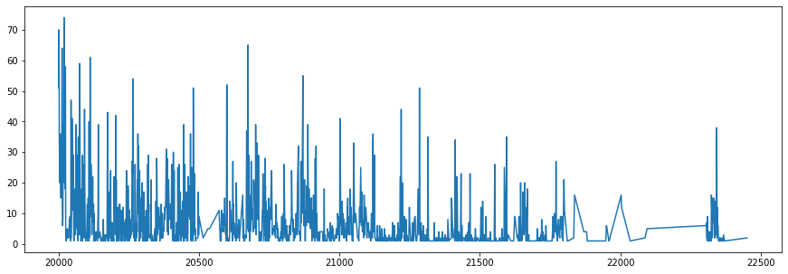

# Dimensionality Reduction: 1000 fashion MNIST

## Goals
### 1. Try out diffreent Dimensionality Reduction techniques, and conclude the best one bz visualization: TNSE
### 2. Dimensionality Reduction for Pre-processing: not recommended 

## Data set description
Source: https://github.com/zalandoresearch/fashion-mnist

Fashion-MNIST is a dataset of Zalando's article images—consisting of a training set of 60,000 examples and a test set of 10,000 examples. Each example is a 28x28 grayscale image, associated with a label from 10 classes. Zalando intends Fashion-MNIST to serve as a direct drop-in replacement for the original MNIST dataset for benchmarking machine learning algorithms. It shares the same image size and structure of training and testing splits.

Each image is 28 pixels in height and 28 pixels in width, for a total of 784 pixels in total. Each pixel has a single pixel-value associated with it, indicating the lightness or darkness of that pixel, with higher numbers meaning darker. This pixel-value is an integer between 0 and 255. The training and test data sets have 785 columns. The first column consists of the class labels (see above), and represents the article of clothing. The rest of the columns contain the pixel-values of the associated image.

### Attributes
- 0: T-shirt/top
- 1: Trouser
- 2: Pullover
- 3: Dress
- 4: Coat
- 5: Sandal
- 6: Shirt
- 7: Sneaker
- 8: Bag
- 9: Ankle boot

### ML tasks 
1. Perform Dimentionality Reduction (DR) techniques
2. Classification with DR as Pre-processing

### We'll use 1000 rows from the original dataset only.


```python
import pandas as pd

data = pd.read_csv('fashion-mnist.csv')
data
```


<div>
<style scoped>
    .dataframe tbody tr th:only-of-type {
        vertical-align: middle;
    }

    .dataframe tbody tr th {
        vertical-align: top;
    }

    .dataframe thead th {
        text-align: right;
    }
</style>
<table border="1" class="dataframe">
  <thead>
    <tr style="text-align: right;">
      <th></th>
      <th>label</th>
      <th>pixel1</th>
      <th>pixel2</th>
      <th>pixel3</th>
      <th>pixel4</th>
      <th>pixel5</th>
      <th>pixel6</th>
      <th>pixel7</th>
      <th>pixel8</th>
      <th>pixel9</th>
      <th>...</th>
      <th>pixel775</th>
      <th>pixel776</th>
      <th>pixel777</th>
      <th>pixel778</th>
      <th>pixel779</th>
      <th>pixel780</th>
      <th>pixel781</th>
      <th>pixel782</th>
      <th>pixel783</th>
      <th>pixel784</th>
    </tr>
  </thead>
  <tbody>
    <tr>
      <th>0</th>
      <td>0</td>
      <td>0</td>
      <td>0</td>
      <td>0</td>
      <td>0</td>
      <td>0</td>
      <td>0</td>
      <td>0</td>
      <td>9</td>
      <td>8</td>
      <td>...</td>
      <td>103</td>
      <td>87</td>
      <td>56</td>
      <td>0</td>
      <td>0</td>
      <td>0</td>
      <td>0</td>
      <td>0</td>
      <td>0</td>
      <td>0</td>
    </tr>
    <tr>
      <th>1</th>
      <td>1</td>
      <td>0</td>
      <td>0</td>
      <td>0</td>
      <td>0</td>
      <td>0</td>
      <td>0</td>
      <td>0</td>
      <td>0</td>
      <td>0</td>
      <td>...</td>
      <td>34</td>
      <td>0</td>
      <td>0</td>
      <td>0</td>
      <td>0</td>
      <td>0</td>
      <td>0</td>
      <td>0</td>
      <td>0</td>
      <td>0</td>
    </tr>
    <tr>
      <th>2</th>
      <td>2</td>
      <td>0</td>
      <td>0</td>
      <td>0</td>
      <td>0</td>
      <td>0</td>
      <td>0</td>
      <td>14</td>
      <td>53</td>
      <td>99</td>
      <td>...</td>
      <td>0</td>
      <td>0</td>
      <td>0</td>
      <td>0</td>
      <td>63</td>
      <td>53</td>
      <td>31</td>
      <td>0</td>
      <td>0</td>
      <td>0</td>
    </tr>
    <tr>
      <th>3</th>
      <td>2</td>
      <td>0</td>
      <td>0</td>
      <td>0</td>
      <td>0</td>
      <td>0</td>
      <td>0</td>
      <td>0</td>
      <td>0</td>
      <td>0</td>
      <td>...</td>
      <td>137</td>
      <td>126</td>
      <td>140</td>
      <td>0</td>
      <td>133</td>
      <td>224</td>
      <td>222</td>
      <td>56</td>
      <td>0</td>
      <td>0</td>
    </tr>
    <tr>
      <th>4</th>
      <td>3</td>
      <td>0</td>
      <td>0</td>
      <td>0</td>
      <td>0</td>
      <td>0</td>
      <td>0</td>
      <td>0</td>
      <td>0</td>
      <td>0</td>
      <td>...</td>
      <td>0</td>
      <td>0</td>
      <td>0</td>
      <td>0</td>
      <td>0</td>
      <td>0</td>
      <td>0</td>
      <td>0</td>
      <td>0</td>
      <td>0</td>
    </tr>
    <tr>
      <th>...</th>
      <td>...</td>
      <td>...</td>
      <td>...</td>
      <td>...</td>
      <td>...</td>
      <td>...</td>
      <td>...</td>
      <td>...</td>
      <td>...</td>
      <td>...</td>
      <td>...</td>
      <td>...</td>
      <td>...</td>
      <td>...</td>
      <td>...</td>
      <td>...</td>
      <td>...</td>
      <td>...</td>
      <td>...</td>
      <td>...</td>
      <td>...</td>
    </tr>
    <tr>
      <th>9995</th>
      <td>0</td>
      <td>0</td>
      <td>0</td>
      <td>0</td>
      <td>0</td>
      <td>0</td>
      <td>0</td>
      <td>0</td>
      <td>0</td>
      <td>0</td>
      <td>...</td>
      <td>32</td>
      <td>23</td>
      <td>14</td>
      <td>20</td>
      <td>0</td>
      <td>0</td>
      <td>1</td>
      <td>0</td>
      <td>0</td>
      <td>0</td>
    </tr>
    <tr>
      <th>9996</th>
      <td>6</td>
      <td>0</td>
      <td>0</td>
      <td>0</td>
      <td>0</td>
      <td>0</td>
      <td>0</td>
      <td>0</td>
      <td>0</td>
      <td>0</td>
      <td>...</td>
      <td>0</td>
      <td>0</td>
      <td>0</td>
      <td>2</td>
      <td>52</td>
      <td>23</td>
      <td>28</td>
      <td>0</td>
      <td>0</td>
      <td>0</td>
    </tr>
    <tr>
      <th>9997</th>
      <td>8</td>
      <td>0</td>
      <td>0</td>
      <td>0</td>
      <td>0</td>
      <td>0</td>
      <td>0</td>
      <td>0</td>
      <td>0</td>
      <td>0</td>
      <td>...</td>
      <td>175</td>
      <td>172</td>
      <td>172</td>
      <td>182</td>
      <td>199</td>
      <td>222</td>
      <td>42</td>
      <td>0</td>
      <td>1</td>
      <td>0</td>
    </tr>
    <tr>
      <th>9998</th>
      <td>8</td>
      <td>0</td>
      <td>1</td>
      <td>3</td>
      <td>0</td>
      <td>0</td>
      <td>0</td>
      <td>0</td>
      <td>0</td>
      <td>0</td>
      <td>...</td>
      <td>0</td>
      <td>0</td>
      <td>0</td>
      <td>0</td>
      <td>0</td>
      <td>1</td>
      <td>0</td>
      <td>0</td>
      <td>0</td>
      <td>0</td>
    </tr>
    <tr>
      <th>9999</th>
      <td>1</td>
      <td>0</td>
      <td>0</td>
      <td>0</td>
      <td>0</td>
      <td>0</td>
      <td>0</td>
      <td>0</td>
      <td>140</td>
      <td>119</td>
      <td>...</td>
      <td>111</td>
      <td>95</td>
      <td>75</td>
      <td>44</td>
      <td>1</td>
      <td>0</td>
      <td>0</td>
      <td>0</td>
      <td>0</td>
      <td>0</td>
    </tr>
  </tbody>
</table>
<p>10000 rows × 785 columns</p>
</div>


```python
from sklearn.model_selection import train_test_split

X, y = data.iloc[:, 1:].to_numpy(), data.iloc[:, 0].to_numpy()
X_train, X_test, y_train, y_test = train_test_split(X, y, test_size=0.33, random_state=42)
```


```python
class_names = ['T-shirt/top', 'Trouser', 'Pullover', 'Dress', 'Coat',
               'Sandal', 'Shirt', 'Sneaker', 'Bag', 'Ankle boot']
```


```python
import matplotlib.pyplot as plt

plt.figure(figsize=(10,10))
for i in range(25):
    plt.subplot(5,5,i+1)
    plt.xticks([])
    plt.yticks([])
    plt.grid(False)
    plt.imshow(X_train[i].reshape(28, 28), cmap="binary")
    plt.xlabel(class_names[y_train[i]])
plt.show()
```


### 1.1. PCA


```python
# perform PCA and keep 95% of variance

from sklearn.decomposition import PCA

pca = PCA(n_components = 0.95)
X_reduced = pca.fit_transform(X_train)
```

Most variance lies along the first two principal components


```python
pca.explained_variance_ratio_[:10]
```


    array([0.28701888, 0.18049693, 0.05945456, 0.04980945, 0.03838398,
           0.03475959, 0.02353651, 0.01864746, 0.0139102 , 0.01324683])


```python
# reconstruct data from compressed data

pca = PCA(n_components = 179)
X_reduced = pca.fit_transform(X_train)
X_recovered = pca.inverse_transform(X_reduced)
```


```python
import matplotlib as mpl
import matplotlib.pyplot as plt

print('non-compressed image')
plt.imshow(X_train[100].reshape(28, 28), cmap="binary")
plt.axis("off")
plt.show()
```

    non-compressed image


```python
print('95% variance compressed image')
plt.imshow(X_recovered[100].reshape(28, 28), cmap="binary")
plt.axis("off")
plt.show()
```

    95% variance compressed image


```python
# helper function for plotting

from sklearn.preprocessing import MinMaxScaler
from matplotlib.offsetbox import AnnotationBbox, OffsetImage
import numpy as np

def plot_digits(X, y, min_distance=0.05, images=None, figsize=(13, 10)):
    # Let's scale the input features so that they range from 0 to 1
    X_normalized = MinMaxScaler().fit_transform(X)
    # Now we create the list of coordinates of the digits plotted so far.
    # We pretend that one is already plotted far away at the start, to
    # avoid `if` statements in the loop below
    neighbors = np.array([[10., 10.]])
    # The rest should be self-explanatory
    plt.figure(figsize=figsize)
    cmap = mpl.cm.get_cmap("prism")
    digits = np.unique(y)
    for digit in digits:
        plt.scatter(X_normalized[y == digit, 0], X_normalized[y == digit, 1], c=[cmap(digit / 9)])
    plt.axis("off")
    ax = plt.gcf().gca()  # get current axes in current figure
    for index, image_coord in enumerate(X_normalized):
        closest_distance = np.linalg.norm(np.array(neighbors) - image_coord, axis=1).min()
        if closest_distance > min_distance:
            neighbors = np.r_[neighbors, [image_coord]]
            if images is None:
                plt.text(image_coord[0], image_coord[1], str(int(y[index])),
                         color=cmap(y[index] / 9), fontdict={"weight": "bold", "size": 16})
            else:
                image = images[index].reshape(28, 28)
                imagebox = AnnotationBbox(OffsetImage(image, cmap="binary"), image_coord)
                ax.add_artist(imagebox)
```


```python
X_pca_reduced = PCA(n_components=2, random_state=42).fit_transform(X_train)
plot_digits(X_pca_reduced, y_train)
plt.show()
```


### 1.2. LDA


```python
from sklearn.discriminant_analysis import LinearDiscriminantAnalysis

X_lda_reduced = LinearDiscriminantAnalysis(n_components=2).fit_transform(X_train, y_train)
plot_digits(X_lda_reduced, y_train, figsize=(12,12))
plt.show()
```


### 1.3. LLE


```python
from sklearn.pipeline import Pipeline
from sklearn.manifold import LocallyLinearEmbedding

pca_lle = Pipeline([
    ("pca", PCA(n_components=0.95, random_state=42)),
    ("lle", LocallyLinearEmbedding(n_components=2, random_state=42)),
])
X_pca_lle_reduced = pca_lle.fit_transform(X_train)
plot_digits(X_pca_lle_reduced, y_train)
plt.show()
```


### 1.4. MDS


```python
from sklearn.manifold import MDS

pca_mds = Pipeline([
    ("pca", PCA(n_components=0.95, random_state=42)),
    ("mds", MDS(n_components=2, random_state=42)),
])
X_pca_mds_reduced = pca_mds.fit_transform(X_train[:1000])
plot_digits(X_pca_mds_reduced, y_train[:1000])
plt.show()
```


### 1.5. Isomap


```python
from sklearn.manifold import Isomap

pca_isomap = Pipeline([
    ("pca", PCA(n_components=0.95, random_state=42)),
    ("isomap", Isomap(n_components=2)),
])
X_pca_isomap_reduced = pca_isomap.fit_transform(X_train)
plot_digits(X_pca_isomap_reduced, y_train)
plt.show()
```


### 1.6. TSNE


```python
from sklearn.manifold import TSNE

pca_tsne = Pipeline([
    ("pca", PCA(n_components=0.95, random_state=42)),
    ("tsne", TSNE(n_components=2, random_state=42)),
])
X_pca_tsne_reduced = pca_tsne.fit_transform(X_train)
plot_digits(X_pca_tsne_reduced, y_train)
plt.show()
```


### TSNS gives the clearest distinction between classes.
### 1.7. TSNE with 'rbf' KPCA


```python
from sklearn.decomposition import KernelPCA
from sklearn.manifold import TSNE

k_pca_tsne = Pipeline([
    ("kpca", KernelPCA(n_components=2, kernel='rbf', random_state=42)),
    ("tsne", TSNE(n_components=2, random_state=42)),
])
X_pca_tsne_reduced = k_pca_tsne.fit_transform(X_train)
plot_digits(X_pca_tsne_reduced, y_train)
plt.show()
```





### 1.8. TSNE with 'poly' KPCA


```python
k_pca_tsne = Pipeline([
    ("kpca", KernelPCA(n_components=2, kernel='poly', random_state=42)),
    ("tsne", TSNE(n_components=2, random_state=42)),
])
X_pca_tsne_reduced = k_pca_tsne.fit_transform(X_train)
plot_digits(X_pca_tsne_reduced, y_train)
plt.show()
```


### 1.9. TSNE with 'sigmoid' PCA


```python
k_pca_tsne = Pipeline([
    ("kpca", KernelPCA(n_components=2, kernel='sigmoid', random_state=42)),
    ("tsne", TSNE(n_components=2, random_state=42)),
])
X_pca_tsne_reduced = k_pca_tsne.fit_transform(X_train)
plot_digits(X_pca_tsne_reduced, y_train)
plt.show()
```


### 2.1. Classification with PCA and TNSE


```python
from sklearn.linear_model import LogisticRegression

lr = LogisticRegression()
lr.fit(X_pca_tsne_reduced, y_train)
```


    LogisticRegression(C=1.0, class_weight=None, dual=False, fit_intercept=True,
                       intercept_scaling=1, l1_ratio=None, max_iter=100,
                       multi_class='auto', n_jobs=None, penalty='l2',
                       random_state=None, solver='lbfgs', tol=0.0001, verbose=0,
                       warm_start=False)


```python
pca_tsne = Pipeline([
    ("pca", PCA(n_components=0.95, random_state=42)),
    ("tsne", TSNE(n_components=2, random_state=42)),
])
X_pca_tsne_reduced_test = pca_tsne.fit_transform(X_test)
```


```python
from sklearn.metrics import accuracy_score

accuracy_score(y_test, lr.predict(X_pca_tsne_reduced_test))
```


    0.0048484848484848485


### The result is very bad. So we can try simple PCA with 2 components.


```python
lr = LogisticRegression(max_iter=100000)
lr.fit(X_pca_reduced, y_train)
```


    LogisticRegression(C=1.0, class_weight=None, dual=False, fit_intercept=True,
                       intercept_scaling=1, l1_ratio=None, max_iter=100000,
                       multi_class='auto', n_jobs=None, penalty='l2',
                       random_state=None, solver='lbfgs', tol=0.0001, verbose=0,
                       warm_start=False)


```python
X_pca_reduced_test = PCA(n_components=2, random_state=42).fit_transform(X_test)
```


```python
accuracy_score(y_test, lr.predict(X_pca_reduced_test))
```


    0.5130303030303031


### This is still not the accuracy we expect, so it is not a good idea to try PCA with 2 components.
