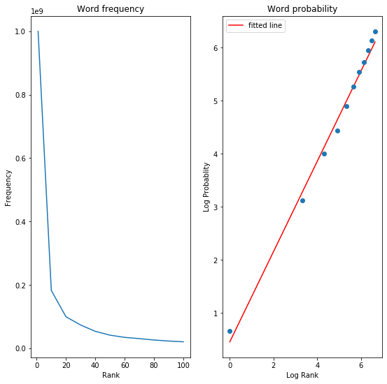

# Statistical testing and fossil analysis: detecting patterns of high speciation in time and space

## Goals
#### 1. High speciation rates: when and where we observe a lot of first occurrences




#### 2. Sampling localities by 10x10 areas and dectect high speciation rates
#### 3. Logistic regression: what is a reasonable expectation for the proportion of first occurrences observed now given past sampling density
#### 4. Statistical testing alpha=0.05: if the observed number of first occurrences is significantly higher than what we would expect


## Attributes
- LONG and LAT give the longitude and latitude, respectively, of where a given fossil occurrence was found.
- MIN AGE and MAX AGE give an estimation of the age of the fossil (in millions of years).
- LIDNUM contains a unique identification number for each locality, where fossils have been found.
- GENUS and SPECIES give information on the taxonomic identification of the fossil.


```python
import pandas as pd
```


```python
data = pd.read_csv('NOW_public_030717.csv')
```


```python
data
```


<div>
<style scoped>
    .dataframe tbody tr th:only-of-type {
        vertical-align: middle;
    }

    .dataframe tbody tr th {
        vertical-align: top;
    }

    .dataframe thead th {
        text-align: right;
    }
</style>
<table border="1" class="dataframe">
  <thead>
    <tr style="text-align: right;">
      <th></th>
      <th>LIDNUM</th>
      <th>NAME</th>
      <th>LATSTR</th>
      <th>LAT</th>
      <th>LONGSTR</th>
      <th>LONG</th>
      <th>MAX_AGE</th>
      <th>BFA_MAX</th>
      <th>FRAC_MAX</th>
      <th>MIN_AGE</th>
      <th>...</th>
      <th>TSHM</th>
      <th>TCRWNHT</th>
      <th>CROWNTYP</th>
      <th>DIET_1</th>
      <th>DIET_2</th>
      <th>DIET_3</th>
      <th>LOCOMO1</th>
      <th>LOCOMO2</th>
      <th>LOCOMO3</th>
      <th>SIDNUM</th>
    </tr>
  </thead>
  <tbody>
    <tr>
      <th>0</th>
      <td>20001</td>
      <td>Steinheim</td>
      <td>48 42 0 N</td>
      <td>48.700001</td>
      <td>10 3 0 E</td>
      <td>10.050000</td>
      <td>12.500000</td>
      <td>MN7-8</td>
      <td>.</td>
      <td>11.2</td>
      <td>...</td>
      <td>cso</td>
      <td>.</td>
      <td>.</td>
      <td>a</td>
      <td>carnivore</td>
      <td>m/bone</td>
      <td>te</td>
      <td>surficial</td>
      <td>gen_quad</td>
      <td>20001</td>
    </tr>
    <tr>
      <th>1</th>
      <td>20001</td>
      <td>Steinheim</td>
      <td>48 42 0 N</td>
      <td>48.700001</td>
      <td>10 3 0 E</td>
      <td>10.050000</td>
      <td>12.500000</td>
      <td>MN7-8</td>
      <td>.</td>
      <td>11.2</td>
      <td>...</td>
      <td>csp</td>
      <td>.</td>
      <td>.</td>
      <td>a</td>
      <td>carnivore</td>
      <td>meat_only</td>
      <td>te</td>
      <td>scansorial</td>
      <td>gen_quad</td>
      <td>20007</td>
    </tr>
    <tr>
      <th>2</th>
      <td>20001</td>
      <td>Steinheim</td>
      <td>48 42 0 N</td>
      <td>48.700001</td>
      <td>10 3 0 E</td>
      <td>10.050000</td>
      <td>12.500000</td>
      <td>MN7-8</td>
      <td>.</td>
      <td>11.2</td>
      <td>...</td>
      <td>csp</td>
      <td>.</td>
      <td>.</td>
      <td>a</td>
      <td>carnivore</td>
      <td>meat_only</td>
      <td>te</td>
      <td>scansorial</td>
      <td>gen_quad</td>
      <td>20008</td>
    </tr>
    <tr>
      <th>3</th>
      <td>20001</td>
      <td>Steinheim</td>
      <td>48 42 0 N</td>
      <td>48.700001</td>
      <td>10 3 0 E</td>
      <td>10.050000</td>
      <td>12.500000</td>
      <td>MN7-8</td>
      <td>.</td>
      <td>11.2</td>
      <td>...</td>
      <td>cso</td>
      <td>.</td>
      <td>.</td>
      <td>a</td>
      <td>carnivore</td>
      <td>m/bone</td>
      <td>te</td>
      <td>surficial</td>
      <td>gen_quad</td>
      <td>20010</td>
    </tr>
    <tr>
      <th>4</th>
      <td>20001</td>
      <td>Steinheim</td>
      <td>48 42 0 N</td>
      <td>48.700001</td>
      <td>10 3 0 E</td>
      <td>10.050000</td>
      <td>12.500000</td>
      <td>MN7-8</td>
      <td>.</td>
      <td>11.2</td>
      <td>...</td>
      <td>cso</td>
      <td>.</td>
      <td>.</td>
      <td>a</td>
      <td>carnivore</td>
      <td>.</td>
      <td>.</td>
      <td>.</td>
      <td>.</td>
      <td>20011</td>
    </tr>
    <tr>
      <th>...</th>
      <td>...</td>
      <td>...</td>
      <td>...</td>
      <td>...</td>
      <td>...</td>
      <td>...</td>
      <td>...</td>
      <td>...</td>
      <td>...</td>
      <td>...</td>
      <td>...</td>
      <td>...</td>
      <td>...</td>
      <td>...</td>
      <td>...</td>
      <td>...</td>
      <td>...</td>
      <td>...</td>
      <td>...</td>
      <td>...</td>
      <td>...</td>
    </tr>
    <tr>
      <th>14130</th>
      <td>22367</td>
      <td>Azambujeira inf.</td>
      <td>39 16 0 N</td>
      <td>39.266666</td>
      <td>8 47 0 W</td>
      <td>-8.783334</td>
      <td>11.200000</td>
      <td>MN 9</td>
      <td>.</td>
      <td>9.5</td>
      <td>...</td>
      <td>bun</td>
      <td>bra</td>
      <td>R2200</td>
      <td>o</td>
      <td>omnivore</td>
      <td>plant_dom</td>
      <td>te</td>
      <td>surficial</td>
      <td>gen_quad</td>
      <td>20207</td>
    </tr>
    <tr>
      <th>14131</th>
      <td>22367</td>
      <td>Azambujeira inf.</td>
      <td>39 16 0 N</td>
      <td>39.266666</td>
      <td>8 47 0 W</td>
      <td>-8.783334</td>
      <td>11.200000</td>
      <td>MN 9</td>
      <td>.</td>
      <td>9.5</td>
      <td>...</td>
      <td>bun</td>
      <td>bra</td>
      <td>R2200</td>
      <td>o</td>
      <td>omnivore</td>
      <td>plant_dom</td>
      <td>te</td>
      <td>surficial</td>
      <td>gen_quad</td>
      <td>25805</td>
    </tr>
    <tr>
      <th>14132</th>
      <td>22371</td>
      <td>Moheda</td>
      <td>40 05 00 N</td>
      <td>40.083332</td>
      <td>02 43 00 W</td>
      <td>-2.716667</td>
      <td>22.799999</td>
      <td>MN 2</td>
      <td>.</td>
      <td>20.0</td>
      <td>...</td>
      <td>.</td>
      <td>.</td>
      <td>.</td>
      <td>.</td>
      <td>.</td>
      <td>.</td>
      <td>te</td>
      <td>.</td>
      <td>.</td>
      <td>25811</td>
    </tr>
    <tr>
      <th>14133</th>
      <td>22451</td>
      <td>Elisabethfeld</td>
      <td>27 00 0 S</td>
      <td>-27.000000</td>
      <td>15 14 0 E</td>
      <td>15.233334</td>
      <td>22.799999</td>
      <td>MN 2</td>
      <td>.</td>
      <td>20.0</td>
      <td>...</td>
      <td>.</td>
      <td>.</td>
      <td>L2220</td>
      <td>.</td>
      <td>.</td>
      <td>.</td>
      <td>te</td>
      <td>surficial</td>
      <td>.</td>
      <td>25846</td>
    </tr>
    <tr>
      <th>14134</th>
      <td>22451</td>
      <td>Elisabethfeld</td>
      <td>27 00 0 S</td>
      <td>-27.000000</td>
      <td>15 14 0 E</td>
      <td>15.233334</td>
      <td>22.799999</td>
      <td>MN 2</td>
      <td>.</td>
      <td>20.0</td>
      <td>...</td>
      <td>.</td>
      <td>.</td>
      <td>L2220</td>
      <td>.</td>
      <td>.</td>
      <td>.</td>
      <td>te</td>
      <td>surficial</td>
      <td>.</td>
      <td>25848</td>
    </tr>
  </tbody>
</table>
<p>14135 rows × 37 columns</p>
</div>


### Data Pre-processing

#### Remove all rows where LAT = LONG = 0; these occurrences have incorrect coordinates. Drop rows where SPECIES is “sp.” or “indet.”; these occurrences have not been properly identified.


```python
data = data[(data['LAT'] != 0) & (data['LONG'] != 0) &
           (data['SPECIES'] != 'sp.') & (data['SPECIES'] != 'indet.')]
```

#### Assign each occurrence to a specific Mammal Neogene (MN) time unit


```python
mn = (data['MIN_AGE'] + data['MAX_AGE'])/2
data['MEAN_AGE'] = mn

mn = pd.cut(mn, 
            bins=[0, 0.01, 0.85, 1.9, 2.5, 3.55, 5, 5.3, 7.1, 7.6, 8.9, 9.9, 11.2, 12.85, 14.2, 16.4, 17.2, 19.5, 21.7, 23, 50], 
            include_lowest=True,
            labels=['post-MN', 'MQ19', 'MQ18', 'MN17', 'MN16', 'MN15', 'MN14', 'MN13', 'MN12', 'MN11', 'MN10', 'MN9', 'MN7-8', 'MN6', 'MN5', 'MN4', 'MN3', 'MN2', 'MN1', 'pre-MN'])
data['MN'] = mn
```

    /Users/MimiHMB/anaconda3/lib/python3.7/site-packages/ipykernel_launcher.py:2: SettingWithCopyWarning: 
    A value is trying to be set on a copy of a slice from a DataFrame.
    Try using .loc[row_indexer,col_indexer] = value instead
    
    See the caveats in the documentation: https://pandas.pydata.org/pandas-docs/stable/user_guide/indexing.html#returning-a-view-versus-a-copy
      
    /Users/MimiHMB/anaconda3/lib/python3.7/site-packages/ipykernel_launcher.py:8: SettingWithCopyWarning: 
    A value is trying to be set on a copy of a slice from a DataFrame.
    Try using .loc[row_indexer,col_indexer] = value instead
    
    See the caveats in the documentation: https://pandas.pydata.org/pandas-docs/stable/user_guide/indexing.html#returning-a-view-versus-a-copy
      


```python
data[['MEAN_AGE', 'MN']]
```


<div>
<style scoped>
    .dataframe tbody tr th:only-of-type {
        vertical-align: middle;
    }

    .dataframe tbody tr th {
        vertical-align: top;
    }

    .dataframe thead th {
        text-align: right;
    }
</style>
<table border="1" class="dataframe">
  <thead>
    <tr style="text-align: right;">
      <th></th>
      <th>MEAN_AGE</th>
      <th>MN</th>
    </tr>
  </thead>
  <tbody>
    <tr>
      <th>0</th>
      <td>11.850000</td>
      <td>MN7-8</td>
    </tr>
    <tr>
      <th>1</th>
      <td>11.850000</td>
      <td>MN7-8</td>
    </tr>
    <tr>
      <th>2</th>
      <td>11.850000</td>
      <td>MN7-8</td>
    </tr>
    <tr>
      <th>3</th>
      <td>11.850000</td>
      <td>MN7-8</td>
    </tr>
    <tr>
      <th>4</th>
      <td>11.850000</td>
      <td>MN7-8</td>
    </tr>
    <tr>
      <th>...</th>
      <td>...</td>
      <td>...</td>
    </tr>
    <tr>
      <th>14130</th>
      <td>10.350000</td>
      <td>MN9</td>
    </tr>
    <tr>
      <th>14131</th>
      <td>10.350000</td>
      <td>MN9</td>
    </tr>
    <tr>
      <th>14132</th>
      <td>21.399999</td>
      <td>MN2</td>
    </tr>
    <tr>
      <th>14133</th>
      <td>21.399999</td>
      <td>MN2</td>
    </tr>
    <tr>
      <th>14134</th>
      <td>21.399999</td>
      <td>MN2</td>
    </tr>
  </tbody>
</table>
<p>10248 rows × 2 columns</p>
</div>


```python
data.loc[data[data['NAME'] == 'Samos Main Bone Beds'].index.to_list(), 'MN'] = 'MN12'
data.loc[data[data['NAME'] == 'Can Llobateres I'].index.to_list(), 'MN'] = 'MN9'
```

    /Users/MimiHMB/anaconda3/lib/python3.7/site-packages/pandas/core/indexing.py:966: SettingWithCopyWarning: 
    A value is trying to be set on a copy of a slice from a DataFrame.
    Try using .loc[row_indexer,col_indexer] = value instead
    
    See the caveats in the documentation: https://pandas.pydata.org/pandas-docs/stable/user_guide/indexing.html#returning-a-view-versus-a-copy
      self.obj[item] = s


#### Identify all occurrences of each species, and assign an unique identification number for each unique combination of GENUS and SPECIES


```python
combined = data['GENUS'] + ' ' + data['SPECIES']
data['GS'] = combined

gs_id = 0
for i in combined.unique():
    data.loc[data[data['GS'] == i].index.to_list(), 'GS_ID'] = 'GS' + str(gs_id)
    gs_id += 1
```

    /Users/MimiHMB/anaconda3/lib/python3.7/site-packages/ipykernel_launcher.py:2: SettingWithCopyWarning: 
    A value is trying to be set on a copy of a slice from a DataFrame.
    Try using .loc[row_indexer,col_indexer] = value instead
    
    See the caveats in the documentation: https://pandas.pydata.org/pandas-docs/stable/user_guide/indexing.html#returning-a-view-versus-a-copy
      
    /Users/MimiHMB/anaconda3/lib/python3.7/site-packages/pandas/core/indexing.py:845: SettingWithCopyWarning: 
    A value is trying to be set on a copy of a slice from a DataFrame.
    Try using .loc[row_indexer,col_indexer] = value instead
    
    See the caveats in the documentation: https://pandas.pydata.org/pandas-docs/stable/user_guide/indexing.html#returning-a-view-versus-a-copy
      self.obj[key] = _infer_fill_value(value)
    /Users/MimiHMB/anaconda3/lib/python3.7/site-packages/pandas/core/indexing.py:966: SettingWithCopyWarning: 
    A value is trying to be set on a copy of a slice from a DataFrame.
    Try using .loc[row_indexer,col_indexer] = value instead
    
    See the caveats in the documentation: https://pandas.pydata.org/pandas-docs/stable/user_guide/indexing.html#returning-a-view-versus-a-copy
      self.obj[item] = s


```python
data[['GS', 'GS_ID']]
```


<div>
<style scoped>
    .dataframe tbody tr th:only-of-type {
        vertical-align: middle;
    }

    .dataframe tbody tr th {
        vertical-align: top;
    }

    .dataframe thead th {
        text-align: right;
    }
</style>
<table border="1" class="dataframe">
  <thead>
    <tr style="text-align: right;">
      <th></th>
      <th>GS</th>
      <th>GS_ID</th>
    </tr>
  </thead>
  <tbody>
    <tr>
      <th>0</th>
      <td>Pseudocyon sansaniensis</td>
      <td>GS0</td>
    </tr>
    <tr>
      <th>1</th>
      <td>Pseudaelurus quadridentatus</td>
      <td>GS1</td>
    </tr>
    <tr>
      <th>2</th>
      <td>Pseudaelurus lorteti</td>
      <td>GS2</td>
    </tr>
    <tr>
      <th>3</th>
      <td>Pseudocyon steinheimensis</td>
      <td>GS3</td>
    </tr>
    <tr>
      <th>4</th>
      <td>Amphicyonopsis serus</td>
      <td>GS4</td>
    </tr>
    <tr>
      <th>...</th>
      <td>...</td>
      <td>...</td>
    </tr>
    <tr>
      <th>14130</th>
      <td>Propotamochoerus palaeochoerus</td>
      <td>GS267</td>
    </tr>
    <tr>
      <th>14131</th>
      <td>Conohyus cf. ebroensis</td>
      <td>GS3046</td>
    </tr>
    <tr>
      <th>14132</th>
      <td>Lorancahyus daamsi</td>
      <td>GS3048</td>
    </tr>
    <tr>
      <th>14133</th>
      <td>Propalaeoryx austroafricanus</td>
      <td>GS3034</td>
    </tr>
    <tr>
      <th>14134</th>
      <td>Sperrgebietomeryx wardi</td>
      <td>GS3049</td>
    </tr>
  </tbody>
</table>
<p>10248 rows × 2 columns</p>
</div>


#### Remove duplicate localities


```python
dup = list()

for i in data['NAME'].unique():
    a = data[data['NAME'] == i]['GS_ID'].value_counts()
    if a[a > 1].size != 0:
        b = a[a > 1].index.to_list()
        for n in b:
            c = data[(data['NAME'] == i) & (data['GS_ID'] == n)].count(axis=1)
            dup += c.sort_values().index[:-1].to_list()
            
dup
```


    [102,
     1573,
     3914,
     4730,
     6203,
     6235,
     6270,
     6991,
     9620,
     10172,
     10239,
     11582,
     11923,
     12716,
     13551]


```python
data.drop(dup, inplace=True)
```

    /Users/MimiHMB/anaconda3/lib/python3.7/site-packages/pandas/core/frame.py:3997: SettingWithCopyWarning: 
    A value is trying to be set on a copy of a slice from a DataFrame
    
    See the caveats in the documentation: https://pandas.pydata.org/pandas-docs/stable/user_guide/indexing.html#returning-a-view-versus-a-copy
      errors=errors,


### 1. High speciation rates: when and where we observe a lot of first occurrences
- Create a DataFrame that shows for each species how many occurrences it has in each time unit
- Create a different DataFrame that shows for each species the time unit when it is first observed (i.e. the oldest time unit). 
- For each time unit, calculate the proportion of first occurrences to all occurrences.


```python
summary_loc = data[['LIDNUM', 'GS_ID']].groupby('LIDNUM').count()
summary_loc.columns = ['TOTAL']
summary_loc['OLDEST_COUNT'] = 0

def summary(data, groupby_col):
    summary = data.pivot_table(index=groupby_col, columns='MN', aggfunc='size')
    summary_total = summary.sum(axis=0)
    
    '''
    print('For each species how many occurrences it has in each time unit:')
    print(summary)
    print('\n')
    '''
    
    return summary_total


def ratio(data, groupby_col):
    oldest = pd.DataFrame(pd.cut(data.groupby(groupby_col)['MEAN_AGE'].max(), 
            bins=[0, 0.01, 0.85, 1.9, 2.5, 3.55, 5, 5.3, 7.1, 7.6, 8.9, 9.9, 11.2, 12.85, 14.2, 16.4, 17.2, 19.5, 21.7, 23, 50], 
            include_lowest=True,
            labels=['post-MN', 'MQ19', 'MQ18', 'MN17', 'MN16', 'MN15', 'MN14', 'MN13', 'MN12', 'MN11', 'MN10', 'MN9', 'MN7-8', 'MN6', 'MN5', 'MN4', 'MN3', 'MN2', 'MN1', 'pre-MN']))
    oldest.columns = ['OLDEST_MN']
    for i in oldest.index:
        data_temp = data[(data['GS_ID'] == i) & (data['MN'] == oldest.loc[i]['OLDEST_MN'])]
        count = int(len(data_temp))
        oldest.loc[i, 'OLDEST_COUNT'] = count
        loc = data_temp['LIDNUM']

        for n in loc.values:
            summary_loc.loc[n, 'OLDEST_COUNT'] += 1
    
    summary_oldest = oldest.pivot_table(index='OLDEST_MN', values='OLDEST_COUNT', aggfunc='sum')
    output = summary_oldest['OLDEST_COUNT']/summary(data, groupby_col)
    
    '''
    print('For each species the time unit when it is first observed:')
    print(oldest)
    print('\n')
    
    print('For each time what is the proportion of first occurrences to all occurrences')
    print(output)
    '''
    
    return output
```


```python
ratio_mn = ratio(data, 'GS_ID')
ratio_mn
```


    OLDEST_MN
    post-MN    0.000000
    MQ19       0.527027
    MQ18       0.517341
    MN17       0.230563
    MN16       0.573810
    MN15       0.659011
    MN14       0.250000
    MN13       0.472527
    MN12       0.171429
    MN11       0.441199
    MN10       0.474886
    MN9        0.366146
    MN7-8      0.412844
    MN6        0.248722
    MN5        0.424865
    MN4        0.516588
    MN3        0.862408
    MN2        0.613014
    MN1        0.506329
    pre-MN     1.000000
    dtype: float64


```python
summary_total = summary(data, 'GS_ID')
summary_total_norm = (summary_total - summary_total.min())/(summary_total.max() - summary_total.min())
summary_total
```


    MN
    post-MN       4
    MQ19        518
    MQ18        346
    MN17        373
    MN16        840
    MN15       1132
    MN14         12
    MN13        728
    MN12         35
    MN11       1301
    MN10        438
    MN9         833
    MN7-8       545
    MN6         587
    MN5         925
    MN4         211
    MN3         814
    MN2         292
    MN1          79
    pre-MN      220
    dtype: int64


```python
import matplotlib
import matplotlib.pyplot as plt

fig = plt.figure(figsize=(15, 5))
ax = fig.add_subplot(111)
ax.plot(ratio_mn)
ax.plot(summary_total_norm)
plt.legend(['proportion of first occurrences', 'total occurrences'])
plt.show()
```


### 2. Sampling localities by 10x10 areas and dectect high speciation rates

#### Create a DataFrame that collects the following information for every locality: locality number (LIDNUM), longitude, latitude, time unit, number of first occurrences in the locality, number of all occurrences in the locality and proportion of first occurrences in the locality.


```python
summary_loc['RATIO'] = summary_loc['OLDEST_COUNT']/summary_loc['TOTAL']

for i in summary_loc.index:
    summary_loc.loc[i, 'LAT'] = data.loc[data['LIDNUM'] == i, 'LAT'].head(1).values[0]
    summary_loc.loc[i, 'LONG'] = data.loc[data['LIDNUM'] == i, 'LONG'].head(1).values[0]
    summary_loc.loc[i, 'MN'] = data.loc[data['LIDNUM'] == i, 'MN'].head(1).values[0]
```


```python
summary_loc
```


<div>
<style scoped>
    .dataframe tbody tr th:only-of-type {
        vertical-align: middle;
    }

    .dataframe tbody tr th {
        vertical-align: top;
    }

    .dataframe thead th {
        text-align: right;
    }
</style>
<table border="1" class="dataframe">
  <thead>
    <tr style="text-align: right;">
      <th></th>
      <th>TOTAL</th>
      <th>OLDEST_COUNT</th>
      <th>RATIO</th>
      <th>LAT</th>
      <th>LONG</th>
      <th>MN</th>
    </tr>
    <tr>
      <th>LIDNUM</th>
      <th></th>
      <th></th>
      <th></th>
      <th></th>
      <th></th>
      <th></th>
    </tr>
  </thead>
  <tbody>
    <tr>
      <th>20001</th>
      <td>51</td>
      <td>10</td>
      <td>0.196078</td>
      <td>48.700001</td>
      <td>10.050000</td>
      <td>MN7-8</td>
    </tr>
    <tr>
      <th>20002</th>
      <td>70</td>
      <td>20</td>
      <td>0.285714</td>
      <td>43.900002</td>
      <td>-0.500000</td>
      <td>MN6</td>
    </tr>
    <tr>
      <th>20003</th>
      <td>36</td>
      <td>29</td>
      <td>0.805556</td>
      <td>40.000000</td>
      <td>28.500000</td>
      <td>MN5</td>
    </tr>
    <tr>
      <th>20005</th>
      <td>20</td>
      <td>3</td>
      <td>0.150000</td>
      <td>48.099998</td>
      <td>2.150000</td>
      <td>MN5</td>
    </tr>
    <tr>
      <th>20006</th>
      <td>25</td>
      <td>22</td>
      <td>0.880000</td>
      <td>48.099998</td>
      <td>1.900000</td>
      <td>MN3</td>
    </tr>
    <tr>
      <th>...</th>
      <td>...</td>
      <td>...</td>
      <td>...</td>
      <td>...</td>
      <td>...</td>
      <td>...</td>
    </tr>
    <tr>
      <th>22365</th>
      <td>2</td>
      <td>2</td>
      <td>1.000000</td>
      <td>40.299999</td>
      <td>-2.283333</td>
      <td>MN3</td>
    </tr>
    <tr>
      <th>22366</th>
      <td>1</td>
      <td>1</td>
      <td>1.000000</td>
      <td>40.299999</td>
      <td>-2.283333</td>
      <td>MN3</td>
    </tr>
    <tr>
      <th>22367</th>
      <td>3</td>
      <td>1</td>
      <td>0.333333</td>
      <td>39.266666</td>
      <td>-8.783334</td>
      <td>MN9</td>
    </tr>
    <tr>
      <th>22371</th>
      <td>1</td>
      <td>1</td>
      <td>1.000000</td>
      <td>40.083332</td>
      <td>-2.716667</td>
      <td>MN2</td>
    </tr>
    <tr>
      <th>22451</th>
      <td>2</td>
      <td>2</td>
      <td>1.000000</td>
      <td>-27.000000</td>
      <td>15.233334</td>
      <td>MN2</td>
    </tr>
  </tbody>
</table>
<p>1418 rows × 6 columns</p>
</div>


```python
import geopandas

world = (geopandas.read_file(geopandas.datasets.get_path('naturalearth_lowres')))
```


```python
from shapely.geometry import Point, Polygon

geo_df = geopandas.GeoDataFrame(summary_loc, crs={'init': 'epsg:4326'}, geometry=[Point(xy) for xy in zip(summary_loc['LONG'], summary_loc['LAT'])])
```

    /Users/MimiHMB/anaconda3/lib/python3.7/site-packages/pyproj/crs/crs.py:53: FutureWarning: '+init=<authority>:<code>' syntax is deprecated. '<authority>:<code>' is the preferred initialization method. When making the change, be mindful of axis order changes: https://pyproj4.github.io/pyproj/stable/gotchas.html#axis-order-changes-in-proj-6
      return _prepare_from_string(" ".join(pjargs))


```python
fig, ax = plt.subplots(figsize=(20, 20))
world.plot(ax=ax, color='wheat', edgecolor='black')
geo_df.plot(ax=ax, markersize='TOTAL', color='blue', marker='o')
ax.set_facecolor('azure')
plt.savefig('loc_total_occ')
```


```python
fig = plt.figure(figsize=(15, 5))
ax = fig.add_subplot(111)
ax.plot(summary_loc['TOTAL'])
plt.show()
```


#### For each locality, 
- look at a ten by ten degrees area (in latitude and longitude) centered around the locality
- record the total number of occurrences and total number of first occurrences found within that square in the time unit corresponding to the focal locality
- record the total number of occurrences within that square in the preceding time unit (relative to the focal locality)


```python
summary_loc_1010 = summary_loc.iloc[:, :-1]

labels = ['post-MN', 'MQ19', 'MQ18', 'MN17', 'MN16', 'MN15', 'MN14', 
          'MN13', 'MN12', 'MN11', 'MN10', 'MN9', 'MN7-8', 'MN6', 'MN5', 
          'MN4', 'MN3', 'MN2', 'MN1', 'pre-MN']

for i in summary_loc_1010.index:
    summary_loc_1010.loc[i, 'LAT+5'] = summary_loc_1010.loc[i, 'LAT'] + 5
    summary_loc_1010.loc[i, 'LAT-5'] = summary_loc_1010.loc[i, 'LAT'] - 5
    summary_loc_1010.loc[i, 'LONG+5'] = summary_loc_1010.loc[i, 'LONG'] + 5
    summary_loc_1010.loc[i, 'LONG-5'] = summary_loc_1010.loc[i, 'LONG'] - 5
    
    index = labels.index(summary_loc_1010.loc[i, 'MN'])
    temp_data = summary_loc_1010[(summary_loc_1010['LAT'] <= summary_loc_1010.loc[i, 'LAT+5']) &
                (summary_loc_1010['LAT'] >= summary_loc_1010.loc[i, 'LAT-5']) &
                (summary_loc_1010['LONG'] <= summary_loc_1010.loc[i, 'LONG+5']) &
                (summary_loc_1010['LONG'] >= summary_loc_1010.loc[i, 'LONG-5'])]
    summary_loc_1010.loc[i, 'TOTAL_10'] = temp_data['TOTAL'].sum()
    summary_loc_1010.loc[i, 'OLDEST_COUNT_10'] = temp_data['OLDEST_COUNT'].sum()
    
    if (index != 0):
        if (index < len(labels) - 1):
            pre_mn = labels[index + 1]
        else:
            pre_mn = labels[-1]
    else:
        pre_mn = labels[0]
        
    temp_data_2 = temp_data[temp_data['MN'] == pre_mn]
    summary_loc_1010.loc[i, 'PRE_MN'] = pre_mn
    summary_loc_1010.loc[i, 'TOTAL_PRE'] = temp_data_2['TOTAL'].sum()
    summary_loc_1010.loc[i, 'OLDEST_COUNT_PRE'] = temp_data_2['OLDEST_COUNT'].sum()
```


```python
summary_loc_1010.iloc[:, [0, 1, -5, -4, -2, -1]]
```


<div>
<style scoped>
    .dataframe tbody tr th:only-of-type {
        vertical-align: middle;
    }

    .dataframe tbody tr th {
        vertical-align: top;
    }

    .dataframe thead th {
        text-align: right;
    }
</style>
<table border="1" class="dataframe">
  <thead>
    <tr style="text-align: right;">
      <th></th>
      <th>TOTAL</th>
      <th>OLDEST_COUNT</th>
      <th>TOTAL_10</th>
      <th>OLDEST_COUNT_10</th>
      <th>TOTAL_PRE</th>
      <th>OLDEST_COUNT_PRE</th>
    </tr>
    <tr>
      <th>LIDNUM</th>
      <th></th>
      <th></th>
      <th></th>
      <th></th>
      <th></th>
      <th></th>
    </tr>
  </thead>
  <tbody>
    <tr>
      <th>20001</th>
      <td>51</td>
      <td>10</td>
      <td>2021.0</td>
      <td>882.0</td>
      <td>214.0</td>
      <td>31.0</td>
    </tr>
    <tr>
      <th>20002</th>
      <td>70</td>
      <td>20</td>
      <td>2863.0</td>
      <td>1375.0</td>
      <td>261.0</td>
      <td>77.0</td>
    </tr>
    <tr>
      <th>20003</th>
      <td>36</td>
      <td>29</td>
      <td>858.0</td>
      <td>463.0</td>
      <td>0.0</td>
      <td>0.0</td>
    </tr>
    <tr>
      <th>20005</th>
      <td>20</td>
      <td>3</td>
      <td>1761.0</td>
      <td>769.0</td>
      <td>70.0</td>
      <td>42.0</td>
    </tr>
    <tr>
      <th>20006</th>
      <td>25</td>
      <td>22</td>
      <td>1725.0</td>
      <td>746.0</td>
      <td>159.0</td>
      <td>99.0</td>
    </tr>
    <tr>
      <th>...</th>
      <td>...</td>
      <td>...</td>
      <td>...</td>
      <td>...</td>
      <td>...</td>
      <td>...</td>
    </tr>
    <tr>
      <th>22365</th>
      <td>2</td>
      <td>2</td>
      <td>2344.0</td>
      <td>1137.0</td>
      <td>69.0</td>
      <td>50.0</td>
    </tr>
    <tr>
      <th>22366</th>
      <td>1</td>
      <td>1</td>
      <td>2344.0</td>
      <td>1137.0</td>
      <td>69.0</td>
      <td>50.0</td>
    </tr>
    <tr>
      <th>22367</th>
      <td>3</td>
      <td>1</td>
      <td>219.0</td>
      <td>96.0</td>
      <td>11.0</td>
      <td>4.0</td>
    </tr>
    <tr>
      <th>22371</th>
      <td>1</td>
      <td>1</td>
      <td>2327.0</td>
      <td>1131.0</td>
      <td>0.0</td>
      <td>0.0</td>
    </tr>
    <tr>
      <th>22451</th>
      <td>2</td>
      <td>2</td>
      <td>16.0</td>
      <td>16.0</td>
      <td>0.0</td>
      <td>0.0</td>
    </tr>
  </tbody>
</table>
<p>1418 rows × 6 columns</p>
</div>


```python
summary_loc_1010.iloc[:, [0, 1, -5, -4, -2, -1]].describe()
```


<div>
<style scoped>
    .dataframe tbody tr th:only-of-type {
        vertical-align: middle;
    }

    .dataframe tbody tr th {
        vertical-align: top;
    }

    .dataframe thead th {
        text-align: right;
    }
</style>
<table border="1" class="dataframe">
  <thead>
    <tr style="text-align: right;">
      <th></th>
      <th>TOTAL</th>
      <th>OLDEST_COUNT</th>
      <th>TOTAL_10</th>
      <th>OLDEST_COUNT_10</th>
      <th>TOTAL_PRE</th>
      <th>OLDEST_COUNT_PRE</th>
    </tr>
  </thead>
  <tbody>
    <tr>
      <th>count</th>
      <td>1418.000000</td>
      <td>1418.000000</td>
      <td>1418.000000</td>
      <td>1418.000000</td>
      <td>1418.000000</td>
      <td>1418.000000</td>
    </tr>
    <tr>
      <th>mean</th>
      <td>7.216502</td>
      <td>3.681241</td>
      <td>1433.684062</td>
      <td>676.825811</td>
      <td>78.433004</td>
      <td>37.643159</td>
    </tr>
    <tr>
      <th>std</th>
      <td>9.568552</td>
      <td>5.659967</td>
      <td>1027.140349</td>
      <td>464.465819</td>
      <td>97.701041</td>
      <td>49.187365</td>
    </tr>
    <tr>
      <th>min</th>
      <td>1.000000</td>
      <td>0.000000</td>
      <td>2.000000</td>
      <td>1.000000</td>
      <td>0.000000</td>
      <td>0.000000</td>
    </tr>
    <tr>
      <th>25%</th>
      <td>1.000000</td>
      <td>1.000000</td>
      <td>504.000000</td>
      <td>241.500000</td>
      <td>2.000000</td>
      <td>0.000000</td>
    </tr>
    <tr>
      <th>50%</th>
      <td>3.000000</td>
      <td>1.000000</td>
      <td>1250.000000</td>
      <td>612.000000</td>
      <td>45.500000</td>
      <td>19.000000</td>
    </tr>
    <tr>
      <th>75%</th>
      <td>9.000000</td>
      <td>4.000000</td>
      <td>2357.000000</td>
      <td>1102.750000</td>
      <td>118.000000</td>
      <td>58.000000</td>
    </tr>
    <tr>
      <th>max</th>
      <td>74.000000</td>
      <td>54.000000</td>
      <td>3282.000000</td>
      <td>1529.000000</td>
      <td>489.000000</td>
      <td>316.000000</td>
    </tr>
  </tbody>
</table>
</div>


### 3. Logistic regression: what is a reasonable expectation for the proportion of first occurrences observed now given past sampling density

#### Create the regression data set, but only use localities in Europe
- Each row in the array represents one occurrence. 
- For each occurrence, the first column of the data frame is the number of occurrences in the focal area in the previous time unit. 
- For the second column, 1 for a first occurrence and 0 for other occurrences


```python
data_7 = data[(-25 < data['LONG']) & (data['LONG'] > 35) & (data['MN'] != 'MN1') & (data['MN'] != 'post-MN') & (data['MN'] != 'pre-MN')]
pre_df = summary_loc_1010.reset_index()[['LIDNUM', 'TOTAL_10', 'OLDEST_COUNT_10', 'TOTAL_PRE']]
regression = data_7.merge(pre_df, on='LIDNUM', suffixes='_2')
```


```python
def oldest_occ(data, groupby_col):
    oldest = pd.DataFrame(pd.cut(data.groupby(groupby_col)['MEAN_AGE'].max(), 
            bins=[0, 0.01, 0.85, 1.9, 2.5, 3.55, 5, 5.3, 7.1, 7.6, 8.9, 9.9, 11.2, 12.85, 14.2, 16.4, 17.2, 19.5, 21.7, 23, 50], 
            include_lowest=True,
            labels=['post-MN', 'MQ19', 'MQ18', 'MN17', 'MN16', 'MN15', 'MN14', 'MN13', 'MN12', 'MN11', 'MN10', 'MN9', 'MN7-8', 'MN6', 'MN5', 'MN4', 'MN3', 'MN2', 'MN1', 'pre-MN']))
    oldest.columns = ['OLDEST_MN']
    
    return oldest
```


```python
oldest_occ_df = oldest_occ(data_7, 'GS_ID').reset_index()
regression = regression.merge(oldest_occ_df, on='GS_ID', suffixes='_2')
regression['OLDEST_CHECK'] = regression['MN'] == regression['OLDEST_MN']
regression['OLDEST_CHECK'] = regression['OLDEST_CHECK'].astype('int')
```


```python
regression
```


<div>
<style scoped>
    .dataframe tbody tr th:only-of-type {
        vertical-align: middle;
    }

    .dataframe tbody tr th {
        vertical-align: top;
    }

    .dataframe thead th {
        text-align: right;
    }
</style>
<table border="1" class="dataframe">
  <thead>
    <tr style="text-align: right;">
      <th></th>
      <th>LIDNUM</th>
      <th>NAME</th>
      <th>LATSTR</th>
      <th>LAT</th>
      <th>LONGSTR</th>
      <th>LONG</th>
      <th>MAX_AGE</th>
      <th>BFA_MAX</th>
      <th>FRAC_MAX</th>
      <th>MIN_AGE</th>
      <th>...</th>
      <th>SIDNUM</th>
      <th>MEAN_AGE</th>
      <th>MN</th>
      <th>GS</th>
      <th>GS_ID</th>
      <th>TOTAL_10</th>
      <th>OLDEST_COUNT_10</th>
      <th>TOTAL_PRE</th>
      <th>OLDEST_MN</th>
      <th>OLDEST_CHECK</th>
    </tr>
  </thead>
  <tbody>
    <tr>
      <th>0</th>
      <td>20024</td>
      <td>Maragheh</td>
      <td>37 21 00 N</td>
      <td>37.349998</td>
      <td>46 07 00 E</td>
      <td>46.116665</td>
      <td>9.0</td>
      <td>MN 11</td>
      <td>.</td>
      <td>7.1</td>
      <td>...</td>
      <td>20131</td>
      <td>8.05</td>
      <td>MN11</td>
      <td>Indarctos atticus</td>
      <td>GS371</td>
      <td>147.0</td>
      <td>70.0</td>
      <td>23.0</td>
      <td>MN11</td>
      <td>1</td>
    </tr>
    <tr>
      <th>1</th>
      <td>20024</td>
      <td>Maragheh</td>
      <td>37 21 00 N</td>
      <td>37.349998</td>
      <td>46 07 00 E</td>
      <td>46.116665</td>
      <td>9.0</td>
      <td>MN 11</td>
      <td>.</td>
      <td>7.1</td>
      <td>...</td>
      <td>20132</td>
      <td>8.05</td>
      <td>MN11</td>
      <td>Parataxidea maraghana</td>
      <td>GS372</td>
      <td>147.0</td>
      <td>70.0</td>
      <td>23.0</td>
      <td>MN11</td>
      <td>1</td>
    </tr>
    <tr>
      <th>2</th>
      <td>20462</td>
      <td>Middle Maragheh</td>
      <td>38 0 0 N</td>
      <td>38.000000</td>
      <td>46 0 0 E</td>
      <td>46.000000</td>
      <td>8.2</td>
      <td>MN 12</td>
      <td>.</td>
      <td>7.1</td>
      <td>...</td>
      <td>20132</td>
      <td>7.65</td>
      <td>MN11</td>
      <td>Parataxidea maraghana</td>
      <td>GS372</td>
      <td>147.0</td>
      <td>70.0</td>
      <td>23.0</td>
      <td>MN11</td>
      <td>1</td>
    </tr>
    <tr>
      <th>3</th>
      <td>20024</td>
      <td>Maragheh</td>
      <td>37 21 00 N</td>
      <td>37.349998</td>
      <td>46 07 00 E</td>
      <td>46.116665</td>
      <td>9.0</td>
      <td>MN 11</td>
      <td>.</td>
      <td>7.1</td>
      <td>...</td>
      <td>20138</td>
      <td>8.05</td>
      <td>MN11</td>
      <td>Metailurus major</td>
      <td>GS332</td>
      <td>147.0</td>
      <td>70.0</td>
      <td>23.0</td>
      <td>MN11</td>
      <td>1</td>
    </tr>
    <tr>
      <th>4</th>
      <td>20024</td>
      <td>Maragheh</td>
      <td>37 21 00 N</td>
      <td>37.349998</td>
      <td>46 07 00 E</td>
      <td>46.116665</td>
      <td>9.0</td>
      <td>MN 11</td>
      <td>.</td>
      <td>7.1</td>
      <td>...</td>
      <td>20140</td>
      <td>8.05</td>
      <td>MN11</td>
      <td>Martes collongensis</td>
      <td>GS373</td>
      <td>147.0</td>
      <td>70.0</td>
      <td>23.0</td>
      <td>MN11</td>
      <td>1</td>
    </tr>
    <tr>
      <th>...</th>
      <td>...</td>
      <td>...</td>
      <td>...</td>
      <td>...</td>
      <td>...</td>
      <td>...</td>
      <td>...</td>
      <td>...</td>
      <td>...</td>
      <td>...</td>
      <td>...</td>
      <td>...</td>
      <td>...</td>
      <td>...</td>
      <td>...</td>
      <td>...</td>
      <td>...</td>
      <td>...</td>
      <td>...</td>
      <td>...</td>
      <td>...</td>
    </tr>
    <tr>
      <th>1243</th>
      <td>22307</td>
      <td>Loh</td>
      <td>45 15 00 N</td>
      <td>45.250000</td>
      <td>101 45 00 E</td>
      <td>101.750000</td>
      <td>28.0</td>
      <td>RMC</td>
      <td>.</td>
      <td>5.3</td>
      <td>...</td>
      <td>25697</td>
      <td>16.65</td>
      <td>MN4</td>
      <td>Heterosminthus firmus</td>
      <td>GS2999</td>
      <td>109.0</td>
      <td>96.0</td>
      <td>0.0</td>
      <td>MN4</td>
      <td>1</td>
    </tr>
    <tr>
      <th>1244</th>
      <td>22307</td>
      <td>Loh</td>
      <td>45 15 00 N</td>
      <td>45.250000</td>
      <td>101 45 00 E</td>
      <td>101.750000</td>
      <td>28.0</td>
      <td>RMC</td>
      <td>.</td>
      <td>5.3</td>
      <td>...</td>
      <td>25698</td>
      <td>16.65</td>
      <td>MN4</td>
      <td>Heterosminthus cf. firmus</td>
      <td>GS3000</td>
      <td>109.0</td>
      <td>96.0</td>
      <td>0.0</td>
      <td>MN4</td>
      <td>1</td>
    </tr>
    <tr>
      <th>1245</th>
      <td>22316</td>
      <td>Builstyn Khudag</td>
      <td>45 25 00 N</td>
      <td>45.416668</td>
      <td>101 30 00 E</td>
      <td>101.500000</td>
      <td>10.0</td>
      <td>RME</td>
      <td>.</td>
      <td>8.0</td>
      <td>...</td>
      <td>25700</td>
      <td>9.00</td>
      <td>MN10</td>
      <td>Heterosminthus gansus</td>
      <td>GS3005</td>
      <td>109.0</td>
      <td>96.0</td>
      <td>0.0</td>
      <td>MN10</td>
      <td>1</td>
    </tr>
    <tr>
      <th>1246</th>
      <td>22317</td>
      <td>Olon Ovoony Churem</td>
      <td>45 30 00 N</td>
      <td>45.500000</td>
      <td>101 10 00 E</td>
      <td>101.166664</td>
      <td>17.0</td>
      <td>RMD1</td>
      <td>.</td>
      <td>14.0</td>
      <td>...</td>
      <td>25699</td>
      <td>15.50</td>
      <td>MN5</td>
      <td>Heterosminthus mongoliensis</td>
      <td>GS3006</td>
      <td>76.0</td>
      <td>69.0</td>
      <td>9.0</td>
      <td>MN5</td>
      <td>1</td>
    </tr>
    <tr>
      <th>1247</th>
      <td>22318</td>
      <td>Ulaan Tolgoi</td>
      <td>45 15 00 N</td>
      <td>45.250000</td>
      <td>101 50 00 E</td>
      <td>101.833336</td>
      <td>17.0</td>
      <td>RMD1</td>
      <td>.</td>
      <td>14.0</td>
      <td>...</td>
      <td>25699</td>
      <td>15.50</td>
      <td>MN5</td>
      <td>Heterosminthus mongoliensis</td>
      <td>GS3006</td>
      <td>109.0</td>
      <td>96.0</td>
      <td>9.0</td>
      <td>MN5</td>
      <td>1</td>
    </tr>
  </tbody>
</table>
<p>1248 rows × 46 columns</p>
</div>


```python
regression_df = regression[['TOTAL_PRE', 'OLDEST_CHECK']]
```


```python
regression_df
```


<div>
<style scoped>
    .dataframe tbody tr th:only-of-type {
        vertical-align: middle;
    }

    .dataframe tbody tr th {
        vertical-align: top;
    }

    .dataframe thead th {
        text-align: right;
    }
</style>
<table border="1" class="dataframe">
  <thead>
    <tr style="text-align: right;">
      <th></th>
      <th>TOTAL_PRE</th>
      <th>OLDEST_CHECK</th>
    </tr>
  </thead>
  <tbody>
    <tr>
      <th>0</th>
      <td>23.0</td>
      <td>1</td>
    </tr>
    <tr>
      <th>1</th>
      <td>23.0</td>
      <td>1</td>
    </tr>
    <tr>
      <th>2</th>
      <td>23.0</td>
      <td>1</td>
    </tr>
    <tr>
      <th>3</th>
      <td>23.0</td>
      <td>1</td>
    </tr>
    <tr>
      <th>4</th>
      <td>23.0</td>
      <td>1</td>
    </tr>
    <tr>
      <th>...</th>
      <td>...</td>
      <td>...</td>
    </tr>
    <tr>
      <th>1243</th>
      <td>0.0</td>
      <td>1</td>
    </tr>
    <tr>
      <th>1244</th>
      <td>0.0</td>
      <td>1</td>
    </tr>
    <tr>
      <th>1245</th>
      <td>0.0</td>
      <td>1</td>
    </tr>
    <tr>
      <th>1246</th>
      <td>9.0</td>
      <td>1</td>
    </tr>
    <tr>
      <th>1247</th>
      <td>9.0</td>
      <td>1</td>
    </tr>
  </tbody>
</table>
<p>1248 rows × 2 columns</p>
</div>


```python
from sklearn.linear_model import LogisticRegression
from sklearn.model_selection import train_test_split

X_train, X_test, y_train, y_test = train_test_split(regression_df['TOTAL_PRE'], regression_df['OLDEST_CHECK'])
clf = LogisticRegression()
clf.fit(np.array(X_train).reshape(-1, 1), y_train)
```


    LogisticRegression(C=1.0, class_weight=None, dual=False, fit_intercept=True,
                       intercept_scaling=1, l1_ratio=None, max_iter=100,
                       multi_class='auto', n_jobs=None, penalty='l2',
                       random_state=None, solver='lbfgs', tol=0.0001, verbose=0,
                       warm_start=False)


```python
y_pred = clf.predict(np.array(X_test).reshape(-1, 1))
```


```python
from sklearn.metrics import accuracy_score

print('Baseline Accuracy score: {:.5f}'.format(accuracy_score(y_test, y_pred)))
```

    Baseline Accuracy score: 0.76923


```python
first_occ_pred = clf.predict(np.array(regression_df['TOTAL_PRE']).reshape(-1, 1))
```


```python
regression['OLDEST_PRED'] = first_occ_pred
```


```python
for i in regression.index:
    regression.loc[i, 'LAT+5'] = regression.loc[i, 'LAT'] + 5
    regression.loc[i, 'LAT-5'] = regression.loc[i, 'LAT'] - 5
    regression.loc[i, 'LONG+5'] = regression.loc[i, 'LONG'] + 5
    regression.loc[i, 'LONG-5'] = regression.loc[i, 'LONG'] - 5
    
    temp_data = regression[(regression['LAT'] <= regression.loc[i, 'LAT+5']) &
                (regression['LAT'] >= regression.loc[i, 'LAT-5']) &
                (regression['LONG'] <= regression.loc[i, 'LONG+5']) &
                (regression['LONG'] >= regression.loc[i, 'LONG-5'])]

    regression.loc[i, 'OLDEST_COUNT_10_PRED'] = temp_data.groupby('LIDNUM').sum()['OLDEST_PRED'].sum()
```


```python
regression
```


<div>
<style scoped>
    .dataframe tbody tr th:only-of-type {
        vertical-align: middle;
    }

    .dataframe tbody tr th {
        vertical-align: top;
    }

    .dataframe thead th {
        text-align: right;
    }
</style>
<table border="1" class="dataframe">
  <thead>
    <tr style="text-align: right;">
      <th></th>
      <th>LIDNUM</th>
      <th>NAME</th>
      <th>LATSTR</th>
      <th>LAT</th>
      <th>LONGSTR</th>
      <th>LONG</th>
      <th>MAX_AGE</th>
      <th>BFA_MAX</th>
      <th>FRAC_MAX</th>
      <th>MIN_AGE</th>
      <th>...</th>
      <th>OLDEST_COUNT_10</th>
      <th>TOTAL_PRE</th>
      <th>OLDEST_MN</th>
      <th>OLDEST_CHECK</th>
      <th>OLDEST_PRED</th>
      <th>LAT+5</th>
      <th>LAT-5</th>
      <th>LONG+5</th>
      <th>LONG-5</th>
      <th>OLDEST_COUNT_10_PRED</th>
    </tr>
  </thead>
  <tbody>
    <tr>
      <th>0</th>
      <td>20024</td>
      <td>Maragheh</td>
      <td>37 21 00 N</td>
      <td>37.349998</td>
      <td>46 07 00 E</td>
      <td>46.116665</td>
      <td>9.0</td>
      <td>MN 11</td>
      <td>.</td>
      <td>7.1</td>
      <td>...</td>
      <td>70.0</td>
      <td>23.0</td>
      <td>MN11</td>
      <td>1</td>
      <td>1</td>
      <td>42.349998</td>
      <td>32.349998</td>
      <td>51.116665</td>
      <td>41.116665</td>
      <td>147.0</td>
    </tr>
    <tr>
      <th>1</th>
      <td>20024</td>
      <td>Maragheh</td>
      <td>37 21 00 N</td>
      <td>37.349998</td>
      <td>46 07 00 E</td>
      <td>46.116665</td>
      <td>9.0</td>
      <td>MN 11</td>
      <td>.</td>
      <td>7.1</td>
      <td>...</td>
      <td>70.0</td>
      <td>23.0</td>
      <td>MN11</td>
      <td>1</td>
      <td>1</td>
      <td>42.349998</td>
      <td>32.349998</td>
      <td>51.116665</td>
      <td>41.116665</td>
      <td>147.0</td>
    </tr>
    <tr>
      <th>2</th>
      <td>20462</td>
      <td>Middle Maragheh</td>
      <td>38 0 0 N</td>
      <td>38.000000</td>
      <td>46 0 0 E</td>
      <td>46.000000</td>
      <td>8.2</td>
      <td>MN 12</td>
      <td>.</td>
      <td>7.1</td>
      <td>...</td>
      <td>70.0</td>
      <td>23.0</td>
      <td>MN11</td>
      <td>1</td>
      <td>1</td>
      <td>43.000000</td>
      <td>33.000000</td>
      <td>51.000000</td>
      <td>41.000000</td>
      <td>147.0</td>
    </tr>
    <tr>
      <th>3</th>
      <td>20024</td>
      <td>Maragheh</td>
      <td>37 21 00 N</td>
      <td>37.349998</td>
      <td>46 07 00 E</td>
      <td>46.116665</td>
      <td>9.0</td>
      <td>MN 11</td>
      <td>.</td>
      <td>7.1</td>
      <td>...</td>
      <td>70.0</td>
      <td>23.0</td>
      <td>MN11</td>
      <td>1</td>
      <td>1</td>
      <td>42.349998</td>
      <td>32.349998</td>
      <td>51.116665</td>
      <td>41.116665</td>
      <td>147.0</td>
    </tr>
    <tr>
      <th>4</th>
      <td>20024</td>
      <td>Maragheh</td>
      <td>37 21 00 N</td>
      <td>37.349998</td>
      <td>46 07 00 E</td>
      <td>46.116665</td>
      <td>9.0</td>
      <td>MN 11</td>
      <td>.</td>
      <td>7.1</td>
      <td>...</td>
      <td>70.0</td>
      <td>23.0</td>
      <td>MN11</td>
      <td>1</td>
      <td>1</td>
      <td>42.349998</td>
      <td>32.349998</td>
      <td>51.116665</td>
      <td>41.116665</td>
      <td>147.0</td>
    </tr>
    <tr>
      <th>...</th>
      <td>...</td>
      <td>...</td>
      <td>...</td>
      <td>...</td>
      <td>...</td>
      <td>...</td>
      <td>...</td>
      <td>...</td>
      <td>...</td>
      <td>...</td>
      <td>...</td>
      <td>...</td>
      <td>...</td>
      <td>...</td>
      <td>...</td>
      <td>...</td>
      <td>...</td>
      <td>...</td>
      <td>...</td>
      <td>...</td>
      <td>...</td>
    </tr>
    <tr>
      <th>1243</th>
      <td>22307</td>
      <td>Loh</td>
      <td>45 15 00 N</td>
      <td>45.250000</td>
      <td>101 45 00 E</td>
      <td>101.750000</td>
      <td>28.0</td>
      <td>RMC</td>
      <td>.</td>
      <td>5.3</td>
      <td>...</td>
      <td>96.0</td>
      <td>0.0</td>
      <td>MN4</td>
      <td>1</td>
      <td>1</td>
      <td>50.250000</td>
      <td>40.250000</td>
      <td>106.750000</td>
      <td>96.750000</td>
      <td>69.0</td>
    </tr>
    <tr>
      <th>1244</th>
      <td>22307</td>
      <td>Loh</td>
      <td>45 15 00 N</td>
      <td>45.250000</td>
      <td>101 45 00 E</td>
      <td>101.750000</td>
      <td>28.0</td>
      <td>RMC</td>
      <td>.</td>
      <td>5.3</td>
      <td>...</td>
      <td>96.0</td>
      <td>0.0</td>
      <td>MN4</td>
      <td>1</td>
      <td>1</td>
      <td>50.250000</td>
      <td>40.250000</td>
      <td>106.750000</td>
      <td>96.750000</td>
      <td>69.0</td>
    </tr>
    <tr>
      <th>1245</th>
      <td>22316</td>
      <td>Builstyn Khudag</td>
      <td>45 25 00 N</td>
      <td>45.416668</td>
      <td>101 30 00 E</td>
      <td>101.500000</td>
      <td>10.0</td>
      <td>RME</td>
      <td>.</td>
      <td>8.0</td>
      <td>...</td>
      <td>96.0</td>
      <td>0.0</td>
      <td>MN10</td>
      <td>1</td>
      <td>1</td>
      <td>50.416668</td>
      <td>40.416668</td>
      <td>106.500000</td>
      <td>96.500000</td>
      <td>69.0</td>
    </tr>
    <tr>
      <th>1246</th>
      <td>22317</td>
      <td>Olon Ovoony Churem</td>
      <td>45 30 00 N</td>
      <td>45.500000</td>
      <td>101 10 00 E</td>
      <td>101.166664</td>
      <td>17.0</td>
      <td>RMD1</td>
      <td>.</td>
      <td>14.0</td>
      <td>...</td>
      <td>69.0</td>
      <td>9.0</td>
      <td>MN5</td>
      <td>1</td>
      <td>1</td>
      <td>50.500000</td>
      <td>40.500000</td>
      <td>106.166664</td>
      <td>96.166664</td>
      <td>36.0</td>
    </tr>
    <tr>
      <th>1247</th>
      <td>22318</td>
      <td>Ulaan Tolgoi</td>
      <td>45 15 00 N</td>
      <td>45.250000</td>
      <td>101 50 00 E</td>
      <td>101.833336</td>
      <td>17.0</td>
      <td>RMD1</td>
      <td>.</td>
      <td>14.0</td>
      <td>...</td>
      <td>96.0</td>
      <td>9.0</td>
      <td>MN5</td>
      <td>1</td>
      <td>1</td>
      <td>50.250000</td>
      <td>40.250000</td>
      <td>106.833336</td>
      <td>96.833336</td>
      <td>69.0</td>
    </tr>
  </tbody>
</table>
<p>1248 rows × 52 columns</p>
</div>


### 4. Statistical testing with alpha=0.05: if the observed number of first occurrences is significantly higher than what we would expect

#### For each European locality, calculate the expected proportion of first occurrences in the focal area surrounding the locality using the logistic regression calculated


```python
stats = regression.groupby('LIDNUM').sum()[['TOTAL_10', 'OLDEST_COUNT_10', 'OLDEST_COUNT_10_PRED', 'TOTAL_PRE', 'OLDEST_CHECK', 'OLDEST_PRED']]
stats['RATIO'] = stats['OLDEST_COUNT_10']/stats['TOTAL_10']
stats['RATIO_PRED'] = stats['OLDEST_COUNT_10_PRED']/stats['TOTAL_10']
```


```python
stats
```


<div>
<style scoped>
    .dataframe tbody tr th:only-of-type {
        vertical-align: middle;
    }

    .dataframe tbody tr th {
        vertical-align: top;
    }

    .dataframe thead th {
        text-align: right;
    }
</style>
<table border="1" class="dataframe">
  <thead>
    <tr style="text-align: right;">
      <th></th>
      <th>TOTAL_10</th>
      <th>OLDEST_COUNT_10</th>
      <th>OLDEST_COUNT_10_PRED</th>
      <th>TOTAL_PRE</th>
      <th>OLDEST_CHECK</th>
      <th>OLDEST_PRED</th>
      <th>RATIO</th>
      <th>RATIO_PRED</th>
    </tr>
    <tr>
      <th>LIDNUM</th>
      <th></th>
      <th></th>
      <th></th>
      <th></th>
      <th></th>
      <th></th>
      <th></th>
      <th></th>
    </tr>
  </thead>
  <tbody>
    <tr>
      <th>20024</th>
      <td>2646.0</td>
      <td>1260.0</td>
      <td>2646.0</td>
      <td>414.0</td>
      <td>18</td>
      <td>18</td>
      <td>0.476190</td>
      <td>1.000000</td>
    </tr>
    <tr>
      <th>20103</th>
      <td>767.0</td>
      <td>442.0</td>
      <td>767.0</td>
      <td>39.0</td>
      <td>6</td>
      <td>13</td>
      <td>0.576271</td>
      <td>1.000000</td>
    </tr>
    <tr>
      <th>20126</th>
      <td>192.0</td>
      <td>103.0</td>
      <td>20.0</td>
      <td>16.0</td>
      <td>1</td>
      <td>1</td>
      <td>0.536458</td>
      <td>0.104167</td>
    </tr>
    <tr>
      <th>20127</th>
      <td>2120.0</td>
      <td>1090.0</td>
      <td>230.0</td>
      <td>530.0</td>
      <td>9</td>
      <td>10</td>
      <td>0.514151</td>
      <td>0.108491</td>
    </tr>
    <tr>
      <th>20128</th>
      <td>848.0</td>
      <td>436.0</td>
      <td>92.0</td>
      <td>84.0</td>
      <td>2</td>
      <td>4</td>
      <td>0.514151</td>
      <td>0.108491</td>
    </tr>
    <tr>
      <th>...</th>
      <td>...</td>
      <td>...</td>
      <td>...</td>
      <td>...</td>
      <td>...</td>
      <td>...</td>
      <td>...</td>
      <td>...</td>
    </tr>
    <tr>
      <th>22095</th>
      <td>690.0</td>
      <td>565.0</td>
      <td>690.0</td>
      <td>55.0</td>
      <td>5</td>
      <td>5</td>
      <td>0.818841</td>
      <td>1.000000</td>
    </tr>
    <tr>
      <th>22307</th>
      <td>218.0</td>
      <td>192.0</td>
      <td>138.0</td>
      <td>0.0</td>
      <td>2</td>
      <td>2</td>
      <td>0.880734</td>
      <td>0.633028</td>
    </tr>
    <tr>
      <th>22316</th>
      <td>109.0</td>
      <td>96.0</td>
      <td>69.0</td>
      <td>0.0</td>
      <td>1</td>
      <td>1</td>
      <td>0.880734</td>
      <td>0.633028</td>
    </tr>
    <tr>
      <th>22317</th>
      <td>76.0</td>
      <td>69.0</td>
      <td>36.0</td>
      <td>9.0</td>
      <td>1</td>
      <td>1</td>
      <td>0.907895</td>
      <td>0.473684</td>
    </tr>
    <tr>
      <th>22318</th>
      <td>109.0</td>
      <td>96.0</td>
      <td>69.0</td>
      <td>9.0</td>
      <td>1</td>
      <td>1</td>
      <td>0.880734</td>
      <td>0.633028</td>
    </tr>
  </tbody>
</table>
<p>257 rows × 8 columns</p>
</div>


```python
from scipy.stats import binom_test

for i in stats.index:
    stats.loc[i, 'p'] = binom_test(stats.loc[i, 'OLDEST_COUNT_10_PRED'], stats.loc[i, 'TOTAL_10'], stats.loc[i, 'RATIO'], alternative='greater')
```


```python
stats['SS'] = stats['p'] <= 0.05
stats['SS'] = stats['SS'].astype(int)
```


```python
stats
```


<div>
<style scoped>
    .dataframe tbody tr th:only-of-type {
        vertical-align: middle;
    }

    .dataframe tbody tr th {
        vertical-align: top;
    }

    .dataframe thead th {
        text-align: right;
    }
</style>
<table border="1" class="dataframe">
  <thead>
    <tr style="text-align: right;">
      <th></th>
      <th>TOTAL_10</th>
      <th>OLDEST_COUNT_10</th>
      <th>OLDEST_COUNT_10_PRED</th>
      <th>TOTAL_PRE</th>
      <th>OLDEST_CHECK</th>
      <th>OLDEST_PRED</th>
      <th>RATIO</th>
      <th>RATIO_PRED</th>
      <th>p</th>
      <th>SS</th>
    </tr>
    <tr>
      <th>LIDNUM</th>
      <th></th>
      <th></th>
      <th></th>
      <th></th>
      <th></th>
      <th></th>
      <th></th>
      <th></th>
      <th></th>
      <th></th>
    </tr>
  </thead>
  <tbody>
    <tr>
      <th>20024</th>
      <td>2646.0</td>
      <td>1260.0</td>
      <td>2646.0</td>
      <td>414.0</td>
      <td>18</td>
      <td>18</td>
      <td>0.476190</td>
      <td>1.000000</td>
      <td>0.000000e+00</td>
      <td>1</td>
    </tr>
    <tr>
      <th>20103</th>
      <td>767.0</td>
      <td>442.0</td>
      <td>767.0</td>
      <td>39.0</td>
      <td>6</td>
      <td>13</td>
      <td>0.576271</td>
      <td>1.000000</td>
      <td>2.516729e-184</td>
      <td>1</td>
    </tr>
    <tr>
      <th>20126</th>
      <td>192.0</td>
      <td>103.0</td>
      <td>20.0</td>
      <td>16.0</td>
      <td>1</td>
      <td>1</td>
      <td>0.536458</td>
      <td>0.104167</td>
      <td>1.000000e+00</td>
      <td>0</td>
    </tr>
    <tr>
      <th>20127</th>
      <td>2120.0</td>
      <td>1090.0</td>
      <td>230.0</td>
      <td>530.0</td>
      <td>9</td>
      <td>10</td>
      <td>0.514151</td>
      <td>0.108491</td>
      <td>1.000000e+00</td>
      <td>0</td>
    </tr>
    <tr>
      <th>20128</th>
      <td>848.0</td>
      <td>436.0</td>
      <td>92.0</td>
      <td>84.0</td>
      <td>2</td>
      <td>4</td>
      <td>0.514151</td>
      <td>0.108491</td>
      <td>1.000000e+00</td>
      <td>0</td>
    </tr>
    <tr>
      <th>...</th>
      <td>...</td>
      <td>...</td>
      <td>...</td>
      <td>...</td>
      <td>...</td>
      <td>...</td>
      <td>...</td>
      <td>...</td>
      <td>...</td>
      <td>...</td>
    </tr>
    <tr>
      <th>22095</th>
      <td>690.0</td>
      <td>565.0</td>
      <td>690.0</td>
      <td>55.0</td>
      <td>5</td>
      <td>5</td>
      <td>0.818841</td>
      <td>1.000000</td>
      <td>1.281021e-60</td>
      <td>1</td>
    </tr>
    <tr>
      <th>22307</th>
      <td>218.0</td>
      <td>192.0</td>
      <td>138.0</td>
      <td>0.0</td>
      <td>2</td>
      <td>2</td>
      <td>0.880734</td>
      <td>0.633028</td>
      <td>1.000000e+00</td>
      <td>0</td>
    </tr>
    <tr>
      <th>22316</th>
      <td>109.0</td>
      <td>96.0</td>
      <td>69.0</td>
      <td>0.0</td>
      <td>1</td>
      <td>1</td>
      <td>0.880734</td>
      <td>0.633028</td>
      <td>1.000000e+00</td>
      <td>0</td>
    </tr>
    <tr>
      <th>22317</th>
      <td>76.0</td>
      <td>69.0</td>
      <td>36.0</td>
      <td>9.0</td>
      <td>1</td>
      <td>1</td>
      <td>0.907895</td>
      <td>0.473684</td>
      <td>1.000000e+00</td>
      <td>0</td>
    </tr>
    <tr>
      <th>22318</th>
      <td>109.0</td>
      <td>96.0</td>
      <td>69.0</td>
      <td>9.0</td>
      <td>1</td>
      <td>1</td>
      <td>0.880734</td>
      <td>0.633028</td>
      <td>1.000000e+00</td>
      <td>0</td>
    </tr>
  </tbody>
</table>
<p>257 rows × 10 columns</p>
</div>


```python
output = stats[stats['SS'] == 1].reset_index()
output_geo = output.merge(regression[['LIDNUM', 'LAT', 'LONG']], on='LIDNUM', suffixes='_2')
geo_df = geopandas.GeoDataFrame(output_geo, crs={'init': 'epsg:4326'}, geometry=[Point(xy) for xy in zip(output_geo['LONG'], output_geo['LAT'])])

output_0 = stats[stats['SS'] == 0].reset_index()
output_geo_0 = output_0.merge(regression[['LIDNUM', 'LAT', 'LONG']], on='LIDNUM', suffixes='_2')
geo_df_0 = geopandas.GeoDataFrame(output_geo_0, crs={'init': 'epsg:4326'}, geometry=[Point(xy) for xy in zip(output_geo_0['LONG'], output_geo_0['LAT'])])
```

    /Users/MimiHMB/anaconda3/lib/python3.7/site-packages/pyproj/crs/crs.py:53: FutureWarning: '+init=<authority>:<code>' syntax is deprecated. '<authority>:<code>' is the preferred initialization method. When making the change, be mindful of axis order changes: https://pyproj4.github.io/pyproj/stable/gotchas.html#axis-order-changes-in-proj-6
      return _prepare_from_string(" ".join(pjargs))


#### Areas with statistically high speciation rate are marked red


```python
fig, ax = plt.subplots(figsize=(20, 20))
world.plot(ax=ax, color='wheat', edgecolor='black')
geo_df.plot(ax=ax, color='red', marker='o')
geo_df_0.plot(ax=ax, color='blue', marker='o')
ax.set_facecolor('azure')
plt.savefig('loc_total_occ')
```


