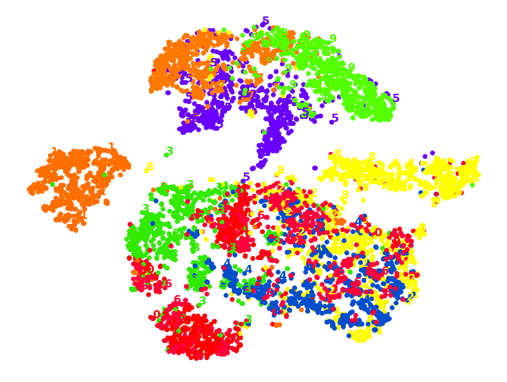

## Mimi's Portfolio

---

### 1. Machine Learning

[QWERTY keyboard typing with 1 finger: modeling and analysis using Fiit's law and Zipf's law](/keyboardMA.md)

[Collaborative filtering recommender system with PySpark: Amazon products](/rs.md)

[Ensemble Learning with RandomForest and XGBoost: speed dating data set](/EL.md)

<!------>

[Dimensionality Reduction: 1000 fashion MNIST](/dr.md)

<!------>

[Support Vector Machine: classification of graduation and regression of admission data](/svm.md)

<!------>

[Supervised learning: regression and classification of math final grades](/studentML.md)

<!------>

[Multivariate linear regression: recommended prices for house](/houseLR.md)

<!------>

---

### 2. Data Science

<!---[Hypothesis testing of differences in sample means using 1000 permutation and t-test: leadership analysis](/meanTesting.md)--->

[Statistical testing and fossil analysis: detecting patterns of speciation in time and space](/fossil.md)

[Spark Structured API: book reviews and user data](/bookRev-sparkAPI.md)

[Yelp web scrapping: top barbers in California, CA](/mimi-yelp-webScrap.md)

<!------>

[Spotify API: Adele and her artwork](/spotifyApi.md)

<!------>

[Large data set analysis with Dask and Plotly: NYC parking ticket violations](/nycParkingTickets.md)

<!------>

[Reddit API: Subreddit Python](/reddit-api.md)

<!------>

[World airports, airlines and their routes](/airport.md)

<!------>

[Income and religion in the US](/pew.md)

<!------>

[Sales project: data cleaning and analysis](/dressSales.md)

<!------>

[Most popular posts and golden hour of publishing comments](/hackerNews.md)

<!------>

[Gender gap STEM degrees](/stemDegree.md)

<!------>

[Titanic gender vs. survival](/titanic.md)

<!------>

---

### 3. Data Engineering

[Data Pipeline with Python and SQLite for research analysis: final results as a report (sample only)](/sample_covidRep.pdf)

[Automate writing JSON data to CSV, and back](/jsonCsv.md)

<!------>

[Database model of an university: queries](/uniDB-queries.txt)

<!------>

[Database model of an university: SQL DB setup](/uniDB-setup.txt)

<!------>

[Database model of an university: class UML and relational models](/uniDB.md)

[Theaters and ticket systems UML](/theaterUML.md)

---

[To be continued with upcoming DS and ML projects]
