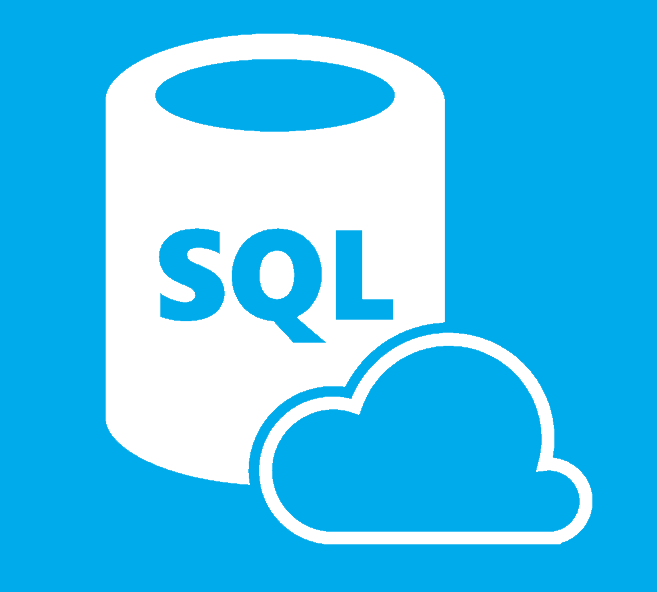

## Portfolio: Machine Learning, Data Science, and Data Engineering

---

### 1. Machine Learning

[Support Vector Machine for graduation and admission data](/svm.md)

---

[Supervised learning: regression and classification of math final grades](/studentML.md)

---

[Multivariate linear regression: recommended prices for house](/houseLR.md)

---
[K-nearest neighbors: recommended prices for cars](/carKNN.md)

---
[K-nearest neighbors: recommended prices for Airbnb listings](/abnbKNN.md)

---

### 2. Data Science

[Yelp web scrapping: top barbers in California, CA](/mimi-yelp-webScrap.md)

---
[Spotify API: Adele and her artwork](/spotifyApi.md)

---
[Large data set analysis with Dask and Plotly: NYC parking ticket violations](/nycParkingTickets.md)

---
[Reddit API: Subreddit Python](/reddit-api.md)

---
[World airports, airlines and their routes](/airport.md)

---
[Income and religion in the US](/pew.md)

---
[Sales project: data cleaning and analysis](/dressSales.md)

---
[Most popular posts and golden hour of publishing comments](/hackerNews.md)

---
[Gender gap STEM degrees](/stemDegree.md)

---
[Titanic gender vs. survival](/titanic.md)

---

### 3. Data Engineering

[Automate writing JSON data to CSV, and back](/jsonCsv.md)

---

[Database model of an university: SQL implementation](/p2.txt)

---

[Database model of an university: class UML and relational models](/uniDB.md)

---
[UML of simple flights](/uml-flight.md)

---

[To be continued with upcoming DS and ML projects]
