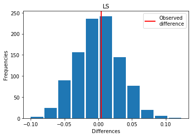

# Mean testing using permutation 1000 times and t-test

## Goals
#### 1. Determine which leadership construct significantly changes over pre-Covid and during-Covid times
#### 2. Hypothesis testing alpha=0.05: difference in means or not
#### 3. Find the average differences

<table border="1" class="dataframe">
  <thead>
    <tr style="text-align: right;">
      <th></th>
      <th>changes = exp - covid</th>
      <th>p_values_permutation</th>
      <th>p_values_t_test</th>
      <th>significant</th>
    </tr>
  </thead>
  <tbody>
    <tr>
      <th>AHC</th>
      <td>0.345929</td>
      <td>0.000</td>
      <td>0.0000</td>
      <td>1</td>
    </tr>
    <tr>
      <th>Bout</th>
      <td>-0.182161</td>
      <td>0.000</td>
      <td>0.0000</td>
      <td>1</td>
    </tr>
    <tr>
      <th>CO</th>
      <td>0.256943</td>
      <td>0.000</td>
      <td>0.0000</td>
      <td>1</td>
    </tr>
    <tr>
      <th>GC</th>
      <td>0.355430</td>
      <td>0.000</td>
      <td>0.0000</td>
      <td>1</td>
    </tr>
    <tr>
      <th>IPC</th>
      <td>0.174999</td>
      <td>0.000</td>
      <td>0.0000</td>
      <td>1</td>
    </tr>
    <tr>
      <th>LMX</th>
      <td>0.021892</td>
      <td>0.095</td>
      <td>0.1692</td>
      <td>0</td>
    </tr>
    <tr>
      <th>LS</th>
      <td>0.004266</td>
      <td>0.462</td>
      <td>0.8994</td>
      <td>0</td>
    </tr>
    <tr>
      <th>MF</th>
      <td>0.395901</td>
      <td>0.000</td>
      <td>0.0000</td>
      <td>1</td>
    </tr>
    <tr>
      <th>PS</th>
      <td>-0.009199</td>
      <td>0.420</td>
      <td>0.7900</td>
      <td>0</td>
    </tr>
    <tr>
      <th>RE</th>
      <td>0.045658</td>
      <td>0.001</td>
      <td>0.0032</td>
      <td>1</td>
    </tr>
    <tr>
      <th>WES</th>
      <td>0.182599</td>
      <td>0.000</td>
      <td>0.0000</td>
      <td>1</td>
    </tr>
    <tr>
      <th>WLC</th>
      <td>-0.894634</td>
      <td>0.000</td>
      <td>0.0000</td>
      <td>1</td>
    </tr>
    <tr>
      <th>WLSP</th>
      <td>0.819718</td>
      <td>0.000</td>
      <td>0.0000</td>
      <td>1</td>
    </tr>
  </tbody>
</table>
</div>


```python
import pandas as pd
import numpy as np
import random
from scipy import stats
import matplotlib.pyplot as plt
```

#### Leadership constructs are abbreviated: after-hour connectivity, burnout, collaborative overload, goal clarity, etc. For more information, please contact My Bui.


```python
label = ['AHC', 'Bout', 'CO', 'GC', 'IPC', 'LMX', 'LS', 'MF', 'PS', 'RE', 'WES', 'WLC', 'WLSP']
```


```python
def read_data(construct):
    data_B = pd.read_excel(construct + '.xlsx', sheet_name='covid')
    data_A = pd.read_excel(construct + '.xlsx', sheet_name='exp')
    array_B = data_B.values.reshape(1, -1)[0]
    array_B = array_B[~np.isnan(array_B)]
    array_A = data_A.values.reshape(1, -1)[0]
    array_A = array_A[~np.isnan(array_A)]
    
    return (array_A, array_B)


def combine(array_A, array_B):
    x = array_A.tolist()
    x += array_B.tolist()
    
    return x


def permutation_A_B(x, n_B, n_A):
    random.shuffle(x)
    x = pd.Series(x)
    n = n_A + n_B
    idx_A = set(random.sample(range(n), n_A))
    idx_B = set(range(n)) - idx_A
    
    return x.loc[idx_A].mean() - x.loc[idx_B].mean()


def permutation_B_A(x, n_B, n_A):
    random.shuffle(x)
    x = pd.Series(x)
    n = n_A + n_B
    idx_A = set(random.sample(range(n), n_A))
    idx_B = set(range(n)) - idx_A
    
    return x.loc[idx_B].mean() - x.loc[idx_A].mean()
```


```python
p_perm_list = []
p_t_test = []

for i in label:
    array_A, array_B = read_data(i)
    combine(array_A, array_B)
    diff = np.mean(array_A) - np.mean(array_B)
    x = combine(array_A, array_B)
    
    if (diff < 0):
        print('For ' + i + ': Covid > Exp')
        diff = np.mean(array_B) - np.mean(array_A)
        perm_diffs = [permutation_B_A(x, len(array_B.tolist()), len(array_A.tolist())) for _ in range(1000)]
    else:
        print('For ' + i + ': Exp > Covid')
        perm_diffs = [permutation_A_B(x, len(array_B.tolist()), len(array_A.tolist())) for _ in range(1000)]
        
    fig, ax = plt.subplots()
    ax.hist(perm_diffs, bins=11, rwidth=0.9)
    ax.axvline(x=diff, color='red', lw=2)
    ax.set_xlabel('Differences')
    ax.set_ylabel('Frequencies')
    plt.legend(['Observed\ndifference'])
    ax.set_title(i)
    plt.show()
    
    p_perm = np.mean(perm_diffs >= diff)
    p_perm_list.append(p_perm)
    print(f'p_perm: {p_perm}')
    
    res = stats.ttest_ind(array_A, array_B, equal_var=False)
    p_t_test.append(res.pvalue)
    print(f'p_t_test: {res.pvalue / 2:.4f}')
    print('\n')
```

    For AHC: Exp > Covid


    p_perm: 0.0
    p_t_test: 0.0000
    
    
    For Bout: Covid > Exp


    p_perm: 0.0
    p_t_test: 0.0000
    
    
    For CO: Exp > Covid


    p_perm: 0.0
    p_t_test: 0.0000
    
    
    For GC: Exp > Covid


    p_perm: 0.0
    p_t_test: 0.0000
    
    
    For IPC: Exp > Covid


    p_perm: 0.0
    p_t_test: 0.0000
    
    
    For LMX: Exp > Covid


    p_perm: 0.095
    p_t_test: 0.0846
    
    
    For LS: Exp > Covid





    p_perm: 0.462
    p_t_test: 0.4497
    
    
    For MF: Exp > Covid


    p_perm: 0.0
    p_t_test: 0.0000
    
    
    For PS: Covid > Exp


    p_perm: 0.42
    p_t_test: 0.3950
    
    
    For RE: Exp > Covid


    p_perm: 0.001
    p_t_test: 0.0016
    
    
    For WES: Exp > Covid


    p_perm: 0.0
    p_t_test: 0.0000
    
    
    For WLC: Covid > Exp


    p_perm: 0.0
    p_t_test: 0.0000
    
    
    For WLSP: Exp > Covid


    p_perm: 0.0
    p_t_test: 0.0000
    
    


```python
changes = {}

for i in label:
    read_data(i)
    array_A, array_B = read_data(i)
    combine(array_A, array_B)
    diff = np.mean(array_A) - np.mean(array_B)
    changes[i] = diff
```


```python
changes = pd.DataFrame.from_dict(data=changes, orient='index', columns=['changes = exp - covid'])
```


```python
changes['p_values_permutation'] = p_perm_list
changes['p_values_t_test'] = p_t_test
changes['p_values_t_test'] = round(changes['p_values_t_test'], 4)
```


```python
changes['significant'] = changes['p_values_permutation'] <= 0.05
changes['significant'] = changes['significant'].astype(int)
```


```python
changes
```


<div>
<style scoped>
    .dataframe tbody tr th:only-of-type {
        vertical-align: middle;
    }

    .dataframe tbody tr th {
        vertical-align: top;
    }

    .dataframe thead th {
        text-align: right;
    }
</style>
<table border="1" class="dataframe">
  <thead>
    <tr style="text-align: right;">
      <th></th>
      <th>changes = exp - covid</th>
      <th>p_values_permutation</th>
      <th>p_values_t_test</th>
      <th>significant</th>
    </tr>
  </thead>
  <tbody>
    <tr>
      <th>AHC</th>
      <td>0.345929</td>
      <td>0.000</td>
      <td>0.0000</td>
      <td>1</td>
    </tr>
    <tr>
      <th>Bout</th>
      <td>-0.182161</td>
      <td>0.000</td>
      <td>0.0000</td>
      <td>1</td>
    </tr>
    <tr>
      <th>CO</th>
      <td>0.256943</td>
      <td>0.000</td>
      <td>0.0000</td>
      <td>1</td>
    </tr>
    <tr>
      <th>GC</th>
      <td>0.355430</td>
      <td>0.000</td>
      <td>0.0000</td>
      <td>1</td>
    </tr>
    <tr>
      <th>IPC</th>
      <td>0.174999</td>
      <td>0.000</td>
      <td>0.0000</td>
      <td>1</td>
    </tr>
    <tr>
      <th>LMX</th>
      <td>0.021892</td>
      <td>0.095</td>
      <td>0.1692</td>
      <td>0</td>
    </tr>
    <tr>
      <th>LS</th>
      <td>0.004266</td>
      <td>0.462</td>
      <td>0.8994</td>
      <td>0</td>
    </tr>
    <tr>
      <th>MF</th>
      <td>0.395901</td>
      <td>0.000</td>
      <td>0.0000</td>
      <td>1</td>
    </tr>
    <tr>
      <th>PS</th>
      <td>-0.009199</td>
      <td>0.420</td>
      <td>0.7900</td>
      <td>0</td>
    </tr>
    <tr>
      <th>RE</th>
      <td>0.045658</td>
      <td>0.001</td>
      <td>0.0032</td>
      <td>1</td>
    </tr>
    <tr>
      <th>WES</th>
      <td>0.182599</td>
      <td>0.000</td>
      <td>0.0000</td>
      <td>1</td>
    </tr>
    <tr>
      <th>WLC</th>
      <td>-0.894634</td>
      <td>0.000</td>
      <td>0.0000</td>
      <td>1</td>
    </tr>
    <tr>
      <th>WLSP</th>
      <td>0.819718</td>
      <td>0.000</td>
      <td>0.0000</td>
      <td>1</td>
    </tr>
  </tbody>
</table>
</div>


