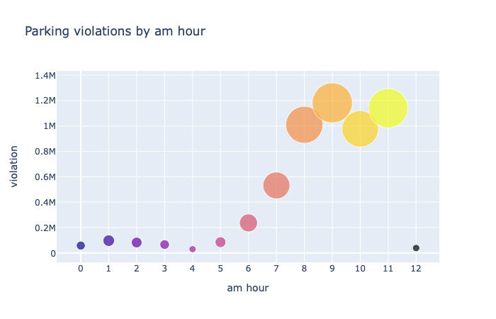

## The NYC Department of Finance collects data on every parking ticket issued in NYC (~10M per year). This data is made publicly available to aid in ticket resolution and to guide policymakers. 

## The data set we'll explore is in 2017. Since its size is quite large - 2.09 GB, we'll apply the concept of 'laziness' from dask. We'll also visualize our analysis with interactive plotly (not displayed here).


```python
import dask
import dask.dataframe as dd
import pandas as pd
```


```python
from dask.distributed import Client
client = Client(n_workers=4)
```


```python
df = dd.read_csv('Parking_Violations_Issued_-_Fiscal_Year_2017.csv', parse_dates=['Issue Date'])
df
```


<div><strong>Dask DataFrame Structure:</strong></div>
<div>
<style scoped>
    .dataframe tbody tr th:only-of-type {
        vertical-align: middle;
    }

    .dataframe tbody tr th {
        vertical-align: top;
    }

    .dataframe thead th {
        text-align: right;
    }
</style>
<table border="1" class="dataframe">
  <thead>
    <tr style="text-align: right;">
      <th></th>
      <th>Summons Number</th>
      <th>Plate ID</th>
      <th>Registration State</th>
      <th>Plate Type</th>
      <th>Issue Date</th>
      <th>Violation Code</th>
      <th>Vehicle Body Type</th>
      <th>Vehicle Make</th>
      <th>Issuing Agency</th>
      <th>Street Code1</th>
      <th>Street Code2</th>
      <th>Street Code3</th>
      <th>Vehicle Expiration Date</th>
      <th>Violation Location</th>
      <th>Violation Precinct</th>
      <th>Issuer Precinct</th>
      <th>Issuer Code</th>
      <th>Issuer Command</th>
      <th>Issuer Squad</th>
      <th>Violation Time</th>
      <th>Time First Observed</th>
      <th>Violation County</th>
      <th>Violation In Front Of Or Opposite</th>
      <th>House Number</th>
      <th>Street Name</th>
      <th>Intersecting Street</th>
      <th>Date First Observed</th>
      <th>Law Section</th>
      <th>Sub Division</th>
      <th>Violation Legal Code</th>
      <th>Days Parking In Effect</th>
      <th>From Hours In Effect</th>
      <th>To Hours In Effect</th>
      <th>Vehicle Color</th>
      <th>Unregistered Vehicle?</th>
      <th>Vehicle Year</th>
      <th>Meter Number</th>
      <th>Feet From Curb</th>
      <th>Violation Post Code</th>
      <th>Violation Description</th>
      <th>No Standing or Stopping Violation</th>
      <th>Hydrant Violation</th>
      <th>Double Parking Violation</th>
    </tr>
    <tr>
      <th>npartitions=33</th>
      <th></th>
      <th></th>
      <th></th>
      <th></th>
      <th></th>
      <th></th>
      <th></th>
      <th></th>
      <th></th>
      <th></th>
      <th></th>
      <th></th>
      <th></th>
      <th></th>
      <th></th>
      <th></th>
      <th></th>
      <th></th>
      <th></th>
      <th></th>
      <th></th>
      <th></th>
      <th></th>
      <th></th>
      <th></th>
      <th></th>
      <th></th>
      <th></th>
      <th></th>
      <th></th>
      <th></th>
      <th></th>
      <th></th>
      <th></th>
      <th></th>
      <th></th>
      <th></th>
      <th></th>
      <th></th>
      <th></th>
      <th></th>
      <th></th>
      <th></th>
    </tr>
  </thead>
  <tbody>
    <tr>
      <th></th>
      <td>int64</td>
      <td>object</td>
      <td>object</td>
      <td>object</td>
      <td>datetime64[ns]</td>
      <td>int64</td>
      <td>object</td>
      <td>object</td>
      <td>object</td>
      <td>int64</td>
      <td>int64</td>
      <td>int64</td>
      <td>int64</td>
      <td>float64</td>
      <td>int64</td>
      <td>int64</td>
      <td>int64</td>
      <td>object</td>
      <td>object</td>
      <td>object</td>
      <td>object</td>
      <td>object</td>
      <td>object</td>
      <td>object</td>
      <td>object</td>
      <td>object</td>
      <td>int64</td>
      <td>int64</td>
      <td>object</td>
      <td>object</td>
      <td>object</td>
      <td>object</td>
      <td>object</td>
      <td>object</td>
      <td>float64</td>
      <td>int64</td>
      <td>object</td>
      <td>int64</td>
      <td>object</td>
      <td>object</td>
      <td>float64</td>
      <td>float64</td>
      <td>float64</td>
    </tr>
    <tr>
      <th></th>
      <td>...</td>
      <td>...</td>
      <td>...</td>
      <td>...</td>
      <td>...</td>
      <td>...</td>
      <td>...</td>
      <td>...</td>
      <td>...</td>
      <td>...</td>
      <td>...</td>
      <td>...</td>
      <td>...</td>
      <td>...</td>
      <td>...</td>
      <td>...</td>
      <td>...</td>
      <td>...</td>
      <td>...</td>
      <td>...</td>
      <td>...</td>
      <td>...</td>
      <td>...</td>
      <td>...</td>
      <td>...</td>
      <td>...</td>
      <td>...</td>
      <td>...</td>
      <td>...</td>
      <td>...</td>
      <td>...</td>
      <td>...</td>
      <td>...</td>
      <td>...</td>
      <td>...</td>
      <td>...</td>
      <td>...</td>
      <td>...</td>
      <td>...</td>
      <td>...</td>
      <td>...</td>
      <td>...</td>
      <td>...</td>
    </tr>
    <tr>
      <th>...</th>
      <td>...</td>
      <td>...</td>
      <td>...</td>
      <td>...</td>
      <td>...</td>
      <td>...</td>
      <td>...</td>
      <td>...</td>
      <td>...</td>
      <td>...</td>
      <td>...</td>
      <td>...</td>
      <td>...</td>
      <td>...</td>
      <td>...</td>
      <td>...</td>
      <td>...</td>
      <td>...</td>
      <td>...</td>
      <td>...</td>
      <td>...</td>
      <td>...</td>
      <td>...</td>
      <td>...</td>
      <td>...</td>
      <td>...</td>
      <td>...</td>
      <td>...</td>
      <td>...</td>
      <td>...</td>
      <td>...</td>
      <td>...</td>
      <td>...</td>
      <td>...</td>
      <td>...</td>
      <td>...</td>
      <td>...</td>
      <td>...</td>
      <td>...</td>
      <td>...</td>
      <td>...</td>
      <td>...</td>
      <td>...</td>
    </tr>
    <tr>
      <th></th>
      <td>...</td>
      <td>...</td>
      <td>...</td>
      <td>...</td>
      <td>...</td>
      <td>...</td>
      <td>...</td>
      <td>...</td>
      <td>...</td>
      <td>...</td>
      <td>...</td>
      <td>...</td>
      <td>...</td>
      <td>...</td>
      <td>...</td>
      <td>...</td>
      <td>...</td>
      <td>...</td>
      <td>...</td>
      <td>...</td>
      <td>...</td>
      <td>...</td>
      <td>...</td>
      <td>...</td>
      <td>...</td>
      <td>...</td>
      <td>...</td>
      <td>...</td>
      <td>...</td>
      <td>...</td>
      <td>...</td>
      <td>...</td>
      <td>...</td>
      <td>...</td>
      <td>...</td>
      <td>...</td>
      <td>...</td>
      <td>...</td>
      <td>...</td>
      <td>...</td>
      <td>...</td>
      <td>...</td>
      <td>...</td>
    </tr>
    <tr>
      <th></th>
      <td>...</td>
      <td>...</td>
      <td>...</td>
      <td>...</td>
      <td>...</td>
      <td>...</td>
      <td>...</td>
      <td>...</td>
      <td>...</td>
      <td>...</td>
      <td>...</td>
      <td>...</td>
      <td>...</td>
      <td>...</td>
      <td>...</td>
      <td>...</td>
      <td>...</td>
      <td>...</td>
      <td>...</td>
      <td>...</td>
      <td>...</td>
      <td>...</td>
      <td>...</td>
      <td>...</td>
      <td>...</td>
      <td>...</td>
      <td>...</td>
      <td>...</td>
      <td>...</td>
      <td>...</td>
      <td>...</td>
      <td>...</td>
      <td>...</td>
      <td>...</td>
      <td>...</td>
      <td>...</td>
      <td>...</td>
      <td>...</td>
      <td>...</td>
      <td>...</td>
      <td>...</td>
      <td>...</td>
      <td>...</td>
    </tr>
  </tbody>
</table>
</div>
<div>Dask Name: from-delayed, 99 tasks</div>


```python
df.head()
```


<div>
<style scoped>
    .dataframe tbody tr th:only-of-type {
        vertical-align: middle;
    }

    .dataframe tbody tr th {
        vertical-align: top;
    }

    .dataframe thead th {
        text-align: right;
    }
</style>
<table border="1" class="dataframe">
  <thead>
    <tr style="text-align: right;">
      <th></th>
      <th>Summons Number</th>
      <th>Plate ID</th>
      <th>Registration State</th>
      <th>Plate Type</th>
      <th>Issue Date</th>
      <th>Violation Code</th>
      <th>Vehicle Body Type</th>
      <th>Vehicle Make</th>
      <th>Issuing Agency</th>
      <th>Street Code1</th>
      <th>...</th>
      <th>Vehicle Color</th>
      <th>Unregistered Vehicle?</th>
      <th>Vehicle Year</th>
      <th>Meter Number</th>
      <th>Feet From Curb</th>
      <th>Violation Post Code</th>
      <th>Violation Description</th>
      <th>No Standing or Stopping Violation</th>
      <th>Hydrant Violation</th>
      <th>Double Parking Violation</th>
    </tr>
  </thead>
  <tbody>
    <tr>
      <th>0</th>
      <td>5092469481</td>
      <td>GZH7067</td>
      <td>NY</td>
      <td>PAS</td>
      <td>2016-07-10</td>
      <td>7</td>
      <td>SUBN</td>
      <td>TOYOT</td>
      <td>V</td>
      <td>0</td>
      <td>...</td>
      <td>GY</td>
      <td>NaN</td>
      <td>2001</td>
      <td>NaN</td>
      <td>0</td>
      <td>NaN</td>
      <td>FAILURE TO STOP AT RED LIGHT</td>
      <td>NaN</td>
      <td>NaN</td>
      <td>NaN</td>
    </tr>
    <tr>
      <th>1</th>
      <td>5092451658</td>
      <td>GZH7067</td>
      <td>NY</td>
      <td>PAS</td>
      <td>2016-07-08</td>
      <td>7</td>
      <td>SUBN</td>
      <td>TOYOT</td>
      <td>V</td>
      <td>0</td>
      <td>...</td>
      <td>GY</td>
      <td>NaN</td>
      <td>2001</td>
      <td>NaN</td>
      <td>0</td>
      <td>NaN</td>
      <td>FAILURE TO STOP AT RED LIGHT</td>
      <td>NaN</td>
      <td>NaN</td>
      <td>NaN</td>
    </tr>
    <tr>
      <th>2</th>
      <td>4006265037</td>
      <td>FZX9232</td>
      <td>NY</td>
      <td>PAS</td>
      <td>2016-08-23</td>
      <td>5</td>
      <td>SUBN</td>
      <td>FORD</td>
      <td>V</td>
      <td>0</td>
      <td>...</td>
      <td>BK</td>
      <td>NaN</td>
      <td>2004</td>
      <td>NaN</td>
      <td>0</td>
      <td>NaN</td>
      <td>BUS LANE VIOLATION</td>
      <td>NaN</td>
      <td>NaN</td>
      <td>NaN</td>
    </tr>
    <tr>
      <th>3</th>
      <td>8478629828</td>
      <td>66623ME</td>
      <td>NY</td>
      <td>COM</td>
      <td>2017-06-14</td>
      <td>47</td>
      <td>REFG</td>
      <td>MITSU</td>
      <td>T</td>
      <td>10610</td>
      <td>...</td>
      <td>WH</td>
      <td>NaN</td>
      <td>2007</td>
      <td>NaN</td>
      <td>0</td>
      <td>04</td>
      <td>47-Double PKG-Midtown</td>
      <td>NaN</td>
      <td>NaN</td>
      <td>NaN</td>
    </tr>
    <tr>
      <th>4</th>
      <td>7868300310</td>
      <td>37033JV</td>
      <td>NY</td>
      <td>COM</td>
      <td>2016-11-21</td>
      <td>69</td>
      <td>DELV</td>
      <td>INTER</td>
      <td>T</td>
      <td>10510</td>
      <td>...</td>
      <td>WHITE</td>
      <td>NaN</td>
      <td>2007</td>
      <td>NaN</td>
      <td>0</td>
      <td>31 6</td>
      <td>69-Failure to Disp Muni Recpt</td>
      <td>NaN</td>
      <td>NaN</td>
      <td>NaN</td>
    </tr>
  </tbody>
</table>
<p>5 rows × 43 columns</p>
</div>


We check some basic info of the data set, e.g. number of partitions dask created.


```python
df.npartitions
```


    33


```python
df.columns
```


    Index(['Summons Number', 'Plate ID', 'Registration State', 'Plate Type',
           'Issue Date', 'Violation Code', 'Vehicle Body Type', 'Vehicle Make',
           'Issuing Agency', 'Street Code1', 'Street Code2', 'Street Code3',
           'Vehicle Expiration Date', 'Violation Location', 'Violation Precinct',
           'Issuer Precinct', 'Issuer Code', 'Issuer Command', 'Issuer Squad',
           'Violation Time', 'Time First Observed', 'Violation County',
           'Violation In Front Of Or Opposite', 'House Number', 'Street Name',
           'Intersecting Street', 'Date First Observed', 'Law Section',
           'Sub Division', 'Violation Legal Code', 'Days Parking In Effect    ',
           'From Hours In Effect', 'To Hours In Effect', 'Vehicle Color',
           'Unregistered Vehicle?', 'Vehicle Year', 'Meter Number',
           'Feet From Curb', 'Violation Post Code', 'Violation Description',
           'No Standing or Stopping Violation', 'Hydrant Violation',
           'Double Parking Violation'],
          dtype='object')


### 1. When are tickets most likely to be issued? Answer in different time periods

### By season

New York Has A Continental Climate. New York's climate is classed as being continental, which means that it receives four distinct seasons spring (March-May), summer (June-August), autumn (September-November) and winter (December-February.


```python
# a helper function to get seasons from months
def get_season(df):
    seasons = df['Issue Date'].dt.month
    
    seasons.replace([3, 4, 5], 'spring', inplace=True)
    seasons.replace([6, 7, 8], 'summer', inplace=True)
    seasons.replace([9, 10, 11], 'autumn', inplace=True)
    seasons.replace([12, 1, 2], 'winter', inplace=True)
    
    return seasons
```


```python
# map over df a function to return a Series season
result = df.map_partitions(get_season)
```

    /Users/MimiHMB/anaconda3/lib/python3.7/site-packages/pandas/core/generic.py:6746: SettingWithCopyWarning: modifications to a property of a datetimelike object are not supported and are discarded. Change values on the original.
      self._update_inplace(new_data)


```python
issue_season = result.value_counts()
```


```python
issue_season_computed = issue_season.compute()
```


```python
# violations happened more frequently in spring and autumn 
import plotly.graph_objects as go

fig = go.Figure()

fig.add_trace(
    go.Scatter(
        x=issue_season_computed.index,
        y=issue_season_computed.values,
        name='line'
    ))

fig.add_trace(
    go.Bar(
        x=issue_season_computed.index,
        y=issue_season_computed.values,
        name='bar'
    ))

fig.update_layout(
    title="Parking violations by season",
    xaxis_title="season",
    yaxis_title="violation")

fig.show()
```


### By month


```python
issue_month = df['Issue Date'].dt.month
```


```python
len(issue_month)
```


    10803028


```python
issue_month_computed = issue_month.value_counts().compute()
```


```python
import plotly.express as px

months = issue_month_computed.sort_index().index
values = issue_month_computed.sort_index().values

fig = px.scatter(issue_month_computed, x=months, y=values, text=months)

fig.update_traces(textposition='top center')

fig.update_layout(xaxis = dict(tickmode = 'array',
                               tickvals = list(range(1, 13)),
                               ticktext = ['Jan', 'Feb', 'Mar', 'Apr', 'May', 'Jun', 'Jul', 'Aug', 'Sep', 'Oct', 'Nov', 'Dec']))

fig.update_layout(xaxis_title="month", 
                  yaxis_title="violation",
                  title_text='Parking violations by month')

fig.show()
```


### By am hour


```python
am = [i[0:2] for i in df['Violation Time'] if ('A' in str(i))]
```


```python
am_df = pd.DataFrame.from_dict(dict((i, am.count(i)) for i in set(am)), orient='index', columns=['count'])
am_df = am_df.sort_index()[4:]
```


```python
am_df
```


<div>
<style scoped>
    .dataframe tbody tr th:only-of-type {
        vertical-align: middle;
    }

    .dataframe tbody tr th {
        vertical-align: top;
    }

    .dataframe thead th {
        text-align: right;
    }
</style>
<table border="1" class="dataframe">
  <thead>
    <tr style="text-align: right;">
      <th></th>
      <th>count</th>
    </tr>
  </thead>
  <tbody>
    <tr>
      <th>00</th>
      <td>58313</td>
    </tr>
    <tr>
      <th>01</th>
      <td>97058</td>
    </tr>
    <tr>
      <th>02</th>
      <td>82352</td>
    </tr>
    <tr>
      <th>03</th>
      <td>66118</td>
    </tr>
    <tr>
      <th>04</th>
      <td>30163</td>
    </tr>
    <tr>
      <th>05</th>
      <td>84800</td>
    </tr>
    <tr>
      <th>06</th>
      <td>236777</td>
    </tr>
    <tr>
      <th>07</th>
      <td>531769</td>
    </tr>
    <tr>
      <th>08</th>
      <td>1008957</td>
    </tr>
    <tr>
      <th>09</th>
      <td>1181344</td>
    </tr>
    <tr>
      <th>10</th>
      <td>976913</td>
    </tr>
    <tr>
      <th>11</th>
      <td>1138919</td>
    </tr>
    <tr>
      <th>12</th>
      <td>38904</td>
    </tr>
  </tbody>
</table>
</div>


```python
# violations happened mostly during 8-11 am
times = am_df.index
time_values = am_df['count'].values
size = time_values/10000

fig = go.Figure(data=[go.Scatter(
    x=times,
    y=time_values,
    mode='markers',
    marker=dict(
        size=size,
        sizemode='area',
        sizeref=1.*max(size)/(40.**2),
        sizemin=5,
        color=[220, 225, 230, 235, 240, 245, 250, 255, 260, 265, 270, 275]
    )
)])

fig.update_layout(xaxis = dict(tickmode = 'array',
                               tickvals = list(range(0, 13))))
fig.update_layout(xaxis_title="am hour", 
                  yaxis_title="violation",
                  title_text='Parking violations by am hour')

fig.show()
```




### By pm hour


```python
pm = [i[0:2] for i in df['Violation Time'] if ('P' in str(i))]
```


```python
pm_df = pd.DataFrame.from_dict(dict((i, pm.count(i)) for i in set(pm)), orient='index', columns=['count'])
pm_df = pm_df.sort_values(by='count', ascending=False)[:13].sort_index()
```


```python
pm_df
```


<div>
<style scoped>
    .dataframe tbody tr th:only-of-type {
        vertical-align: middle;
    }

    .dataframe tbody tr th {
        vertical-align: top;
    }

    .dataframe thead th {
        text-align: right;
    }
</style>
<table border="1" class="dataframe">
  <thead>
    <tr style="text-align: right;">
      <th></th>
      <th>count</th>
    </tr>
  </thead>
  <tbody>
    <tr>
      <th>00</th>
      <td>261</td>
    </tr>
    <tr>
      <th>01</th>
      <td>1076390</td>
    </tr>
    <tr>
      <th>02</th>
      <td>907268</td>
    </tr>
    <tr>
      <th>03</th>
      <td>617187</td>
    </tr>
    <tr>
      <th>04</th>
      <td>587900</td>
    </tr>
    <tr>
      <th>05</th>
      <td>423884</td>
    </tr>
    <tr>
      <th>06</th>
      <td>223467</td>
    </tr>
    <tr>
      <th>07</th>
      <td>61111</td>
    </tr>
    <tr>
      <th>08</th>
      <td>108834</td>
    </tr>
    <tr>
      <th>09</th>
      <td>119346</td>
    </tr>
    <tr>
      <th>10</th>
      <td>91404</td>
    </tr>
    <tr>
      <th>11</th>
      <td>62722</td>
    </tr>
    <tr>
      <th>12</th>
      <td>990649</td>
    </tr>
  </tbody>
</table>
</div>


```python
# violations happened mostly during 12-2 pm
pm_times = pm_df.index
pm_time_values = pm_df['count'].values
pm_size = pm_time_values/10000

fig = go.Figure(data=[go.Scatter(
    x=pm_times,
    y=pm_time_values,
    mode='markers',
    marker=dict(
        size=pm_size,
        sizemode='area',
        sizeref=1.*max(pm_size)/(40.**2),
        sizemin=5,
        color=[100, 105, 110, 115, 120, 125, 130, 135, 140, 145, 150, 155]
    )
)])

fig.update_layout(xaxis = dict(tickmode = 'array',
                               tickvals = list(range(0, 13))))
fig.update_layout(xaxis_title="pm hour", 
                  yaxis_title="violation",
                  title_text='Parking violations by pm hour')

fig.show()
```


### 2. Where are tickets most commonly issued?

### At which street


```python
where = df['Street Name'].value_counts().compute()
```


```python
# most issued at Broadway
where[:5]
```


    Broadway         206157
    3rd Ave          160282
    Madison Ave       98853
    5th Ave           90707
    Lexington Ave     81199
    Name: Street Name, dtype: int64


### At which intersections


```python
bw_int= df[df['Street Name'] == 'Broadway']['Intersecting Street'].value_counts().compute()
```


```python
# top 20 intersections with Broadway street that parking violations occurred
bw_int[:20]
```


    30ft S/of W 118th St    82
    30ft N/of E 8th St      62
    20ft S/of W 118th St    61
    20ft N/of E 8th St      49
    10ft N/of W 110th St    45
    10ft S/of W 118th St    42
    20ft S/of W 76th St     41
    10ft S/of W 90th St     41
    40ft N/of E 8th St      41
    15ft S/of W 118th St    41
    20ft S/of W 77th St     37
    20ft N/of W 102nd St    37
    30ft N/of W 102nd St    37
    20ft N/of W 67th St     36
    40ft S/of W 118th St    35
    10ft N/of W 77th St     33
    5ft N/of W 102nd St     31
    30ft S/of W 76th St     31
    10ft N/of W 102nd St    30
    20ft N/of W 77th St     30
    Name: Intersecting Street, dtype: int64


```python
# a helper function to filter only street names
def get_int(df):
    filter = df[df['Street Name'] == 'Broadway']['Intersecting Street'].dropna().str.split().str.get(-2)
    return filter
```


```python
broadway_int = df.map_partitions(get_int)
```


```python
broadway_int_count = broadway_int.value_counts().compute()
```


```python
# most commonly issued at the intersection of Broadway and 118th streets
broadway_int_count.sort_values(ascending=False)[:10]
```


    118th      516
    77th       478
    8th        448
    78th       435
    76th       404
    102nd      373
    Britton    290
    74th       284
    82nd       258
    107th      252
    Name: Intersecting Street, dtype: int64


### For which violation reasons


```python
bw_desc = df[df['Street Name'] == 'Broadway']['Violation Description'].value_counts().compute()
```


```python
# top 10 violation reasons at Broadway Street
bw_desc[:10]
```


    38-Failure to Display Muni Rec    47029
    37-Expired Muni Meter             29334
    46B-Double Parking (Com-100Ft)    16541
    14-No Standing                    15002
    19-No Stand (bus stop)            12799
    21-No Parking (street clean)      11571
    69-Failure to Disp Muni Recpt      9755
    31-No Stand (Com. Mtr. Zone)       8380
    71A-Insp Sticker Expired (NYS)     6288
    40-Fire Hydrant                    5490
    Name: Violation Description, dtype: int64


```python

```
