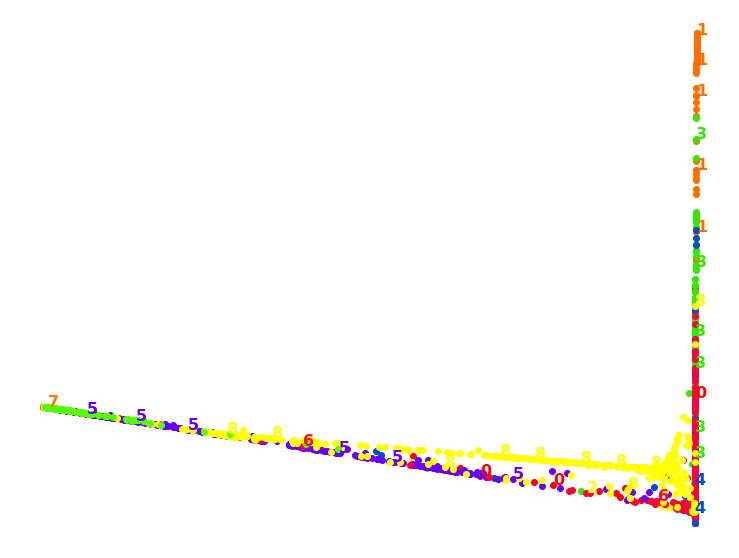

### This data set explores the relationship between income and religion in the US. It comes from a report produced by the Pew Research Center, an American think-tank that collects data on attitudes to topics ranging from religion to the internet.


```python
import pandas as pd
import numpy as np
import seaborn as sns
import matplotlib.pyplot as plt

%matplotlib inline
```


```python
pew_data = pd.read_csv('Data/pew.csv')
pew_data
```


<div>
<style scoped>
    .dataframe tbody tr th:only-of-type {
        vertical-align: middle;
    }

    .dataframe tbody tr th {
        vertical-align: top;
    }

    .dataframe thead th {
        text-align: right;
    }
</style>
<table border="1" class="dataframe">
  <thead>
    <tr style="text-align: right;">
      <th></th>
      <th>religion</th>
      <th>&lt;$10k</th>
      <th>$10-20k</th>
      <th>$20-30k</th>
      <th>$30-40k</th>
      <th>$40-50k</th>
      <th>$50-75k</th>
      <th>$75-100k</th>
      <th>$100-150k</th>
      <th>&gt;150k</th>
      <th>Don't know/refused</th>
    </tr>
  </thead>
  <tbody>
    <tr>
      <th>0</th>
      <td>Agnostic</td>
      <td>27</td>
      <td>34</td>
      <td>60</td>
      <td>81</td>
      <td>76</td>
      <td>137</td>
      <td>122</td>
      <td>109</td>
      <td>84</td>
      <td>96</td>
    </tr>
    <tr>
      <th>1</th>
      <td>Atheist</td>
      <td>12</td>
      <td>27</td>
      <td>37</td>
      <td>52</td>
      <td>35</td>
      <td>70</td>
      <td>73</td>
      <td>59</td>
      <td>74</td>
      <td>76</td>
    </tr>
    <tr>
      <th>2</th>
      <td>Buddhist</td>
      <td>27</td>
      <td>21</td>
      <td>30</td>
      <td>34</td>
      <td>33</td>
      <td>58</td>
      <td>62</td>
      <td>39</td>
      <td>53</td>
      <td>54</td>
    </tr>
    <tr>
      <th>3</th>
      <td>Catholic</td>
      <td>418</td>
      <td>617</td>
      <td>732</td>
      <td>670</td>
      <td>638</td>
      <td>1116</td>
      <td>949</td>
      <td>792</td>
      <td>633</td>
      <td>1489</td>
    </tr>
    <tr>
      <th>4</th>
      <td>Don’t know/refused</td>
      <td>15</td>
      <td>14</td>
      <td>15</td>
      <td>11</td>
      <td>10</td>
      <td>35</td>
      <td>21</td>
      <td>17</td>
      <td>18</td>
      <td>116</td>
    </tr>
    <tr>
      <th>5</th>
      <td>Evangelical Prot</td>
      <td>575</td>
      <td>869</td>
      <td>1064</td>
      <td>982</td>
      <td>881</td>
      <td>1486</td>
      <td>949</td>
      <td>723</td>
      <td>414</td>
      <td>1529</td>
    </tr>
    <tr>
      <th>6</th>
      <td>Hindu</td>
      <td>1</td>
      <td>9</td>
      <td>7</td>
      <td>9</td>
      <td>11</td>
      <td>34</td>
      <td>47</td>
      <td>48</td>
      <td>54</td>
      <td>37</td>
    </tr>
    <tr>
      <th>7</th>
      <td>Historically Black Prot</td>
      <td>228</td>
      <td>244</td>
      <td>236</td>
      <td>238</td>
      <td>197</td>
      <td>223</td>
      <td>131</td>
      <td>81</td>
      <td>78</td>
      <td>339</td>
    </tr>
    <tr>
      <th>8</th>
      <td>Jehovah's Witness</td>
      <td>20</td>
      <td>27</td>
      <td>24</td>
      <td>24</td>
      <td>21</td>
      <td>30</td>
      <td>15</td>
      <td>11</td>
      <td>6</td>
      <td>37</td>
    </tr>
    <tr>
      <th>9</th>
      <td>Jewish</td>
      <td>19</td>
      <td>19</td>
      <td>25</td>
      <td>25</td>
      <td>30</td>
      <td>95</td>
      <td>69</td>
      <td>87</td>
      <td>151</td>
      <td>162</td>
    </tr>
    <tr>
      <th>10</th>
      <td>Mainline Prot</td>
      <td>289</td>
      <td>495</td>
      <td>619</td>
      <td>655</td>
      <td>651</td>
      <td>1107</td>
      <td>939</td>
      <td>753</td>
      <td>634</td>
      <td>1328</td>
    </tr>
    <tr>
      <th>11</th>
      <td>Mormon</td>
      <td>29</td>
      <td>40</td>
      <td>48</td>
      <td>51</td>
      <td>56</td>
      <td>112</td>
      <td>85</td>
      <td>49</td>
      <td>42</td>
      <td>69</td>
    </tr>
    <tr>
      <th>12</th>
      <td>Muslim</td>
      <td>6</td>
      <td>7</td>
      <td>9</td>
      <td>10</td>
      <td>9</td>
      <td>23</td>
      <td>16</td>
      <td>8</td>
      <td>6</td>
      <td>22</td>
    </tr>
    <tr>
      <th>13</th>
      <td>Orthodox</td>
      <td>13</td>
      <td>17</td>
      <td>23</td>
      <td>32</td>
      <td>32</td>
      <td>47</td>
      <td>38</td>
      <td>42</td>
      <td>46</td>
      <td>73</td>
    </tr>
    <tr>
      <th>14</th>
      <td>Other Christian</td>
      <td>9</td>
      <td>7</td>
      <td>11</td>
      <td>13</td>
      <td>13</td>
      <td>14</td>
      <td>18</td>
      <td>14</td>
      <td>12</td>
      <td>18</td>
    </tr>
    <tr>
      <th>15</th>
      <td>Other Faiths</td>
      <td>20</td>
      <td>33</td>
      <td>40</td>
      <td>46</td>
      <td>49</td>
      <td>63</td>
      <td>46</td>
      <td>40</td>
      <td>41</td>
      <td>71</td>
    </tr>
    <tr>
      <th>16</th>
      <td>Other World Religions</td>
      <td>5</td>
      <td>2</td>
      <td>3</td>
      <td>4</td>
      <td>2</td>
      <td>7</td>
      <td>3</td>
      <td>4</td>
      <td>4</td>
      <td>8</td>
    </tr>
    <tr>
      <th>17</th>
      <td>Unaffiliated</td>
      <td>217</td>
      <td>299</td>
      <td>374</td>
      <td>365</td>
      <td>341</td>
      <td>528</td>
      <td>407</td>
      <td>321</td>
      <td>258</td>
      <td>597</td>
    </tr>
  </tbody>
</table>
</div>


```python
pew_data['Total'] = pew_data.sum(axis=1)
pew_data.set_index('religion', inplace=True)
pew_data
```


<div>
<style scoped>
    .dataframe tbody tr th:only-of-type {
        vertical-align: middle;
    }

    .dataframe tbody tr th {
        vertical-align: top;
    }

    .dataframe thead th {
        text-align: right;
    }
</style>
<table border="1" class="dataframe">
  <thead>
    <tr style="text-align: right;">
      <th></th>
      <th>&lt;$10k</th>
      <th>$10-20k</th>
      <th>$20-30k</th>
      <th>$30-40k</th>
      <th>$40-50k</th>
      <th>$50-75k</th>
      <th>$75-100k</th>
      <th>$100-150k</th>
      <th>&gt;150k</th>
      <th>Don't know/refused</th>
      <th>Total</th>
    </tr>
    <tr>
      <th>religion</th>
      <th></th>
      <th></th>
      <th></th>
      <th></th>
      <th></th>
      <th></th>
      <th></th>
      <th></th>
      <th></th>
      <th></th>
      <th></th>
    </tr>
  </thead>
  <tbody>
    <tr>
      <th>Agnostic</th>
      <td>27</td>
      <td>34</td>
      <td>60</td>
      <td>81</td>
      <td>76</td>
      <td>137</td>
      <td>122</td>
      <td>109</td>
      <td>84</td>
      <td>96</td>
      <td>826</td>
    </tr>
    <tr>
      <th>Atheist</th>
      <td>12</td>
      <td>27</td>
      <td>37</td>
      <td>52</td>
      <td>35</td>
      <td>70</td>
      <td>73</td>
      <td>59</td>
      <td>74</td>
      <td>76</td>
      <td>515</td>
    </tr>
    <tr>
      <th>Buddhist</th>
      <td>27</td>
      <td>21</td>
      <td>30</td>
      <td>34</td>
      <td>33</td>
      <td>58</td>
      <td>62</td>
      <td>39</td>
      <td>53</td>
      <td>54</td>
      <td>411</td>
    </tr>
    <tr>
      <th>Catholic</th>
      <td>418</td>
      <td>617</td>
      <td>732</td>
      <td>670</td>
      <td>638</td>
      <td>1116</td>
      <td>949</td>
      <td>792</td>
      <td>633</td>
      <td>1489</td>
      <td>8054</td>
    </tr>
    <tr>
      <th>Don’t know/refused</th>
      <td>15</td>
      <td>14</td>
      <td>15</td>
      <td>11</td>
      <td>10</td>
      <td>35</td>
      <td>21</td>
      <td>17</td>
      <td>18</td>
      <td>116</td>
      <td>272</td>
    </tr>
    <tr>
      <th>Evangelical Prot</th>
      <td>575</td>
      <td>869</td>
      <td>1064</td>
      <td>982</td>
      <td>881</td>
      <td>1486</td>
      <td>949</td>
      <td>723</td>
      <td>414</td>
      <td>1529</td>
      <td>9472</td>
    </tr>
    <tr>
      <th>Hindu</th>
      <td>1</td>
      <td>9</td>
      <td>7</td>
      <td>9</td>
      <td>11</td>
      <td>34</td>
      <td>47</td>
      <td>48</td>
      <td>54</td>
      <td>37</td>
      <td>257</td>
    </tr>
    <tr>
      <th>Historically Black Prot</th>
      <td>228</td>
      <td>244</td>
      <td>236</td>
      <td>238</td>
      <td>197</td>
      <td>223</td>
      <td>131</td>
      <td>81</td>
      <td>78</td>
      <td>339</td>
      <td>1995</td>
    </tr>
    <tr>
      <th>Jehovah's Witness</th>
      <td>20</td>
      <td>27</td>
      <td>24</td>
      <td>24</td>
      <td>21</td>
      <td>30</td>
      <td>15</td>
      <td>11</td>
      <td>6</td>
      <td>37</td>
      <td>215</td>
    </tr>
    <tr>
      <th>Jewish</th>
      <td>19</td>
      <td>19</td>
      <td>25</td>
      <td>25</td>
      <td>30</td>
      <td>95</td>
      <td>69</td>
      <td>87</td>
      <td>151</td>
      <td>162</td>
      <td>682</td>
    </tr>
    <tr>
      <th>Mainline Prot</th>
      <td>289</td>
      <td>495</td>
      <td>619</td>
      <td>655</td>
      <td>651</td>
      <td>1107</td>
      <td>939</td>
      <td>753</td>
      <td>634</td>
      <td>1328</td>
      <td>7470</td>
    </tr>
    <tr>
      <th>Mormon</th>
      <td>29</td>
      <td>40</td>
      <td>48</td>
      <td>51</td>
      <td>56</td>
      <td>112</td>
      <td>85</td>
      <td>49</td>
      <td>42</td>
      <td>69</td>
      <td>581</td>
    </tr>
    <tr>
      <th>Muslim</th>
      <td>6</td>
      <td>7</td>
      <td>9</td>
      <td>10</td>
      <td>9</td>
      <td>23</td>
      <td>16</td>
      <td>8</td>
      <td>6</td>
      <td>22</td>
      <td>116</td>
    </tr>
    <tr>
      <th>Orthodox</th>
      <td>13</td>
      <td>17</td>
      <td>23</td>
      <td>32</td>
      <td>32</td>
      <td>47</td>
      <td>38</td>
      <td>42</td>
      <td>46</td>
      <td>73</td>
      <td>363</td>
    </tr>
    <tr>
      <th>Other Christian</th>
      <td>9</td>
      <td>7</td>
      <td>11</td>
      <td>13</td>
      <td>13</td>
      <td>14</td>
      <td>18</td>
      <td>14</td>
      <td>12</td>
      <td>18</td>
      <td>129</td>
    </tr>
    <tr>
      <th>Other Faiths</th>
      <td>20</td>
      <td>33</td>
      <td>40</td>
      <td>46</td>
      <td>49</td>
      <td>63</td>
      <td>46</td>
      <td>40</td>
      <td>41</td>
      <td>71</td>
      <td>449</td>
    </tr>
    <tr>
      <th>Other World Religions</th>
      <td>5</td>
      <td>2</td>
      <td>3</td>
      <td>4</td>
      <td>2</td>
      <td>7</td>
      <td>3</td>
      <td>4</td>
      <td>4</td>
      <td>8</td>
      <td>42</td>
    </tr>
    <tr>
      <th>Unaffiliated</th>
      <td>217</td>
      <td>299</td>
      <td>374</td>
      <td>365</td>
      <td>341</td>
      <td>528</td>
      <td>407</td>
      <td>321</td>
      <td>258</td>
      <td>597</td>
      <td>3707</td>
    </tr>
  </tbody>
</table>
</div>


### 1. What are the most common income range for each group?

### We'll start with computing ratio income for each group. As we are only interested in known income range (e.g. $x-yk), we will drop the column 'Don't know/refused'. 


```python
pew_ratio = pew_data.copy()

for i in pew_data:
    pew_ratio[i] = round(pew_data[i]/pew_data['Total'], 3)
    
pew_ratio.drop(columns=["Don't know/refused", 'Total'], inplace=True)
pew_ratio
```


<div>
<style scoped>
    .dataframe tbody tr th:only-of-type {
        vertical-align: middle;
    }

    .dataframe tbody tr th {
        vertical-align: top;
    }

    .dataframe thead th {
        text-align: right;
    }
</style>
<table border="1" class="dataframe">
  <thead>
    <tr style="text-align: right;">
      <th></th>
      <th>&lt;$10k</th>
      <th>$10-20k</th>
      <th>$20-30k</th>
      <th>$30-40k</th>
      <th>$40-50k</th>
      <th>$50-75k</th>
      <th>$75-100k</th>
      <th>$100-150k</th>
      <th>&gt;150k</th>
    </tr>
    <tr>
      <th>religion</th>
      <th></th>
      <th></th>
      <th></th>
      <th></th>
      <th></th>
      <th></th>
      <th></th>
      <th></th>
      <th></th>
    </tr>
  </thead>
  <tbody>
    <tr>
      <th>Agnostic</th>
      <td>0.033</td>
      <td>0.041</td>
      <td>0.073</td>
      <td>0.098</td>
      <td>0.092</td>
      <td>0.166</td>
      <td>0.148</td>
      <td>0.132</td>
      <td>0.102</td>
    </tr>
    <tr>
      <th>Atheist</th>
      <td>0.023</td>
      <td>0.052</td>
      <td>0.072</td>
      <td>0.101</td>
      <td>0.068</td>
      <td>0.136</td>
      <td>0.142</td>
      <td>0.115</td>
      <td>0.144</td>
    </tr>
    <tr>
      <th>Buddhist</th>
      <td>0.066</td>
      <td>0.051</td>
      <td>0.073</td>
      <td>0.083</td>
      <td>0.080</td>
      <td>0.141</td>
      <td>0.151</td>
      <td>0.095</td>
      <td>0.129</td>
    </tr>
    <tr>
      <th>Catholic</th>
      <td>0.052</td>
      <td>0.077</td>
      <td>0.091</td>
      <td>0.083</td>
      <td>0.079</td>
      <td>0.139</td>
      <td>0.118</td>
      <td>0.098</td>
      <td>0.079</td>
    </tr>
    <tr>
      <th>Don’t know/refused</th>
      <td>0.055</td>
      <td>0.051</td>
      <td>0.055</td>
      <td>0.040</td>
      <td>0.037</td>
      <td>0.129</td>
      <td>0.077</td>
      <td>0.062</td>
      <td>0.066</td>
    </tr>
    <tr>
      <th>Evangelical Prot</th>
      <td>0.061</td>
      <td>0.092</td>
      <td>0.112</td>
      <td>0.104</td>
      <td>0.093</td>
      <td>0.157</td>
      <td>0.100</td>
      <td>0.076</td>
      <td>0.044</td>
    </tr>
    <tr>
      <th>Hindu</th>
      <td>0.004</td>
      <td>0.035</td>
      <td>0.027</td>
      <td>0.035</td>
      <td>0.043</td>
      <td>0.132</td>
      <td>0.183</td>
      <td>0.187</td>
      <td>0.210</td>
    </tr>
    <tr>
      <th>Historically Black Prot</th>
      <td>0.114</td>
      <td>0.122</td>
      <td>0.118</td>
      <td>0.119</td>
      <td>0.099</td>
      <td>0.112</td>
      <td>0.066</td>
      <td>0.041</td>
      <td>0.039</td>
    </tr>
    <tr>
      <th>Jehovah's Witness</th>
      <td>0.093</td>
      <td>0.126</td>
      <td>0.112</td>
      <td>0.112</td>
      <td>0.098</td>
      <td>0.140</td>
      <td>0.070</td>
      <td>0.051</td>
      <td>0.028</td>
    </tr>
    <tr>
      <th>Jewish</th>
      <td>0.028</td>
      <td>0.028</td>
      <td>0.037</td>
      <td>0.037</td>
      <td>0.044</td>
      <td>0.139</td>
      <td>0.101</td>
      <td>0.128</td>
      <td>0.221</td>
    </tr>
    <tr>
      <th>Mainline Prot</th>
      <td>0.039</td>
      <td>0.066</td>
      <td>0.083</td>
      <td>0.088</td>
      <td>0.087</td>
      <td>0.148</td>
      <td>0.126</td>
      <td>0.101</td>
      <td>0.085</td>
    </tr>
    <tr>
      <th>Mormon</th>
      <td>0.050</td>
      <td>0.069</td>
      <td>0.083</td>
      <td>0.088</td>
      <td>0.096</td>
      <td>0.193</td>
      <td>0.146</td>
      <td>0.084</td>
      <td>0.072</td>
    </tr>
    <tr>
      <th>Muslim</th>
      <td>0.052</td>
      <td>0.060</td>
      <td>0.078</td>
      <td>0.086</td>
      <td>0.078</td>
      <td>0.198</td>
      <td>0.138</td>
      <td>0.069</td>
      <td>0.052</td>
    </tr>
    <tr>
      <th>Orthodox</th>
      <td>0.036</td>
      <td>0.047</td>
      <td>0.063</td>
      <td>0.088</td>
      <td>0.088</td>
      <td>0.129</td>
      <td>0.105</td>
      <td>0.116</td>
      <td>0.127</td>
    </tr>
    <tr>
      <th>Other Christian</th>
      <td>0.070</td>
      <td>0.054</td>
      <td>0.085</td>
      <td>0.101</td>
      <td>0.101</td>
      <td>0.109</td>
      <td>0.140</td>
      <td>0.109</td>
      <td>0.093</td>
    </tr>
    <tr>
      <th>Other Faiths</th>
      <td>0.045</td>
      <td>0.073</td>
      <td>0.089</td>
      <td>0.102</td>
      <td>0.109</td>
      <td>0.140</td>
      <td>0.102</td>
      <td>0.089</td>
      <td>0.091</td>
    </tr>
    <tr>
      <th>Other World Religions</th>
      <td>0.119</td>
      <td>0.048</td>
      <td>0.071</td>
      <td>0.095</td>
      <td>0.048</td>
      <td>0.167</td>
      <td>0.071</td>
      <td>0.095</td>
      <td>0.095</td>
    </tr>
    <tr>
      <th>Unaffiliated</th>
      <td>0.059</td>
      <td>0.081</td>
      <td>0.101</td>
      <td>0.098</td>
      <td>0.092</td>
      <td>0.142</td>
      <td>0.110</td>
      <td>0.087</td>
      <td>0.070</td>
    </tr>
  </tbody>
</table>
</div>


### The most common income range for each group is constructed with a helper method 'income_range'.


```python
def income_range(df):
    holder = []
    most_common = pd.DataFrame(pew_ratio.max(axis=1), columns=['ratio'])
    for i in range(0, len(df)):
        income_index = np.where(df[df.index == df.index[i]].values == most_common.iloc[i].values[0])[1][0]
        holder.append(df.columns[income_index])
    most_common['most common income range'] = holder
    return most_common
```


```python
output_1 = income_range(pew_ratio)
output_1
```


<div>
<style scoped>
    .dataframe tbody tr th:only-of-type {
        vertical-align: middle;
    }

    .dataframe tbody tr th {
        vertical-align: top;
    }

    .dataframe thead th {
        text-align: right;
    }
</style>
<table border="1" class="dataframe">
  <thead>
    <tr style="text-align: right;">
      <th></th>
      <th>ratio</th>
      <th>most common income range</th>
    </tr>
    <tr>
      <th>religion</th>
      <th></th>
      <th></th>
    </tr>
  </thead>
  <tbody>
    <tr>
      <th>Agnostic</th>
      <td>0.166</td>
      <td>$50-75k</td>
    </tr>
    <tr>
      <th>Atheist</th>
      <td>0.144</td>
      <td>&gt;150k</td>
    </tr>
    <tr>
      <th>Buddhist</th>
      <td>0.151</td>
      <td>$75-100k</td>
    </tr>
    <tr>
      <th>Catholic</th>
      <td>0.139</td>
      <td>$50-75k</td>
    </tr>
    <tr>
      <th>Don’t know/refused</th>
      <td>0.129</td>
      <td>$50-75k</td>
    </tr>
    <tr>
      <th>Evangelical Prot</th>
      <td>0.157</td>
      <td>$50-75k</td>
    </tr>
    <tr>
      <th>Hindu</th>
      <td>0.210</td>
      <td>&gt;150k</td>
    </tr>
    <tr>
      <th>Historically Black Prot</th>
      <td>0.122</td>
      <td>$10-20k</td>
    </tr>
    <tr>
      <th>Jehovah's Witness</th>
      <td>0.140</td>
      <td>$50-75k</td>
    </tr>
    <tr>
      <th>Jewish</th>
      <td>0.221</td>
      <td>&gt;150k</td>
    </tr>
    <tr>
      <th>Mainline Prot</th>
      <td>0.148</td>
      <td>$50-75k</td>
    </tr>
    <tr>
      <th>Mormon</th>
      <td>0.193</td>
      <td>$50-75k</td>
    </tr>
    <tr>
      <th>Muslim</th>
      <td>0.198</td>
      <td>$50-75k</td>
    </tr>
    <tr>
      <th>Orthodox</th>
      <td>0.129</td>
      <td>$50-75k</td>
    </tr>
    <tr>
      <th>Other Christian</th>
      <td>0.140</td>
      <td>$75-100k</td>
    </tr>
    <tr>
      <th>Other Faiths</th>
      <td>0.140</td>
      <td>$50-75k</td>
    </tr>
    <tr>
      <th>Other World Religions</th>
      <td>0.167</td>
      <td>$50-75k</td>
    </tr>
    <tr>
      <th>Unaffiliated</th>
      <td>0.142</td>
      <td>$50-75k</td>
    </tr>
  </tbody>
</table>
</div>


### There is quite a few interesting knowledge left unexploited. Here are some sub-questions that we'd like to explore:
#### 1.1. Among these income ranges, what is the highest range?

#### 1.2. What is the most common range?

#### 1.3. What is the lowest range?

#### Due to sensitivity, we are only interested in the column 'most common income range'. We'll drop other columns off interests.


```python
output_1.reset_index().drop(columns=['religion', 'ratio']).sort_values(by='most common income range')
```


<div>
<style scoped>
    .dataframe tbody tr th:only-of-type {
        vertical-align: middle;
    }

    .dataframe tbody tr th {
        vertical-align: top;
    }

    .dataframe thead th {
        text-align: right;
    }
</style>
<table border="1" class="dataframe">
  <thead>
    <tr style="text-align: right;">
      <th></th>
      <th>most common income range</th>
    </tr>
  </thead>
  <tbody>
    <tr>
      <th>7</th>
      <td>$10-20k</td>
    </tr>
    <tr>
      <th>0</th>
      <td>$50-75k</td>
    </tr>
    <tr>
      <th>15</th>
      <td>$50-75k</td>
    </tr>
    <tr>
      <th>13</th>
      <td>$50-75k</td>
    </tr>
    <tr>
      <th>12</th>
      <td>$50-75k</td>
    </tr>
    <tr>
      <th>11</th>
      <td>$50-75k</td>
    </tr>
    <tr>
      <th>10</th>
      <td>$50-75k</td>
    </tr>
    <tr>
      <th>16</th>
      <td>$50-75k</td>
    </tr>
    <tr>
      <th>8</th>
      <td>$50-75k</td>
    </tr>
    <tr>
      <th>5</th>
      <td>$50-75k</td>
    </tr>
    <tr>
      <th>4</th>
      <td>$50-75k</td>
    </tr>
    <tr>
      <th>3</th>
      <td>$50-75k</td>
    </tr>
    <tr>
      <th>17</th>
      <td>$50-75k</td>
    </tr>
    <tr>
      <th>2</th>
      <td>$75-100k</td>
    </tr>
    <tr>
      <th>14</th>
      <td>$75-100k</td>
    </tr>
    <tr>
      <th>9</th>
      <td>&gt;150k</td>
    </tr>
    <tr>
      <th>1</th>
      <td>&gt;150k</td>
    </tr>
    <tr>
      <th>6</th>
      <td>&gt;150k</td>
    </tr>
  </tbody>
</table>
</div>


### The answer to 3 sub-questions is obvious:

#### 1.1. The highest income range is '>150k'. There are 3 religion groups that reach the maximum.

#### 1.2. The most common income range is '$50-75k'.

#### 1.3. The lowest income range is '$10-20k'.

### The insights can be visualized below.


```python
fig, ax = plt.subplots(figsize=(8, 8))
output_1.plot(ax=ax, x='most common income range', y='ratio', kind='scatter', figsize=(6, 6))
ax.set_title('Income ranges scatter plot')
plt.xlabel('Income ranges')
ax.spines['right'].set_visible(False)
ax.spines['left'].set_visible(False)
ax.spines['top'].set_visible(False)
ax.get_yaxis().set_visible(False)
plt.tick_params(left=False, top=False, right=False, labelleft=False)
```


### 2. Visualize income distribution


```python
fig, ax = plt.subplots(figsize=(8, 8))
pew_data.boxplot(ax=ax, rot=45)
ax.set_title('Income ranges distribution')
plt.xlabel('Income ranges')
ax.spines['right'].set_visible(False)
ax.spines['top'].set_visible(False)
ax.grid(False)
plt.tick_params(top=False, right=False)
```


```python
pew_t = pew_data.T
pew_t
```


<div>
<style scoped>
    .dataframe tbody tr th:only-of-type {
        vertical-align: middle;
    }

    .dataframe tbody tr th {
        vertical-align: top;
    }

    .dataframe thead th {
        text-align: right;
    }
</style>
<table border="1" class="dataframe">
  <thead>
    <tr style="text-align: right;">
      <th>religion</th>
      <th>Agnostic</th>
      <th>Atheist</th>
      <th>Buddhist</th>
      <th>Catholic</th>
      <th>Don’t know/refused</th>
      <th>Evangelical Prot</th>
      <th>Hindu</th>
      <th>Historically Black Prot</th>
      <th>Jehovah's Witness</th>
      <th>Jewish</th>
      <th>Mainline Prot</th>
      <th>Mormon</th>
      <th>Muslim</th>
      <th>Orthodox</th>
      <th>Other Christian</th>
      <th>Other Faiths</th>
      <th>Other World Religions</th>
      <th>Unaffiliated</th>
    </tr>
  </thead>
  <tbody>
    <tr>
      <th>&lt;$10k</th>
      <td>27</td>
      <td>12</td>
      <td>27</td>
      <td>418</td>
      <td>15</td>
      <td>575</td>
      <td>1</td>
      <td>228</td>
      <td>20</td>
      <td>19</td>
      <td>289</td>
      <td>29</td>
      <td>6</td>
      <td>13</td>
      <td>9</td>
      <td>20</td>
      <td>5</td>
      <td>217</td>
    </tr>
    <tr>
      <th>$10-20k</th>
      <td>34</td>
      <td>27</td>
      <td>21</td>
      <td>617</td>
      <td>14</td>
      <td>869</td>
      <td>9</td>
      <td>244</td>
      <td>27</td>
      <td>19</td>
      <td>495</td>
      <td>40</td>
      <td>7</td>
      <td>17</td>
      <td>7</td>
      <td>33</td>
      <td>2</td>
      <td>299</td>
    </tr>
    <tr>
      <th>$20-30k</th>
      <td>60</td>
      <td>37</td>
      <td>30</td>
      <td>732</td>
      <td>15</td>
      <td>1064</td>
      <td>7</td>
      <td>236</td>
      <td>24</td>
      <td>25</td>
      <td>619</td>
      <td>48</td>
      <td>9</td>
      <td>23</td>
      <td>11</td>
      <td>40</td>
      <td>3</td>
      <td>374</td>
    </tr>
    <tr>
      <th>$30-40k</th>
      <td>81</td>
      <td>52</td>
      <td>34</td>
      <td>670</td>
      <td>11</td>
      <td>982</td>
      <td>9</td>
      <td>238</td>
      <td>24</td>
      <td>25</td>
      <td>655</td>
      <td>51</td>
      <td>10</td>
      <td>32</td>
      <td>13</td>
      <td>46</td>
      <td>4</td>
      <td>365</td>
    </tr>
    <tr>
      <th>$40-50k</th>
      <td>76</td>
      <td>35</td>
      <td>33</td>
      <td>638</td>
      <td>10</td>
      <td>881</td>
      <td>11</td>
      <td>197</td>
      <td>21</td>
      <td>30</td>
      <td>651</td>
      <td>56</td>
      <td>9</td>
      <td>32</td>
      <td>13</td>
      <td>49</td>
      <td>2</td>
      <td>341</td>
    </tr>
    <tr>
      <th>$50-75k</th>
      <td>137</td>
      <td>70</td>
      <td>58</td>
      <td>1116</td>
      <td>35</td>
      <td>1486</td>
      <td>34</td>
      <td>223</td>
      <td>30</td>
      <td>95</td>
      <td>1107</td>
      <td>112</td>
      <td>23</td>
      <td>47</td>
      <td>14</td>
      <td>63</td>
      <td>7</td>
      <td>528</td>
    </tr>
    <tr>
      <th>$75-100k</th>
      <td>122</td>
      <td>73</td>
      <td>62</td>
      <td>949</td>
      <td>21</td>
      <td>949</td>
      <td>47</td>
      <td>131</td>
      <td>15</td>
      <td>69</td>
      <td>939</td>
      <td>85</td>
      <td>16</td>
      <td>38</td>
      <td>18</td>
      <td>46</td>
      <td>3</td>
      <td>407</td>
    </tr>
    <tr>
      <th>$100-150k</th>
      <td>109</td>
      <td>59</td>
      <td>39</td>
      <td>792</td>
      <td>17</td>
      <td>723</td>
      <td>48</td>
      <td>81</td>
      <td>11</td>
      <td>87</td>
      <td>753</td>
      <td>49</td>
      <td>8</td>
      <td>42</td>
      <td>14</td>
      <td>40</td>
      <td>4</td>
      <td>321</td>
    </tr>
    <tr>
      <th>&gt;150k</th>
      <td>84</td>
      <td>74</td>
      <td>53</td>
      <td>633</td>
      <td>18</td>
      <td>414</td>
      <td>54</td>
      <td>78</td>
      <td>6</td>
      <td>151</td>
      <td>634</td>
      <td>42</td>
      <td>6</td>
      <td>46</td>
      <td>12</td>
      <td>41</td>
      <td>4</td>
      <td>258</td>
    </tr>
    <tr>
      <th>Don't know/refused</th>
      <td>96</td>
      <td>76</td>
      <td>54</td>
      <td>1489</td>
      <td>116</td>
      <td>1529</td>
      <td>37</td>
      <td>339</td>
      <td>37</td>
      <td>162</td>
      <td>1328</td>
      <td>69</td>
      <td>22</td>
      <td>73</td>
      <td>18</td>
      <td>71</td>
      <td>8</td>
      <td>597</td>
    </tr>
    <tr>
      <th>Total</th>
      <td>826</td>
      <td>515</td>
      <td>411</td>
      <td>8054</td>
      <td>272</td>
      <td>9472</td>
      <td>257</td>
      <td>1995</td>
      <td>215</td>
      <td>682</td>
      <td>7470</td>
      <td>581</td>
      <td>116</td>
      <td>363</td>
      <td>129</td>
      <td>449</td>
      <td>42</td>
      <td>3707</td>
    </tr>
  </tbody>
</table>
</div>


```python
# drop unused columns and rows
pew_t = pew_t[1:]
pew_t = pew_t[:-2]
```


```python
# make a weight table
pew_t['Total'] = pew_t.sum(axis=1)
for i in pew_t:
    pew_t[i] = pew_t[i]/pew_t['Total']*100
pew_t
```


<div>
<style scoped>
    .dataframe tbody tr th:only-of-type {
        vertical-align: middle;
    }

    .dataframe tbody tr th {
        vertical-align: top;
    }

    .dataframe thead th {
        text-align: right;
    }
</style>
<table border="1" class="dataframe">
  <thead>
    <tr style="text-align: right;">
      <th>religion</th>
      <th>Agnostic</th>
      <th>Atheist</th>
      <th>Buddhist</th>
      <th>Catholic</th>
      <th>Don’t know/refused</th>
      <th>Evangelical Prot</th>
      <th>Hindu</th>
      <th>Historically Black Prot</th>
      <th>Jehovah's Witness</th>
      <th>Jewish</th>
      <th>Mainline Prot</th>
      <th>Mormon</th>
      <th>Muslim</th>
      <th>Orthodox</th>
      <th>Other Christian</th>
      <th>Other Faiths</th>
      <th>Other World Religions</th>
      <th>Unaffiliated</th>
      <th>Total</th>
    </tr>
  </thead>
  <tbody>
    <tr>
      <th>$10-20k</th>
      <td>1.222582</td>
      <td>0.970874</td>
      <td>0.755124</td>
      <td>22.186264</td>
      <td>0.503416</td>
      <td>31.247753</td>
      <td>0.323625</td>
      <td>8.773822</td>
      <td>0.970874</td>
      <td>0.683207</td>
      <td>17.799353</td>
      <td>1.438332</td>
      <td>0.251708</td>
      <td>0.611291</td>
      <td>0.251708</td>
      <td>1.186624</td>
      <td>0.071917</td>
      <td>10.751528</td>
      <td>100.0</td>
    </tr>
    <tr>
      <th>$20-30k</th>
      <td>1.787310</td>
      <td>1.102175</td>
      <td>0.893655</td>
      <td>21.805183</td>
      <td>0.446828</td>
      <td>31.694966</td>
      <td>0.208520</td>
      <td>7.030086</td>
      <td>0.714924</td>
      <td>0.744713</td>
      <td>18.439083</td>
      <td>1.429848</td>
      <td>0.268097</td>
      <td>0.685136</td>
      <td>0.327674</td>
      <td>1.191540</td>
      <td>0.089366</td>
      <td>11.140900</td>
      <td>100.0</td>
    </tr>
    <tr>
      <th>$30-40k</th>
      <td>2.453059</td>
      <td>1.574803</td>
      <td>1.029679</td>
      <td>20.290733</td>
      <td>0.333131</td>
      <td>29.739552</td>
      <td>0.272562</td>
      <td>7.207753</td>
      <td>0.726832</td>
      <td>0.757117</td>
      <td>19.836463</td>
      <td>1.544518</td>
      <td>0.302847</td>
      <td>0.969110</td>
      <td>0.393701</td>
      <td>1.393095</td>
      <td>0.121139</td>
      <td>11.053907</td>
      <td>100.0</td>
    </tr>
    <tr>
      <th>$40-50k</th>
      <td>2.463533</td>
      <td>1.134522</td>
      <td>1.069692</td>
      <td>20.680713</td>
      <td>0.324149</td>
      <td>28.557536</td>
      <td>0.356564</td>
      <td>6.385737</td>
      <td>0.680713</td>
      <td>0.972447</td>
      <td>21.102107</td>
      <td>1.815235</td>
      <td>0.291734</td>
      <td>1.037277</td>
      <td>0.421394</td>
      <td>1.588331</td>
      <td>0.064830</td>
      <td>11.053485</td>
      <td>100.0</td>
    </tr>
    <tr>
      <th>$50-75k</th>
      <td>2.642237</td>
      <td>1.350048</td>
      <td>1.118611</td>
      <td>21.523626</td>
      <td>0.675024</td>
      <td>28.659595</td>
      <td>0.655738</td>
      <td>4.300868</td>
      <td>0.578592</td>
      <td>1.832208</td>
      <td>21.350048</td>
      <td>2.160077</td>
      <td>0.443587</td>
      <td>0.906461</td>
      <td>0.270010</td>
      <td>1.215043</td>
      <td>0.135005</td>
      <td>10.183221</td>
      <td>100.0</td>
    </tr>
    <tr>
      <th>$75-100k</th>
      <td>3.057644</td>
      <td>1.829574</td>
      <td>1.553885</td>
      <td>23.784461</td>
      <td>0.526316</td>
      <td>23.784461</td>
      <td>1.177945</td>
      <td>3.283208</td>
      <td>0.375940</td>
      <td>1.729323</td>
      <td>23.533835</td>
      <td>2.130326</td>
      <td>0.401003</td>
      <td>0.952381</td>
      <td>0.451128</td>
      <td>1.152882</td>
      <td>0.075188</td>
      <td>10.200501</td>
      <td>100.0</td>
    </tr>
    <tr>
      <th>$100-150k</th>
      <td>3.409446</td>
      <td>1.845480</td>
      <td>1.219894</td>
      <td>24.773225</td>
      <td>0.531749</td>
      <td>22.614952</td>
      <td>1.501408</td>
      <td>2.533625</td>
      <td>0.344073</td>
      <td>2.721301</td>
      <td>23.553331</td>
      <td>1.532687</td>
      <td>0.250235</td>
      <td>1.313732</td>
      <td>0.437911</td>
      <td>1.251173</td>
      <td>0.125117</td>
      <td>10.040663</td>
      <td>100.0</td>
    </tr>
    <tr>
      <th>&gt;150k</th>
      <td>3.220859</td>
      <td>2.837423</td>
      <td>2.032209</td>
      <td>24.271472</td>
      <td>0.690184</td>
      <td>15.874233</td>
      <td>2.070552</td>
      <td>2.990798</td>
      <td>0.230061</td>
      <td>5.789877</td>
      <td>24.309816</td>
      <td>1.610429</td>
      <td>0.230061</td>
      <td>1.763804</td>
      <td>0.460123</td>
      <td>1.572086</td>
      <td>0.153374</td>
      <td>9.892638</td>
      <td>100.0</td>
    </tr>
  </tbody>
</table>
</div>


```python
income = pew_t.index.to_list()[:-1]
pew_t_cols = pew_t.columns[:-1]
result = dict()
for i in pew_t_cols:
    result[i] = list(pew_t[i].values)

def survey(result, income):
    labels = list(result.keys())
    data = np.array(list(result.values()))
    data_cum = data.cumsum(axis=1)
    category_colors = plt.get_cmap('RdYlGn')(np.linspace(0.15, 1, data.shape[1]))

    fig, ax = plt.subplots(figsize=(10, 8))
    ax.invert_yaxis()
    ax.xaxis.set_visible(False)
    ax.set_xlim(0, np.sum(data, axis=1).max())

    for i, (colname, color) in enumerate(zip(income, category_colors)):
        widths = data[:, i]
        starts = data_cum[:, i] - widths
        ax.barh(labels, widths, left=starts, height=0.7,
                label=colname, color=color)
        # place number at center of bar
        #xcenters = starts + widths / 2

        r, g, b, _ = color
        text_color = 'white' if r * g * b < 0.5 else 'darkgrey'
        #for y, (x, c) in enumerate(zip(xcenters, widths)):
            #ax.text(x, y, str(int(c)), ha='center', va='center',
                    #color=text_color)
    ax.legend(ncol=len(income), bbox_to_anchor=(0, 1),
              loc='upper right', fontsize='large')
    ax.set_title('Income distribution per religion group')
    ax.legend()
    return fig, ax

survey(result, income)

plt.show()
```




