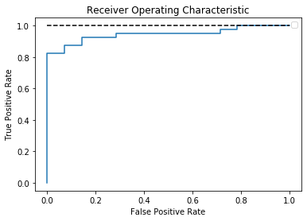

# Support Vector Machine: classification of graduation and regression of admission data

## Goals 
### 1. Classification - job placement status after graduation: score = 0.8703
### 2. Regression - chance of admission: MSE = 0.0042


```python
import pandas as pd
from sklearn import metrics
from sklearn.model_selection import KFold, cross_val_score 
from sklearn.pipeline import make_pipeline, Pipeline
from sklearn.linear_model import LogisticRegression
from sklearn.preprocessing import StandardScaler
from sklearn.model_selection import train_test_split
from sklearn.model_selection import GridSearchCV
from sklearn.svm import SVC
from sklearn.metrics import confusion_matrix
from sklearn.metrics import mean_squared_error
```


```python
data = pd.read_csv('Placement_Data_Full_Class.csv')
```


```python
data = data.iloc[:, 1:]
data
```


<div>
<style scoped>
    .dataframe tbody tr th:only-of-type {
        vertical-align: middle;
    }

    .dataframe tbody tr th {
        vertical-align: top;
    }

    .dataframe thead th {
        text-align: right;
    }
</style>
<table border="1" class="dataframe">
  <thead>
    <tr style="text-align: right;">
      <th></th>
      <th>gender</th>
      <th>ssc_p</th>
      <th>ssc_b</th>
      <th>hsc_p</th>
      <th>hsc_b</th>
      <th>hsc_s</th>
      <th>degree_p</th>
      <th>degree_t</th>
      <th>workex</th>
      <th>etest_p</th>
      <th>specialisation</th>
      <th>mba_p</th>
      <th>status</th>
      <th>salary</th>
    </tr>
  </thead>
  <tbody>
    <tr>
      <th>0</th>
      <td>M</td>
      <td>67.00</td>
      <td>Others</td>
      <td>91.00</td>
      <td>Others</td>
      <td>Commerce</td>
      <td>58.00</td>
      <td>Sci&amp;Tech</td>
      <td>No</td>
      <td>55.0</td>
      <td>Mkt&amp;HR</td>
      <td>58.80</td>
      <td>Placed</td>
      <td>270000.0</td>
    </tr>
    <tr>
      <th>1</th>
      <td>M</td>
      <td>79.33</td>
      <td>Central</td>
      <td>78.33</td>
      <td>Others</td>
      <td>Science</td>
      <td>77.48</td>
      <td>Sci&amp;Tech</td>
      <td>Yes</td>
      <td>86.5</td>
      <td>Mkt&amp;Fin</td>
      <td>66.28</td>
      <td>Placed</td>
      <td>200000.0</td>
    </tr>
    <tr>
      <th>2</th>
      <td>M</td>
      <td>65.00</td>
      <td>Central</td>
      <td>68.00</td>
      <td>Central</td>
      <td>Arts</td>
      <td>64.00</td>
      <td>Comm&amp;Mgmt</td>
      <td>No</td>
      <td>75.0</td>
      <td>Mkt&amp;Fin</td>
      <td>57.80</td>
      <td>Placed</td>
      <td>250000.0</td>
    </tr>
    <tr>
      <th>3</th>
      <td>M</td>
      <td>56.00</td>
      <td>Central</td>
      <td>52.00</td>
      <td>Central</td>
      <td>Science</td>
      <td>52.00</td>
      <td>Sci&amp;Tech</td>
      <td>No</td>
      <td>66.0</td>
      <td>Mkt&amp;HR</td>
      <td>59.43</td>
      <td>Not Placed</td>
      <td>NaN</td>
    </tr>
    <tr>
      <th>4</th>
      <td>M</td>
      <td>85.80</td>
      <td>Central</td>
      <td>73.60</td>
      <td>Central</td>
      <td>Commerce</td>
      <td>73.30</td>
      <td>Comm&amp;Mgmt</td>
      <td>No</td>
      <td>96.8</td>
      <td>Mkt&amp;Fin</td>
      <td>55.50</td>
      <td>Placed</td>
      <td>425000.0</td>
    </tr>
    <tr>
      <th>...</th>
      <td>...</td>
      <td>...</td>
      <td>...</td>
      <td>...</td>
      <td>...</td>
      <td>...</td>
      <td>...</td>
      <td>...</td>
      <td>...</td>
      <td>...</td>
      <td>...</td>
      <td>...</td>
      <td>...</td>
      <td>...</td>
    </tr>
    <tr>
      <th>210</th>
      <td>M</td>
      <td>80.60</td>
      <td>Others</td>
      <td>82.00</td>
      <td>Others</td>
      <td>Commerce</td>
      <td>77.60</td>
      <td>Comm&amp;Mgmt</td>
      <td>No</td>
      <td>91.0</td>
      <td>Mkt&amp;Fin</td>
      <td>74.49</td>
      <td>Placed</td>
      <td>400000.0</td>
    </tr>
    <tr>
      <th>211</th>
      <td>M</td>
      <td>58.00</td>
      <td>Others</td>
      <td>60.00</td>
      <td>Others</td>
      <td>Science</td>
      <td>72.00</td>
      <td>Sci&amp;Tech</td>
      <td>No</td>
      <td>74.0</td>
      <td>Mkt&amp;Fin</td>
      <td>53.62</td>
      <td>Placed</td>
      <td>275000.0</td>
    </tr>
    <tr>
      <th>212</th>
      <td>M</td>
      <td>67.00</td>
      <td>Others</td>
      <td>67.00</td>
      <td>Others</td>
      <td>Commerce</td>
      <td>73.00</td>
      <td>Comm&amp;Mgmt</td>
      <td>Yes</td>
      <td>59.0</td>
      <td>Mkt&amp;Fin</td>
      <td>69.72</td>
      <td>Placed</td>
      <td>295000.0</td>
    </tr>
    <tr>
      <th>213</th>
      <td>F</td>
      <td>74.00</td>
      <td>Others</td>
      <td>66.00</td>
      <td>Others</td>
      <td>Commerce</td>
      <td>58.00</td>
      <td>Comm&amp;Mgmt</td>
      <td>No</td>
      <td>70.0</td>
      <td>Mkt&amp;HR</td>
      <td>60.23</td>
      <td>Placed</td>
      <td>204000.0</td>
    </tr>
    <tr>
      <th>214</th>
      <td>M</td>
      <td>62.00</td>
      <td>Central</td>
      <td>58.00</td>
      <td>Others</td>
      <td>Science</td>
      <td>53.00</td>
      <td>Comm&amp;Mgmt</td>
      <td>No</td>
      <td>89.0</td>
      <td>Mkt&amp;HR</td>
      <td>60.22</td>
      <td>Not Placed</td>
      <td>NaN</td>
    </tr>
  </tbody>
</table>
<p>215 rows × 14 columns</p>
</div>


### Data pre-processing: tranform categorial data into numerical data


```python
o = list(data.select_dtypes(include='object').columns)
num_data = data.copy().drop(o, axis=1)
txt_data = data.loc[:, o]
for i in o:
    txt_data[i] = data[i].astype('category')
    txt_data = pd.concat([txt_data, 
                        pd.get_dummies(txt_data.select_dtypes(include=['category']))], axis=1).drop(i, axis=1)
trans_data = pd.concat([txt_data, num_data], axis=1)
trans_data.drop('status_Not Placed', axis=1, inplace=True)
```


```python
trans_data
```


<div>
<style scoped>
    .dataframe tbody tr th:only-of-type {
        vertical-align: middle;
    }

    .dataframe tbody tr th {
        vertical-align: top;
    }

    .dataframe thead th {
        text-align: right;
    }
</style>
<table border="1" class="dataframe">
  <thead>
    <tr style="text-align: right;">
      <th></th>
      <th>gender_F</th>
      <th>gender_M</th>
      <th>ssc_b_Central</th>
      <th>ssc_b_Others</th>
      <th>hsc_b_Central</th>
      <th>hsc_b_Others</th>
      <th>hsc_s_Arts</th>
      <th>hsc_s_Commerce</th>
      <th>hsc_s_Science</th>
      <th>degree_t_Comm&amp;Mgmt</th>
      <th>...</th>
      <th>workex_Yes</th>
      <th>specialisation_Mkt&amp;Fin</th>
      <th>specialisation_Mkt&amp;HR</th>
      <th>status_Placed</th>
      <th>ssc_p</th>
      <th>hsc_p</th>
      <th>degree_p</th>
      <th>etest_p</th>
      <th>mba_p</th>
      <th>salary</th>
    </tr>
  </thead>
  <tbody>
    <tr>
      <th>0</th>
      <td>0</td>
      <td>1</td>
      <td>0</td>
      <td>1</td>
      <td>0</td>
      <td>1</td>
      <td>0</td>
      <td>1</td>
      <td>0</td>
      <td>0</td>
      <td>...</td>
      <td>0</td>
      <td>0</td>
      <td>1</td>
      <td>1</td>
      <td>67.00</td>
      <td>91.00</td>
      <td>58.00</td>
      <td>55.0</td>
      <td>58.80</td>
      <td>270000.0</td>
    </tr>
    <tr>
      <th>1</th>
      <td>0</td>
      <td>1</td>
      <td>1</td>
      <td>0</td>
      <td>0</td>
      <td>1</td>
      <td>0</td>
      <td>0</td>
      <td>1</td>
      <td>0</td>
      <td>...</td>
      <td>1</td>
      <td>1</td>
      <td>0</td>
      <td>1</td>
      <td>79.33</td>
      <td>78.33</td>
      <td>77.48</td>
      <td>86.5</td>
      <td>66.28</td>
      <td>200000.0</td>
    </tr>
    <tr>
      <th>2</th>
      <td>0</td>
      <td>1</td>
      <td>1</td>
      <td>0</td>
      <td>1</td>
      <td>0</td>
      <td>1</td>
      <td>0</td>
      <td>0</td>
      <td>1</td>
      <td>...</td>
      <td>0</td>
      <td>1</td>
      <td>0</td>
      <td>1</td>
      <td>65.00</td>
      <td>68.00</td>
      <td>64.00</td>
      <td>75.0</td>
      <td>57.80</td>
      <td>250000.0</td>
    </tr>
    <tr>
      <th>3</th>
      <td>0</td>
      <td>1</td>
      <td>1</td>
      <td>0</td>
      <td>1</td>
      <td>0</td>
      <td>0</td>
      <td>0</td>
      <td>1</td>
      <td>0</td>
      <td>...</td>
      <td>0</td>
      <td>0</td>
      <td>1</td>
      <td>0</td>
      <td>56.00</td>
      <td>52.00</td>
      <td>52.00</td>
      <td>66.0</td>
      <td>59.43</td>
      <td>NaN</td>
    </tr>
    <tr>
      <th>4</th>
      <td>0</td>
      <td>1</td>
      <td>1</td>
      <td>0</td>
      <td>1</td>
      <td>0</td>
      <td>0</td>
      <td>1</td>
      <td>0</td>
      <td>1</td>
      <td>...</td>
      <td>0</td>
      <td>1</td>
      <td>0</td>
      <td>1</td>
      <td>85.80</td>
      <td>73.60</td>
      <td>73.30</td>
      <td>96.8</td>
      <td>55.50</td>
      <td>425000.0</td>
    </tr>
    <tr>
      <th>...</th>
      <td>...</td>
      <td>...</td>
      <td>...</td>
      <td>...</td>
      <td>...</td>
      <td>...</td>
      <td>...</td>
      <td>...</td>
      <td>...</td>
      <td>...</td>
      <td>...</td>
      <td>...</td>
      <td>...</td>
      <td>...</td>
      <td>...</td>
      <td>...</td>
      <td>...</td>
      <td>...</td>
      <td>...</td>
      <td>...</td>
      <td>...</td>
    </tr>
    <tr>
      <th>210</th>
      <td>0</td>
      <td>1</td>
      <td>0</td>
      <td>1</td>
      <td>0</td>
      <td>1</td>
      <td>0</td>
      <td>1</td>
      <td>0</td>
      <td>1</td>
      <td>...</td>
      <td>0</td>
      <td>1</td>
      <td>0</td>
      <td>1</td>
      <td>80.60</td>
      <td>82.00</td>
      <td>77.60</td>
      <td>91.0</td>
      <td>74.49</td>
      <td>400000.0</td>
    </tr>
    <tr>
      <th>211</th>
      <td>0</td>
      <td>1</td>
      <td>0</td>
      <td>1</td>
      <td>0</td>
      <td>1</td>
      <td>0</td>
      <td>0</td>
      <td>1</td>
      <td>0</td>
      <td>...</td>
      <td>0</td>
      <td>1</td>
      <td>0</td>
      <td>1</td>
      <td>58.00</td>
      <td>60.00</td>
      <td>72.00</td>
      <td>74.0</td>
      <td>53.62</td>
      <td>275000.0</td>
    </tr>
    <tr>
      <th>212</th>
      <td>0</td>
      <td>1</td>
      <td>0</td>
      <td>1</td>
      <td>0</td>
      <td>1</td>
      <td>0</td>
      <td>1</td>
      <td>0</td>
      <td>1</td>
      <td>...</td>
      <td>1</td>
      <td>1</td>
      <td>0</td>
      <td>1</td>
      <td>67.00</td>
      <td>67.00</td>
      <td>73.00</td>
      <td>59.0</td>
      <td>69.72</td>
      <td>295000.0</td>
    </tr>
    <tr>
      <th>213</th>
      <td>1</td>
      <td>0</td>
      <td>0</td>
      <td>1</td>
      <td>0</td>
      <td>1</td>
      <td>0</td>
      <td>1</td>
      <td>0</td>
      <td>1</td>
      <td>...</td>
      <td>0</td>
      <td>0</td>
      <td>1</td>
      <td>1</td>
      <td>74.00</td>
      <td>66.00</td>
      <td>58.00</td>
      <td>70.0</td>
      <td>60.23</td>
      <td>204000.0</td>
    </tr>
    <tr>
      <th>214</th>
      <td>0</td>
      <td>1</td>
      <td>1</td>
      <td>0</td>
      <td>0</td>
      <td>1</td>
      <td>0</td>
      <td>0</td>
      <td>1</td>
      <td>1</td>
      <td>...</td>
      <td>0</td>
      <td>0</td>
      <td>1</td>
      <td>0</td>
      <td>62.00</td>
      <td>58.00</td>
      <td>53.00</td>
      <td>89.0</td>
      <td>60.22</td>
      <td>NaN</td>
    </tr>
  </tbody>
</table>
<p>215 rows × 23 columns</p>
</div>


### 1. Classification: job placement status after graduation


```python
task_1_data = pd.concat([trans_data.iloc[:, -6:-1], trans_data.iloc[:, :-6]], axis=1)
```


```python
task_1_data
```


<div>
<style scoped>
    .dataframe tbody tr th:only-of-type {
        vertical-align: middle;
    }

    .dataframe tbody tr th {
        vertical-align: top;
    }

    .dataframe thead th {
        text-align: right;
    }
</style>
<table border="1" class="dataframe">
  <thead>
    <tr style="text-align: right;">
      <th></th>
      <th>ssc_p</th>
      <th>hsc_p</th>
      <th>degree_p</th>
      <th>etest_p</th>
      <th>mba_p</th>
      <th>gender_F</th>
      <th>gender_M</th>
      <th>ssc_b_Central</th>
      <th>ssc_b_Others</th>
      <th>hsc_b_Central</th>
      <th>...</th>
      <th>hsc_s_Commerce</th>
      <th>hsc_s_Science</th>
      <th>degree_t_Comm&amp;Mgmt</th>
      <th>degree_t_Others</th>
      <th>degree_t_Sci&amp;Tech</th>
      <th>workex_No</th>
      <th>workex_Yes</th>
      <th>specialisation_Mkt&amp;Fin</th>
      <th>specialisation_Mkt&amp;HR</th>
      <th>status_Placed</th>
    </tr>
  </thead>
  <tbody>
    <tr>
      <th>0</th>
      <td>67.00</td>
      <td>91.00</td>
      <td>58.00</td>
      <td>55.0</td>
      <td>58.80</td>
      <td>0</td>
      <td>1</td>
      <td>0</td>
      <td>1</td>
      <td>0</td>
      <td>...</td>
      <td>1</td>
      <td>0</td>
      <td>0</td>
      <td>0</td>
      <td>1</td>
      <td>1</td>
      <td>0</td>
      <td>0</td>
      <td>1</td>
      <td>1</td>
    </tr>
    <tr>
      <th>1</th>
      <td>79.33</td>
      <td>78.33</td>
      <td>77.48</td>
      <td>86.5</td>
      <td>66.28</td>
      <td>0</td>
      <td>1</td>
      <td>1</td>
      <td>0</td>
      <td>0</td>
      <td>...</td>
      <td>0</td>
      <td>1</td>
      <td>0</td>
      <td>0</td>
      <td>1</td>
      <td>0</td>
      <td>1</td>
      <td>1</td>
      <td>0</td>
      <td>1</td>
    </tr>
    <tr>
      <th>2</th>
      <td>65.00</td>
      <td>68.00</td>
      <td>64.00</td>
      <td>75.0</td>
      <td>57.80</td>
      <td>0</td>
      <td>1</td>
      <td>1</td>
      <td>0</td>
      <td>1</td>
      <td>...</td>
      <td>0</td>
      <td>0</td>
      <td>1</td>
      <td>0</td>
      <td>0</td>
      <td>1</td>
      <td>0</td>
      <td>1</td>
      <td>0</td>
      <td>1</td>
    </tr>
    <tr>
      <th>3</th>
      <td>56.00</td>
      <td>52.00</td>
      <td>52.00</td>
      <td>66.0</td>
      <td>59.43</td>
      <td>0</td>
      <td>1</td>
      <td>1</td>
      <td>0</td>
      <td>1</td>
      <td>...</td>
      <td>0</td>
      <td>1</td>
      <td>0</td>
      <td>0</td>
      <td>1</td>
      <td>1</td>
      <td>0</td>
      <td>0</td>
      <td>1</td>
      <td>0</td>
    </tr>
    <tr>
      <th>4</th>
      <td>85.80</td>
      <td>73.60</td>
      <td>73.30</td>
      <td>96.8</td>
      <td>55.50</td>
      <td>0</td>
      <td>1</td>
      <td>1</td>
      <td>0</td>
      <td>1</td>
      <td>...</td>
      <td>1</td>
      <td>0</td>
      <td>1</td>
      <td>0</td>
      <td>0</td>
      <td>1</td>
      <td>0</td>
      <td>1</td>
      <td>0</td>
      <td>1</td>
    </tr>
    <tr>
      <th>...</th>
      <td>...</td>
      <td>...</td>
      <td>...</td>
      <td>...</td>
      <td>...</td>
      <td>...</td>
      <td>...</td>
      <td>...</td>
      <td>...</td>
      <td>...</td>
      <td>...</td>
      <td>...</td>
      <td>...</td>
      <td>...</td>
      <td>...</td>
      <td>...</td>
      <td>...</td>
      <td>...</td>
      <td>...</td>
      <td>...</td>
      <td>...</td>
    </tr>
    <tr>
      <th>210</th>
      <td>80.60</td>
      <td>82.00</td>
      <td>77.60</td>
      <td>91.0</td>
      <td>74.49</td>
      <td>0</td>
      <td>1</td>
      <td>0</td>
      <td>1</td>
      <td>0</td>
      <td>...</td>
      <td>1</td>
      <td>0</td>
      <td>1</td>
      <td>0</td>
      <td>0</td>
      <td>1</td>
      <td>0</td>
      <td>1</td>
      <td>0</td>
      <td>1</td>
    </tr>
    <tr>
      <th>211</th>
      <td>58.00</td>
      <td>60.00</td>
      <td>72.00</td>
      <td>74.0</td>
      <td>53.62</td>
      <td>0</td>
      <td>1</td>
      <td>0</td>
      <td>1</td>
      <td>0</td>
      <td>...</td>
      <td>0</td>
      <td>1</td>
      <td>0</td>
      <td>0</td>
      <td>1</td>
      <td>1</td>
      <td>0</td>
      <td>1</td>
      <td>0</td>
      <td>1</td>
    </tr>
    <tr>
      <th>212</th>
      <td>67.00</td>
      <td>67.00</td>
      <td>73.00</td>
      <td>59.0</td>
      <td>69.72</td>
      <td>0</td>
      <td>1</td>
      <td>0</td>
      <td>1</td>
      <td>0</td>
      <td>...</td>
      <td>1</td>
      <td>0</td>
      <td>1</td>
      <td>0</td>
      <td>0</td>
      <td>0</td>
      <td>1</td>
      <td>1</td>
      <td>0</td>
      <td>1</td>
    </tr>
    <tr>
      <th>213</th>
      <td>74.00</td>
      <td>66.00</td>
      <td>58.00</td>
      <td>70.0</td>
      <td>60.23</td>
      <td>1</td>
      <td>0</td>
      <td>0</td>
      <td>1</td>
      <td>0</td>
      <td>...</td>
      <td>1</td>
      <td>0</td>
      <td>1</td>
      <td>0</td>
      <td>0</td>
      <td>1</td>
      <td>0</td>
      <td>0</td>
      <td>1</td>
      <td>1</td>
    </tr>
    <tr>
      <th>214</th>
      <td>62.00</td>
      <td>58.00</td>
      <td>53.00</td>
      <td>89.0</td>
      <td>60.22</td>
      <td>0</td>
      <td>1</td>
      <td>1</td>
      <td>0</td>
      <td>0</td>
      <td>...</td>
      <td>0</td>
      <td>1</td>
      <td>1</td>
      <td>0</td>
      <td>0</td>
      <td>1</td>
      <td>0</td>
      <td>0</td>
      <td>1</td>
      <td>0</td>
    </tr>
  </tbody>
</table>
<p>215 rows × 22 columns</p>
</div>


### Model selection for imbalanced data


```python
# comfirm if imbalanced
task_1_data['status_Placed'].value_counts(normalize=True)
```


    1    0.688372
    0    0.311628
    Name: status_Placed, dtype: float64


```python
X_train, X_test, y_train, y_test = train_test_split(task_1_data.iloc[:, :-1], task_1_data.iloc[:, -1], random_state=42)
```


```python
pipe = Pipeline([('preprocessing', StandardScaler()), ('classifier', SVC())])
param_grid = [{'classifier': [SVC()], 'preprocessing': [StandardScaler()],
             'classifier__gamma': [0.001, 0.01, 0.1, 1, 10, 100],
             'classifier__C': [0.001, 0.01, 0.1, 1, 10, 100],
             'classifier__probability': [True],
             'classifier__class_weight': ['balanced']}]

grid = GridSearchCV(pipe, param_grid, cv=10)
grid.fit(X_train, y_train)
print(grid.best_params_)
```

    {'classifier': SVC(C=10, break_ties=False, cache_size=200, class_weight='balanced', coef0=0.0,
        decision_function_shape='ovr', degree=3, gamma=0.01, kernel='rbf',
        max_iter=-1, probability=True, random_state=None, shrinking=True, tol=0.001,
        verbose=False), 'classifier__C': 10, 'classifier__class_weight': 'balanced', 'classifier__gamma': 0.01, 'classifier__probability': True, 'preprocessing': StandardScaler(copy=True, with_mean=True, with_std=True)}


### Perform model and check scores


```python
pipe = Pipeline([('preprocessing', StandardScaler()), ('classifier', grid.best_params_['classifier'])])
pipe.fit(X_train, y_train)
print(pipe.score(X_train, y_train))
print(pipe.score(X_test, y_test))
```

    0.9192546583850931
    0.8703703703703703


```python
cross_val_score(pipe, task_1_data.iloc[:, :-1], task_1_data.iloc[:, -1], scoring="f1")
```


    array([0.8852459 , 0.87096774, 0.92857143, 0.83333333, 0.84615385])


```python
import matplotlib.pyplot as plt
from sklearn.metrics import roc_curve, roc_auc_score, precision_recall_curve

y_probabilities = pipe.predict_proba(X_test)[:,1]
false_positive_rate, true_positive_rate, threshold = roc_curve(y_test, y_probabilities)

# ROC curve
plt.title("Receiver Operating Characteristic") 
plt.plot(false_positive_rate, true_positive_rate) 
plt.plot([1, 1], ls='--', c='black') 
plt.ylabel("True Positive Rate")
plt.xlabel("False Positive Rate")
plt.legend([])
plt.show()
```





```python
# area under roc line
roc_auc_score(y_test, y_probabilities)
```


    0.9446428571428571


```python
# support vectors
for i in range(0, 5):
    print(task_1_data.columns[pipe[1].support_[i]])
```

    hsc_p
    mba_p
    gender_M
    ssc_b_Central
    ssc_b_Others


### 2. Regression: chance of admission


```python
task_2_data = pd.read_csv('Admission_Predict_Ver1.1.csv', index_col='Serial No.')
```


```python
X, y = task_2_data.iloc[:, :-1], task_2_data.iloc[:, -1].values
```


```python
X_train, X_test, y_train, y_test = train_test_split(X, y, random_state=42)
```


```python
corr_cols = task_2_data.corr()['Chance of Admit '].sort_values(ascending=False)
```


```python
# high correlation between columns
corr_cols[1:]
```


    CGPA                 0.882413
    GRE Score            0.810351
    TOEFL Score          0.792228
    University Rating    0.690132
    SOP                  0.684137
    LOR                  0.645365
    Research             0.545871
    Name: Chance of Admit , dtype: float64


### Model selection


```python
from sklearn.svm import SVR

pipe = make_pipeline(StandardScaler(), SVR())

param_grid = [{'svr__kernel': ['rbf'],
               'svr__C': [0.001, 0.01, 0.1, 1, 10, 100],
               'svr__gamma': [0.001, 0.01, 0.1, 1, 10, 100]},
              {'svr__kernel': ['linear'],
               'svr__C': [0.001, 0.01, 0.1, 1, 10, 100]}]

grid = GridSearchCV(pipe, param_grid, cv=5)
grid.fit(X_train, y_train)
print(grid.best_params_)
```

    {'svr__C': 100, 'svr__kernel': 'linear'}


### Perform model and check mse score


```python
pipe = make_pipeline(StandardScaler(), SVR(C=100, kernel='linear'))
pipe.fit(X_train, y_train)
print(mean_squared_error(y_test, pipe.predict(X_test)))
```

    0.004247343408697258

