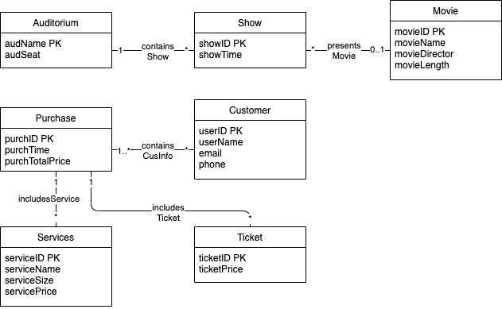

### In this project we’ll implement a theater database that has the following requirements:
- The theatre consists of several auditoriums, which have a unique name. For each auditorium, the number of its seats is known, too. The theatre arranges shows in the auditoriums. For each show, the information contains the name of the auditorium of the show, the date and the time, and the movie which is shown. Each movie has a unique ID. In addition, the name of the movie, the name of its director and the length (in minutes) of the movie are stored. The same movie may be shown in several shows in different auditoriums at the same time.
- The database contains information about customers who can purchase tickets through the webstore. For the sake of simplicity, we assume that the tickets do not have seat numbers. The customers have a unique user id. In addition, the name, the e-mail address and the phone number of the customer are stored. For each purchase made by a customer, the database contains a unique id of the purchase, information about which show the ticket is for, time of the purchase, the number of tickets purchased (the customer can purchase simultaneously several tickets for the same show for him/herself and his/her friends -- no information about the friends is stored anywhere), information about which extra service (food and drinks, for example) are included and the total price of the purchase. Part of the tickets are sold directly at the box office of the theatre. Those purchases are stored otherwise in the same way in the database, but no information about the customer is stored. Possible extra services included in the purchase are food and drinks, for example. One purchase may contain, for example, four tickets for the same show, three large soft drinks, one small portion of popcorn and two portions of ice cream. The data stored about extra services contains a unique ID of the service, the name of the service, and the size of the service (small or large, for example).

### UML model

### Relational DB model

- Auditorium (<u>audName</u>, audSeat)
- Show (<u>showID</u>, showTime, audName) combined with containsShow
- Movie (<u>movieID</u>, movieName, movieDirector, movieLength) combined with presentsMovie

- Purchase (<u>purchID</u>, purchTime, purchTotalPrice)
- Customer (<u>userID</u>, userName, email, phone, purchID) combined with containsCusInfo
- Services (<u>serviceID</u>, serviceName, serviceSize, servicePrice, purchID) combined with includesServices
- Ticket (<u>ticketID</u>, ticketPrice, purchID) combined with includesTicket
