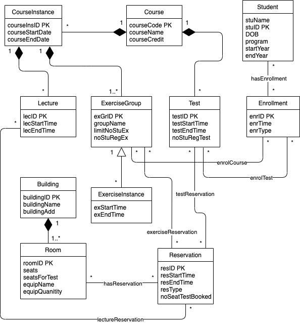

### UML modeling for an unversity database that has the following requirements:
- The database contains information about the courses of the university. For each course, the
information contains the course code, the name, and the number of credits.
- The same course may be organized several times either in the same semester or in different
semesters. Below, we call different implementations of the same course course instances.
- A course may have lectures, exercise groups and exams. The lectures and exercise groups
belong to a certain course instance, the exams belong to the course.
- The time of the lectures of the course instance may vary i.e. they are not necessarily the same
every week.
- The same exercise group may meet several times and the timetable may be different in different
weeks. The group may also have several meetings during the same week.
- A course may have several exams (for example, an exam immediately after a course instance
and retake exams later).
- The student enrolls for a course by enrolling for one of its exercise groups. We assume that
every course instance has at least one exercise group. An exercise group may have a limit for the number of students and the student cannot enroll for the group which has already reached the limit.
- If a student wants to take an exam, he/she has always enroll for it (it is not enough to enroll for a course).
- For each student, the system stores at least the name, student ID, date of birth, degree program, the year the student started his/her studies and the expiration date of study right.
- The university has several buildings, which contain rooms for teaching purposes (like lecture halls and class rooms). They are called rooms below. For each building, the information about its name and street address are stored. The database also contains information about which rooms are located in a certain buiding.
- For each room, the following information is stored: the number of seats, the number of seats in an exam (may be smaller, because the students cannot sit too near each other in the exam), the equipment in the room (like video projector, two video projectors, computer for the teacher, document camera, computers for students etc.) It must be able to store information also about other type of equipment than listed above.
- The database must contain information on the reservations of the rooms. There can been only one exercise group or lecture in a certain room at the same time, but it is possible to have exams of several courses simultaneously in the same room. The reservation for a exam may be longer than the actual exam to give time for practical arrangements.

### The following operations are possible. These operations are not presented in the UML diagram and in the relational model, but it is designed such that the operations are possible:
- Store information about courses, course instances, students, lectures, exercises groups and their times, exams and enrollments.
- Store information about the buildings, rooms and their reservations. The system must also store information about the history of the reservations, for example which exercise group of which course had a reservation for a certain room at a certain time a year ago.
- Search for the courses which are arranged in a certain time interval.
- Find out, which exams a certain course has during a certain time interval.
- Find out, when a certain course has been arranged or when it will be arranged.
- Find the lectures belonging to a certain course instance.
- Find the exercise groups belonging to a certain course instance and find out, when and where a
certain exercise group meets.
- Find a room which has at least a certain number of seats and which is free for reservation at a
certain time.
- Find out for which purpose a certain room is reserved at a certain time.
- Enroll a certain student for a certain exam or exercise group.
- List all students who have enrolled for a certain course instance, exercise group or exam.
- Find out which exercise groups at a certain course instance are not full yet.

#### Relations 

- Course (<u>courseCode</u>, courseName, courseCredit)
- CourseInstance (<u>courseInsID</u>, courseStartDate, courseEndDate)

- Lecture (<u>lecID</u>, lecDate, lecStartTime, lecEndTime, <u>courseInsID</u>, <u>courseCode</u>)
- ExerciseGroup (<u>exGrID</u>, groupName, <u>limitNoStuEX</u>, <u>noStuRegEx</u>, <u>courseInsID</u>, <u>courseCode</u>)
- ExerciseInstance (<u>exInsID</u>, exDate, exStartTime, exEndTime, <u>limitNoStuEX</u>, <u>noStuRegEx</u>, <u>courseInsID</u>, <u>courseCode</u>)
- Test (<u>testID</u>, testDate, testStartTime, testEndTime, <u>noStuRegTest</u>, <u>courseCode</u>)

- Student (<u>enrID</u>, enrDate, enrTime, enrType)
- Enrollment (<u>ID</u>, studentName, DOB, program, startYear, endYear)

- Building (<u>buildingName</u>, buildingAdd)
- Room (<u>roomID</u>, seats, <u>seatsForTest</u>, equipName, equipQuantity, <u>buildingName</u>)
- Reservation (<u>resID</u>, resStartTime, resEndTime, resType, noSeatTestBooked)

#### Associations

- enrolCourse (<u>stuID</u>, <u>enrID</u>, <u>exGrID</u>, <u>courseInsID</u>, <u>courseCode</u>)
- enrolTest (<u>stuID</u>, <u>enrID</u>, <u>testID</u>, <u>courseCode</u>)

- resTest (<u>courseCode</u>, <u>testID</u>, <u>resID</u>, <u>roomID</u>, <u>buildingName</u>, <u>seatForTest</u>)
- resCourse (<u>courseInsID</u>, <u>resID</u>, <u>roomID</u>, <u>buildingName</u>, <u>seats</u>)
